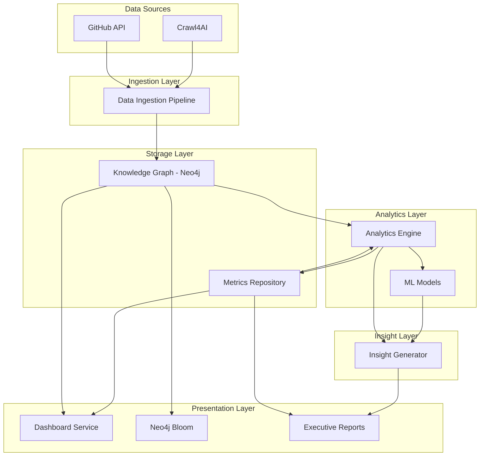
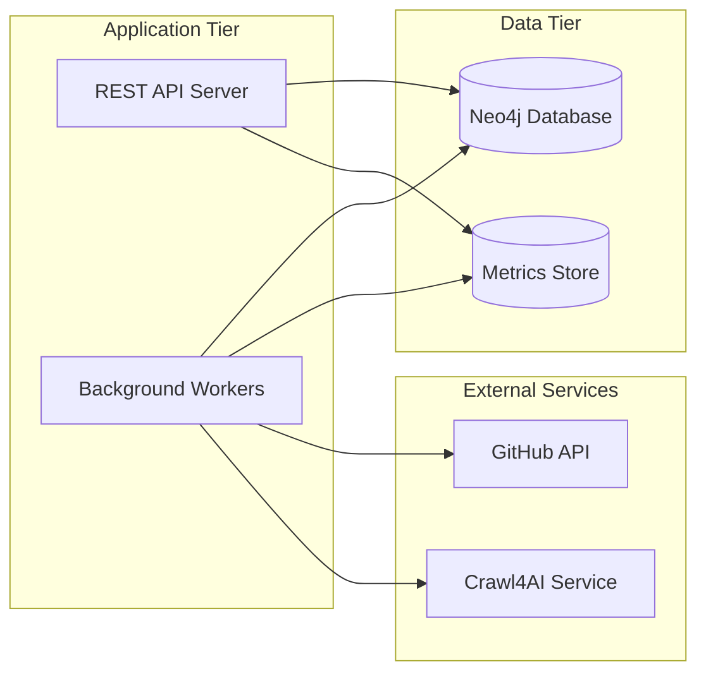

# Design Document: Fortune 500 Knowledge Graph Analytics

## Overview

The Fortune 500 Knowledge Graph Analytics System is a comprehensive business intelligence platform that combines graph database technology, machine learning, and advanced analytics to provide actionable insights about Fortune 500 companies. The system integrates multiple data sources (Crawl4AI web scraping, GitHub APIs) into a Neo4j knowledge graph, executes sophisticated graph algorithms (PageRank, Louvain community detection, betweenness centrality), and calculates derived metrics that correlate with business outcomes.

The platform serves multiple user personas:
- **Data Analysts**: Ingest and validate data quality
- **Business Strategists**: Analyze innovation metrics and competitive positioning
- **Data Scientists**: Execute graph algorithms and build predictive models
- **Sector Analysts**: Benchmark digital maturity across industries
- **Executives**: Access interactive dashboards and executive reports
- **Strategy Consultants**: Generate actionable recommendations with ROI calculations

The system delivers value through:
- **Quantifiable Metrics**: Innovation Score, Ecosystem Centrality, Digital Maturity Index
- **Predictive Analytics**: ML-based forecasting of revenue growth and competitive dynamics
- **Interactive Visualizations**: Dashboards with multiple chart types and Neo4j Bloom integration
- **Business Intelligence**: Automated insight generation with ROI calculations
- **Historical Analysis**: Time-series tracking and trend identification
- **Cross-Sector Benchmarking**: Comparative analysis across industry sectors

## Architecture

### System Components

The system follows a layered architecture with clear separation of concerns:



### Component Responsibilities

**Data Ingestion Pipeline**
- Fetches Fortune 500 company data from Crawl4AI
- Retrieves GitHub metrics (stars, forks, contributors) via GitHub API
- Handles API rate limiting with exponential backoff
- Validates data completeness and quality
- Creates nodes and relationships in Knowledge Graph
- Logs ingestion statistics and data quality reports

**Knowledge Graph (Neo4j)**
- Stores company nodes with attributes (name, sector, revenue rank, employee count)
- Stores relationship edges (partnerships, acquisitions, technology dependencies)
- Supports Cypher query execution for custom analysis
- Provides graph algorithm execution environment
- Enables Neo4j Bloom visualization

**Analytics Engine**
- Executes graph algorithms (PageRank, Louvain, betweenness centrality)
- Calculates derived metrics (Innovation Score, Ecosystem Centrality, Digital Maturity Index)
- Computes statistical correlations with business outcomes
- Performs historical trend analysis
- Executes cross-sector comparative analysis
- Manages custom Cypher query execution
- Monitors algorithm performance and resource utilization

**ML Models**
- Trains on graph embeddings and historical metrics
- Predicts revenue growth for next fiscal year
- Generates prediction confidence scores
- Validates predictions against actual outcomes

**Metrics Repository**
- Stores computed metrics with timestamps
- Maintains historical metric values for trend analysis
- Supports efficient time-range queries
- Exports metrics in multiple formats (CSV, JSON, BI tool formats)

**Insight Generator**
- Analyzes metrics to identify patterns and anomalies
- Generates business recommendations with confidence levels
- Calculates ROI metrics for system value
- Produces executive reports with visualizations
- Identifies acquisition targets and investment opportunities

**Dashboard Service**
- Renders interactive visualizations (bar charts, network graphs, line charts, heatmaps)
- Supports filtering by sector, year, and metric thresholds
- Integrates with Neo4j Bloom for graph exploration
- Provides system health monitoring dashboard
- Enables real-time metric updates

### Technology Stack

- **Graph Database**: Neo4j (with Graph Data Science library)
- **Data Processing**: Python with pandas, numpy
- **Graph Algorithms**: Neo4j GDS (PageRank, Louvain, betweenness centrality)
- **Machine Learning**: scikit-learn, TensorFlow/PyTorch for graph embeddings
- **Web Scraping**: Crawl4AI
- **API Integration**: GitHub REST API v3
- **Visualization**: D3.js, Plotly, Neo4j Bloom
- **Report Generation**: ReportLab (PDF), Jinja2 (HTML)
- **Export Formats**: CSV, JSON, Tableau REST API, Power BI connector

### Deployment Architecture



## Components and Interfaces

### Data Ingestion Pipeline

**Interface: DataIngestionPipeline**

```python
class DataIngestionPipeline:
    def ingest_crawl4ai_data(self, crawl_data: CrawlData) -> IngestionResult:
        """
        Parse Crawl4AI data and create Knowledge Graph nodes/edges.
        
        Args:
            crawl_data: Structured data from Crawl4AI containing company info
            
        Returns:
            IngestionResult with node_count, edge_count, errors
        """
        
    def fetch_github_metrics(self, company: Company) -> GitHubMetrics:
        """
        Retrieve GitHub metrics for a company's organization.
        
        Args:
            company: Company entity with github_org attribute
            
        Returns:
            GitHubMetrics with stars, forks, contributors
            
        Raises:
            RateLimitError: When GitHub API rate limit exceeded
        """
        
    def validate_data_quality(self) -> DataQualityReport:
        """
        Validate completeness and accuracy of ingested data.
        
        Returns:
            DataQualityReport with completeness percentages, missing fields
        """
        
    def handle_rate_limit(self, retry_after: int) -> None:
        """
        Queue requests and retry with exponential backoff.
        
        Args:
            retry_after: Seconds to wait before retry
        """
```

### Analytics Engine

**Interface: AnalyticsEngine**

```python
class AnalyticsEngine:
    def calculate_innovation_score(self, company_id: str) -> float:
        """
        Calculate Innovation Score: (stars + forks) / employee_count.
        
        Args:
            company_id: Unique identifier for company
            
        Returns:
            Normalized Innovation Score (0-10 scale)
        """
        
    def execute_pagerank(self, max_iterations: int = 20) -> Dict[str, float]:
        """
        Execute PageRank algorithm on Knowledge Graph.
        
        Args:
            max_iterations: Maximum iterations for convergence
            
        Returns:
            Dictionary mapping company_id to PageRank score
        """
        
    def execute_louvain(self) -> Dict[str, int]:
        """
        Execute Louvain community detection algorithm.
        
        Returns:
            Dictionary mapping company_id to community_id
        """
        
    def calculate_betweenness_centrality(self, top_n: int = 10) -> Dict[str, float]:
        """
        Calculate betweenness centrality for top N nodes per company.
        
        Args:
            top_n: Number of top nodes to analyze per company
            
        Returns:
            Dictionary mapping node_id to centrality score
        """
        
    def calculate_digital_maturity_index(self, company_id: str) -> float:
        """
        Calculate Digital Maturity Index: (stars + forks + contributors) / revenue_rank.
        
        Args:
            company_id: Unique identifier for company
            
        Returns:
            Digital Maturity Index value
        """
        
    def calculate_correlation(self, metric1: str, metric2: str) -> CorrelationResult:
        """
        Calculate Pearson correlation between two metrics.
        
        Args:
            metric1: First metric name (e.g., 'innovation_score')
            metric2: Second metric name (e.g., 'revenue_growth')
            
        Returns:
            CorrelationResult with coefficient, p_value, confidence_interval
        """
        
    def execute_custom_query(self, cypher_query: str) -> QueryResult:
        """
        Execute custom Cypher query with validation and timeout.
        
        Args:
            cypher_query: Cypher query string
            
        Returns:
            QueryResult with rows, execution_time
            
        Raises:
            QueryTimeoutError: When execution exceeds 30 seconds
            QuerySyntaxError: When query syntax is invalid
        """
```

### ML Models

**Interface: PredictiveModel**

```python
class PredictiveModel:
    def train(self, embeddings: np.ndarray, historical_metrics: pd.DataFrame) -> None:
        """
        Train ML model on graph embeddings and historical data.
        
        Args:
            embeddings: Graph embeddings from Neo4j GDS
            historical_metrics: Historical metric values with timestamps
        """
        
    def predict_revenue_growth(self, company_id: str) -> PredictionResult:
        """
        Predict next fiscal year revenue growth.
        
        Args:
            company_id: Unique identifier for company
            
        Returns:
            PredictionResult with predicted_growth, confidence_score
        """
        
    def validate_predictions(self, actual_outcomes: pd.DataFrame) -> ValidationMetrics:
        """
        Compare predictions to actual outcomes.
        
        Args:
            actual_outcomes: Actual revenue growth values
            
        Returns:
            ValidationMetrics with accuracy, RMSE, MAE
        """
```

### Insight Generator

**Interface: InsightGenerator**

```python
class InsightGenerator:
    def identify_underperformers(self, sector: str) -> List[Company]:
        """
        Identify companies with Innovation Score below sector average.
        
        Args:
            sector: Industry sector name
            
        Returns:
            List of underperforming companies with gap analysis
        """
        
    def recommend_investments(self, quartile: str = 'bottom') -> List[Recommendation]:
        """
        Generate investment recommendations for companies in specified quartile.
        
        Args:
            quartile: Target quartile ('bottom', 'top', etc.)
            
        Returns:
            List of Recommendation objects with strategy, expected_outcome, confidence
        """
        
    def identify_acquisition_targets(self) -> List[AcquisitionTarget]:
        """
        Identify companies with high centrality and low valuation.
        
        Returns:
            List of AcquisitionTarget with rationale and metrics
        """
        
    def calculate_roi(self) -> ROIMetrics:
        """
        Calculate system ROI based on time savings and decision impact.
        
        Returns:
            ROIMetrics with time_savings, revenue_impact, decision_speed, roi_ratio
        """
        
    def generate_executive_report(self) -> ExecutiveReport:
        """
        Produce comprehensive executive report with metrics and recommendations.
        
        Returns:
            ExecutiveReport object with sections for metrics, trends, recommendations, ROI
        """
```

### Dashboard Service

**Interface: DashboardService**

```python
class DashboardService:
    def render_leaderboard(self, metric: str, filters: Dict) -> Visualization:
        """
        Render bar chart of companies ranked by specified metric.
        
        Args:
            metric: Metric name to display
            filters: Dictionary with sector, year filters
            
        Returns:
            Visualization object with chart data and configuration
        """
        
    def render_network_graph(self, filters: Dict) -> NetworkVisualization:
        """
        Render force-directed network graph with metric overlays.
        
        Args:
            filters: Dictionary with sector, metric_threshold filters
            
        Returns:
            NetworkVisualization with nodes, edges, layout
        """
        
    def render_trend_chart(self, company_id: str, metric: str, time_range: str) -> Visualization:
        """
        Render line chart showing metric evolution over time.
        
        Args:
            company_id: Company identifier
            metric: Metric name
            time_range: Time range (e.g., '5y', '10y')
            
        Returns:
            Visualization with time-series data
        """
        
    def render_heatmap(self, x_axis: str, y_axis: str) -> Visualization:
        """
        Render heatmap matrix for two-dimensional metric comparison.
        
        Args:
            x_axis: Metric for x-axis (e.g., 'sector_centrality')
            y_axis: Metric for y-axis (e.g., 'revenue')
            
        Returns:
            Visualization with heatmap data
        """
        
    def configure_bloom_overlay(self, node_size_metric: str, node_color_metric: str) -> BloomConfig:
        """
        Configure Neo4j Bloom visualization overlays.
        
        Args:
            node_size_metric: Metric to map to node size
            node_color_metric: Metric to map to node color intensity
            
        Returns:
            BloomConfig with visualization settings
        """
```

## Data Models

### Knowledge Graph Schema

**Node Types**

```cypher
// Company Node
(:Company {
    id: String,              // Unique identifier
    name: String,            // Company name
    sector: String,          // Industry sector
    revenue_rank: Integer,   // Fortune 500 rank
    employee_count: Integer, // Number of employees
    github_org: String,      // GitHub organization name
    created_at: DateTime,    // Node creation timestamp
    updated_at: DateTime     // Last update timestamp
})

// Repository Node
(:Repository {
    id: String,              // GitHub repo ID
    name: String,            // Repository name
    stars: Integer,          // GitHub stars
    forks: Integer,          // GitHub forks
    contributors: Integer,   // Contributor count
    created_at: DateTime
})

// Sector Node
(:Sector {
    id: String,              // Sector identifier
    name: String,            // Sector name
    avg_innovation_score: Float,
    avg_digital_maturity: Float
})
```

**Relationship Types**

```cypher
// Company owns Repository
(:Company)-[:OWNS]->(:Repository)

// Company partners with Company
(:Company)-[:PARTNERS_WITH {
    since: Date,
    partnership_type: String
}]->(:Company)

// Company acquired Company
(:Company)-[:ACQUIRED {
    date: Date,
    amount: Float
}]->(:Company)

// Company belongs to Sector
(:Company)-[:BELONGS_TO]->(:Sector)

// Company depends on Repository (technology dependency)
(:Company)-[:DEPENDS_ON {
    dependency_type: String
}]->(:Repository)
```

### Metrics Repository Schema

```python
@dataclass
class MetricRecord:
    """Base class for all metric records."""
    company_id: str
    metric_name: str
    metric_value: float
    timestamp: datetime
    metadata: Dict[str, Any]

@dataclass
class InnovationScoreRecord(MetricRecord):
    """Innovation Score metric."""
    github_stars: int
    github_forks: int
    employee_count: int
    normalized_score: float  # 0-10 scale
    decile_rank: int

@dataclass
class EcosystemCentralityRecord(MetricRecord):
    """Ecosystem Centrality metric."""
    betweenness_centrality: float
    pagerank_score: float
    sector_avg_centrality: float

@dataclass
class DigitalMaturityRecord(MetricRecord):
    """Digital Maturity Index metric."""
    stars: int
    forks: int
    contributors: int
    revenue_rank: int
    sector: str
    sector_avg: float
    quartile: str  # 'top', 'upper_mid', 'lower_mid', 'bottom'

@dataclass
class CorrelationRecord:
    """Correlation analysis result."""
    metric1: str
    metric2: str
    correlation_coefficient: float
    p_value: float
    confidence_interval: Tuple[float, float]
    sample_size: int
    timestamp: datetime

@dataclass
class PredictionRecord:
    """ML prediction result."""
    company_id: str
    prediction_type: str  # 'revenue_growth', 'market_position'
    predicted_value: float
    confidence_score: float
    prediction_date: datetime
    target_date: datetime
    actual_value: Optional[float]  # Filled when outcome known
```

### Executive Report Schema

```python
@dataclass
class ExecutiveReport:
    """Comprehensive executive report structure."""
    report_id: str
    generation_date: datetime
    time_period: str  # e.g., 'Q4 2024'
    
    # Metrics Summary Section
    metrics_summary: MetricsSummary
    
    # Leaderboard Section
    leaderboard: List[LeaderboardEntry]
    
    # Trends Section
    trends: TrendsAnalysis
    
    # Recommendations Section
    recommendations: List[Recommendation]
    
    # ROI Section
    roi_analysis: ROIAnalysis
    
    # Export formats
    pdf_path: Optional[str]
    html_path: Optional[str]

@dataclass
class MetricsSummary:
    """Aggregated metrics overview."""
    total_companies: int
    avg_innovation_score: float
    avg_digital_maturity: float
    top_sector: str
    highest_growth_company: str
    highest_growth_rate: float

@dataclass
class LeaderboardEntry:
    """Single leaderboard entry."""
    rank: int
    company_name: str
    sector: str
    innovation_score: float
    digital_maturity: float
    ecosystem_centrality: float
    yoy_change: float  # Year-over-year change

@dataclass
class TrendsAnalysis:
    """Historical trends analysis."""
    innovation_score_trend: List[Tuple[datetime, float]]
    digital_maturity_trend: List[Tuple[datetime, float]]
    sector_trends: Dict[str, List[Tuple[datetime, float]]]
    inflection_points: List[InflectionPoint]

@dataclass
class Recommendation:
    """Business recommendation."""
    priority: int  # 1 (highest) to 5 (lowest)
    category: str  # 'investment', 'acquisition', 'partnership'
    title: str
    description: str
    target_companies: List[str]
    expected_outcome: str
    confidence_level: float  # 0.0 to 1.0
    supporting_metrics: Dict[str, float]

@dataclass
class ROIAnalysis:
    """ROI calculation details."""
    time_savings_hours: float
    time_savings_value: float  # Monetary value
    revenue_impact_top_quartile: float
    revenue_impact_bottom_quartile: float
    decision_speed_improvement: float  # Percentage
    knowledge_loss_avoidance: float
    total_benefits: float
    system_costs: float
    roi_ratio: float  # benefits / costs
```

### Data Quality Report Schema

```python
@dataclass
class DataQualityReport:
    """Data quality validation results."""
    report_date: datetime
    total_companies: int
    companies_with_complete_data: int
    completeness_percentage: float
    
    # Missing data breakdown
    missing_github_org: List[str]  # Company IDs
    missing_employee_count: List[str]
    missing_revenue_rank: List[str]
    
    # Data source statistics
    crawl4ai_records: int
    github_api_records: int
    github_api_failures: int
    
    # Validation issues
    validation_errors: List[ValidationError]

@dataclass
class ValidationError:
    """Single validation error."""
    company_id: str
    field_name: str
    error_type: str  # 'missing', 'invalid', 'out_of_range'
    error_message: str
```


## Correctness Properties

A property is a characteristic or behavior that should hold true across all valid executions of a system—essentially, a formal statement about what the system should do. Properties serve as the bridge between human-readable specifications and machine-verifiable correctness guarantees.

### Data Ingestion Properties

### Property 1: Crawl4AI Data Parsing Completeness

For any valid Crawl4AI data structure containing company information, parsing and storing to the Knowledge Graph should result in nodes and relationships that preserve all company attributes and connections from the source data.

**Validates: Requirements 1.1**

### Property 2: GitHub Metrics Retrieval Accuracy

For any company with an associated GitHub organization, the retrieved metrics (stars, forks, contributors) should match the values returned by the GitHub API for that organization.

**Validates: Requirements 1.2**

### Property 3: Required Company Attributes Persistence

For any company ingested into the Knowledge Graph, the stored node must contain both employee_count and revenue_rank attributes with non-null values.

**Validates: Requirements 1.3**

### Property 4: Ingestion Logging Accuracy

For any data ingestion operation, the logged node count and edge count should equal the actual number of nodes and edges created in the Knowledge Graph.

**Validates: Requirements 1.4**

### Property 5: Rate Limit Exponential Backoff

For any sequence of GitHub API requests that encounter rate limit errors, the retry delays should follow exponential backoff pattern (each retry delay ≥ 2× previous delay).

**Validates: Requirements 1.5**

### Innovation Score Properties

### Property 6: Innovation Score Calculation Formula

For any company with GitHub metrics and employee count, the Innovation Score should equal (github_stars + github_forks) / employee_count before normalization.

**Validates: Requirements 2.1**

### Property 7: Innovation Score Normalization Bounds

For any set of companies with calculated Innovation Scores, all normalized scores should fall within the range [0, 10].

**Validates: Requirements 2.2**

### Property 8: Innovation Score Persistence with Timestamp

For any calculated Innovation Score, the stored metric record should contain the score value and a timestamp indicating when the calculation occurred.

**Validates: Requirements 2.3**

### Property 9: Innovation Score Decile Ranking Correctness

For any set of companies ranked by Innovation Score, companies should be assigned to deciles such that each decile contains approximately 10% of companies, ordered from lowest (decile 1) to highest (decile 10).

**Validates: Requirements 2.4**

### Property 10: Correlation Coefficient Calculation

For any two metric series (Innovation Score and revenue growth), the calculated Pearson correlation coefficient should match the mathematical definition: r = Σ((x - x̄)(y - ȳ)) / √(Σ(x - x̄)² × Σ(y - ȳ)²).

**Validates: Requirements 2.5**

### Graph Algorithm Properties

### Property 11: PageRank Iteration Limit

For any Knowledge Graph, executing PageRank should complete within 20 iterations or converge earlier, never exceeding the maximum iteration count.

**Validates: Requirements 3.1**

### Property 12: Louvain Community Assignment Completeness

For any Knowledge Graph, executing Louvain community detection should assign every company node to exactly one community identifier.

**Validates: Requirements 3.2**

### Property 13: Betweenness Centrality Top-N Selection

For any company in the Knowledge Graph, calculating betweenness centrality should analyze at most the top 10 web-connected nodes associated with that company.

**Validates: Requirements 3.3**

### Property 14: Graph Algorithm Result Persistence

For any completed graph algorithm execution (PageRank, Louvain, betweenness centrality), the results should be stored in the Metrics Repository before the algorithm function returns.

**Validates: Requirements 3.4**

### Property 15: Sector-Level Centrality Aggregation

For any sector grouping of companies, the average Ecosystem Centrality should equal the sum of individual company centrality values divided by the number of companies in that sector.

**Validates: Requirements 3.5**

### Digital Maturity Properties

### Property 16: Digital Maturity Index Calculation Formula

For any company with GitHub metrics and revenue rank, the Digital Maturity Index should equal (stars + forks + contributors) / revenue_rank.

**Validates: Requirements 4.1**

### Property 17: Sector-Level Digital Maturity Aggregation

For any sector, the sector-level average Digital Maturity Index should equal the arithmetic mean of all companies' Digital Maturity Index values within that sector.

**Validates: Requirements 4.2**

### Property 18: Sector Gap Percentage Calculation

For any two sectors with average Digital Maturity Index values A and B, the percentage gap should equal ((A - B) / B) × 100.

**Validates: Requirements 4.3**

### Property 19: Bottom Quartile Identification

For any sector with N companies ranked by Digital Maturity Index, the bottom quartile should contain the ⌊N/4⌋ companies with the lowest index values.

**Validates: Requirements 4.4**

### Property 20: Digital Maturity Persistence with Metadata

For any calculated Digital Maturity Index, the stored record should contain the index value, sector identifier, and timestamp.

**Validates: Requirements 4.5**

### Visualization Properties

### Property 21: Leaderboard Visualization Data Completeness

For any rendered leaderboard bar chart, each displayed company should have both an Innovation Score value and a Fortune 500 rank value present in the visualization data.

**Validates: Requirements 5.1**

### Property 22: Network Graph Structure Completeness

For any rendered force-directed network graph, the visualization should contain node objects for companies, edge objects for relationships, and metric overlay values for each node.

**Validates: Requirements 5.2**

### Property 23: Time-Series Chart Temporal Ordering

For any rendered line chart showing GitHub activity trends, the data points should be ordered chronologically by timestamp.

**Validates: Requirements 5.3**

### Property 24: Heatmap Matrix Dimensionality

For any rendered heatmap showing sector centrality versus revenue, the matrix should have dimensions equal to (number of sectors) × (number of revenue bins).

**Validates: Requirements 5.4**

### Property 25: Sector Filter Application Consistency

For any sector filter selection, all visualizations should display only companies belonging to the selected sector after the filter is applied.

**Validates: Requirements 5.5**

### Property 26: Year Filter Temporal Consistency

For any year filter selection, all visualizations should display only data with timestamps falling within the selected year.

**Validates: Requirements 5.6**

### Neo4j Bloom Properties

### Property 27: Bloom Node Size Metric Mapping

For any Knowledge Graph visualization in Neo4j Bloom, node sizes should be proportional to Innovation Score values (higher scores → larger nodes).

**Validates: Requirements 6.2**

### Property 28: Bloom Node Color Metric Mapping

For any Knowledge Graph visualization in Neo4j Bloom, node color intensity should be proportional to Ecosystem Centrality values (higher centrality → more intense color).

**Validates: Requirements 6.3**

### Property 29: Bloom Filter Effectiveness

For any applied filter (sector, revenue range, metric threshold) in Neo4j Bloom, the displayed nodes should satisfy all active filter conditions.

**Validates: Requirements 6.4**

### Property 30: Bloom Relationship Display Completeness

For any displayed relationship in Neo4j Bloom, the edge should show both the relationship type label and any associated weight values.

**Validates: Requirements 6.5**

### Business Outcome Correlation Properties

### Property 31: Innovation-Revenue Correlation Calculation

For any dataset of companies with Innovation Scores and revenue growth rates, the Pearson correlation coefficient should be calculated using the standard statistical formula.

**Validates: Requirements 7.1**

### Property 32: Centrality-M&A Correlation Calculation

For any dataset of companies with Ecosystem Centrality and M&A activity frequency, the correlation coefficient should be calculated correctly.

**Validates: Requirements 7.2**

### Property 33: Top Quartile Revenue Growth Aggregation

For any set of companies ranked by Innovation Score, the average revenue growth rate for the top quartile should equal the mean of growth rates for companies in positions 1 through ⌊N/4⌋.

**Validates: Requirements 7.3**

### Property 34: Quartile Revenue Growth Comparison

For any set of companies divided into high-score and low-score quartiles, the comparison should calculate the difference between the two quartile average growth rates.

**Validates: Requirements 7.4**

### Property 35: Correlation Persistence with Confidence Intervals

For any calculated correlation coefficient, the stored record should include the coefficient value, p-value, and confidence interval bounds.

**Validates: Requirements 7.5**

### Predictive Analytics Properties

### Property 36: ML Model Training Completion

For any valid graph embeddings and historical metrics dataset, the ML model training process should complete without errors and produce a trained model artifact.

**Validates: Requirements 8.1**

### Property 37: Revenue Growth Prediction Coverage

For any trained ML model, predictions for next fiscal year revenue growth should be generated for all companies in the dataset.

**Validates: Requirements 8.2**

### Property 38: High-Growth Low-Rank Identification

For any set of companies with predictions, identified high-growth candidates should have predicted growth above the median AND current rank below the 75th percentile.

**Validates: Requirements 8.3**

### Property 39: Prediction Accuracy Calculation

For any set of predictions with known actual outcomes, the accuracy metric should equal 1 - (mean absolute error / mean actual value).

**Validates: Requirements 8.4**

### Property 40: High-Confidence Forecast Flagging

For any prediction with confidence score C, the prediction should be flagged as high-confidence if and only if C > 0.80.

**Validates: Requirements 8.5**

### Business Insight Properties

### Property 41: Underperformer Identification Correctness

For any sector with average Innovation Score S_avg, identified underperforming companies should have Innovation Score < S_avg.

**Validates: Requirements 9.1**

### Property 42: Bottom Quartile Investment Recommendation Coverage

For any sector, open-source investment recommendations should be generated for all companies in the bottom quartile of Digital Maturity Index.

**Validates: Requirements 9.2**

### Property 43: Acquisition Target Multi-Criteria Filtering

For any identified acquisition target, the company should satisfy both high Ecosystem Centrality (above sector median) AND low market valuation (below sector median).

**Validates: Requirements 9.3**

### Property 44: Talent Attraction Quantification Presence

For any company that increases open-source contributions, the generated insight should include a quantified talent attraction improvement metric.

**Validates: Requirements 9.4**

### Property 45: Recommendation Structure Completeness

For any generated strategic recommendation, the recommendation object should contain supporting metrics, confidence level, and expected outcome fields.

**Validates: Requirements 9.5**

### ROI Calculation Properties

### Property 46: Time Savings Calculation Methodology

For any ROI analysis, time savings should be calculated as (traditional_method_hours - system_hours) × hourly_rate.

**Validates: Requirements 10.1**

### Property 47: Quartile Revenue Impact Quantification

For any ROI analysis, revenue impact should be calculated as the difference between top quartile average revenue and bottom quartile average revenue.

**Validates: Requirements 10.2**

### Property 48: Decision Speed Improvement Calculation

For any ROI analysis, decision-making speed improvement should be expressed as a percentage: ((old_time - new_time) / old_time) × 100.

**Validates: Requirements 10.3**

### Property 49: Knowledge Loss Avoidance Estimation

For any ROI analysis, knowledge loss avoidance value should be calculated based on employee turnover rate and knowledge reconstruction costs.

**Validates: Requirements 10.4**

### Property 50: ROI Ratio Calculation

For any ROI analysis, the ROI ratio should equal total_benefits / system_costs, where total_benefits is the sum of all quantified benefit categories.

**Validates: Requirements 10.5**

### Executive Report Properties

### Property 51: Executive Report Section Completeness

For any generated Executive Report, the document should contain all required sections: metrics summary, leaderboard, trends, recommendations, and ROI.

**Validates: Requirements 11.1**

### Property 52: Leaderboard Section Content Requirements

For any Executive Report leaderboard section, each company entry should include Innovation Score rank, company name, and sector context.

**Validates: Requirements 11.2**

### Property 53: Trends Section Temporal Coverage

For any Executive Report trends section, year-over-year changes should be calculated for all key metrics (Innovation Score, Digital Maturity Index, Ecosystem Centrality).

**Validates: Requirements 11.3**

### Property 54: Recommendations Section Prioritization

For any Executive Report recommendations section, recommendations should be ordered by priority (1 = highest) and include expected outcomes for each action.

**Validates: Requirements 11.4**

### Property 55: ROI Section Calculation Completeness

For any Executive Report ROI section, the section should include quantified benefits, system costs, ROI ratio, and supporting calculations.

**Validates: Requirements 11.5**

### Property 56: Executive Report Export Format Availability

For any generated Executive Report, both PDF and interactive HTML format files should be created and accessible.

**Validates: Requirements 11.6**

### Historical Trend Analysis Properties

### Property 57: Metric Timestamp Persistence

For any metric value stored in the Metrics Repository, the record should include a timestamp indicating when the metric was calculated.

**Validates: Requirements 12.1**

### Property 58: Time-Range Query Filtering Accuracy

For any trend analysis request with time range [T_start, T_end], all retrieved metric records should have timestamps T where T_start ≤ T ≤ T_end.

**Validates: Requirements 12.2**

### Property 59: Year-Over-Year Growth Rate Calculation

For any metric with values V_current and V_previous from consecutive years, the YoY growth rate should equal ((V_current - V_previous) / V_previous) × 100.

**Validates: Requirements 12.3**

### Property 60: Time-Series Visualization Multi-Year Coverage

For any rendered time-series visualization, the data should span at least two distinct years to show evolution over time.

**Validates: Requirements 12.4**

### Property 61: Inflection Point Detection Criteria

For any identified inflection point in a metric trend, the point should represent a location where the trend changes from increasing to decreasing or vice versa.

**Validates: Requirements 12.5**

### Cross-Sector Analysis Properties

### Property 62: Sector-Level Metric Aggregation Completeness

For any key metric, sector-level averages should be calculated for all distinct sectors present in the dataset.

**Validates: Requirements 13.1**

### Property 63: Sector Extrema Identification

For any metric with sector-level averages, the identified highest sector should have the maximum average value and the lowest sector should have the minimum average value.

**Validates: Requirements 13.2**

### Property 64: Inter-Sector Percentage Difference Calculation

For any two sectors A and B with average metric values M_A and M_B, the percentage difference should equal ((M_A - M_B) / M_B) × 100.

**Validates: Requirements 13.3**

### Property 65: Sector Comparison Visualization Data Completeness

For any rendered sector comparison visualization, all sectors should be represented with their corresponding average metric values.

**Validates: Requirements 13.4**

### Property 66: Best Practice Identification from High Performers

For any generated best practice recommendation, the referenced practices should come from sectors with above-median average performance on the relevant metric.

**Validates: Requirements 13.5**

### Competitor Cluster Properties

### Property 67: Cluster Identification from Louvain Results

For any Louvain community detection result, each identified cluster should correspond to a unique community_id from the algorithm output.

**Validates: Requirements 14.1**

### Property 68: Network Density Calculation per Cluster

For any identified cluster with N nodes and E edges, the network density should equal E / (N × (N-1) / 2) for undirected graphs.

**Validates: Requirements 14.2**

### Property 69: Density Gap Identification Threshold

For any identified density gap, the gap should represent a difference between cluster densities that exceeds a statistically significant threshold.

**Validates: Requirements 14.3**

### Property 70: Cluster Visualization Color Coding

For any rendered network map with clusters, each cluster should be assigned a distinct color, and all nodes within a cluster should share that color.

**Validates: Requirements 14.4**

### Property 71: Low-Density Cluster Opportunity Flagging

For any cluster with network density below the median density across all clusters, the cluster should be flagged as a potential acquisition or partnership opportunity.

**Validates: Requirements 14.5**

### Data Quality Validation Properties

### Property 72: Fortune 500 Completeness Validation

For any completed data ingestion, the Knowledge Graph should contain exactly 500 company nodes (one for each Fortune 500 company).

**Validates: Requirements 15.1**

### Property 73: Missing GitHub Organization Identification

For any data quality validation, companies without a github_org attribute should be identified and included in the missing data report.

**Validates: Requirements 15.2**

### Property 74: Required Attribute Presence Validation

For any company node in the Knowledge Graph, both employee_count and revenue_rank attributes should be present and non-null.

**Validates: Requirements 15.3**

### Property 75: Validation Failure Logging Completeness

For any company that fails data validation, the log entry should include the company identifier and a list of all missing or invalid fields.

**Validates: Requirements 15.4**

### Property 76: Data Quality Report Completeness Metrics

For any generated data quality report, the report should include completeness percentages for each data source (Crawl4AI, GitHub API).

**Validates: Requirements 15.5**

### Custom Query Properties

### Property 77: Cypher Query Syntax Validation

For any submitted Cypher query, queries with invalid syntax should be rejected before execution with a syntax error message.

**Validates: Requirements 16.2**

### Property 78: Query Result Tabular Format

For any executed Cypher query that returns results, the results should be formatted as a table with column headers and row data.

**Validates: Requirements 16.3**

### Property 79: Query Execution Audit Logging

For any executed Cypher query, the audit log should contain an entry with the query text, timestamp, and user identifier.

**Validates: Requirements 16.4**

### Property 80: Query Timeout Enforcement

For any Cypher query with execution time exceeding 30 seconds, the query should be terminated and a timeout error should be returned.

**Validates: Requirements 16.5**

### Metrics Export Properties

### Property 81: CSV Export Structure Validation

For any metrics export to CSV format, each row should contain a company identifier and all associated metric values with column headers.

**Validates: Requirements 17.1**

### Property 82: JSON Export Validity

For any metrics export to JSON format, the exported file should be valid JSON and parseable by standard JSON libraries.

**Validates: Requirements 17.2**

### Property 83: Tableau Integration Conditional Publishing

For any metrics export when Tableau integration is configured, metrics should be published to Tableau Server via REST API; when not configured, this step should be skipped.

**Validates: Requirements 17.3**

### Property 84: Power BI Export Format Compatibility

For any metrics export when Power BI integration is configured, the exported format should be compatible with Power BI data import requirements.

**Validates: Requirements 17.4**

### Property 85: Export Metadata Inclusion

For any metrics export, the exported data should include metadata describing metric definitions and the timestamp when metrics were calculated.

**Validates: Requirements 17.5**

### Performance Monitoring Properties

### Property 86: Algorithm Execution Time Logging

For any graph algorithm execution, the performance log should contain an entry with the algorithm name and execution time in milliseconds.

**Validates: Requirements 18.1**

### Property 87: Algorithm Memory Consumption Logging

For any graph algorithm execution, the performance log should contain an entry with peak memory consumption during execution.

**Validates: Requirements 18.2**

### Property 88: Performance Alert Threshold Detection

For any algorithm execution with time T_current, if T_current > 1.5 × T_baseline, a performance alert should be generated.

**Validates: Requirements 18.3**

### Property 89: Ingestion Throughput Calculation

For any data ingestion operation processing N records in T seconds, the throughput should be calculated as N / T records per second.

**Validates: Requirements 18.4**

### Property 90: System Health Dashboard Metrics Coverage

For any rendered system health dashboard, the dashboard should display both algorithm performance metrics (execution time, memory) and resource utilization metrics (CPU, memory, disk).

**Validates: Requirements 18.5**

## Error Handling

### Data Ingestion Error Handling

**GitHub API Rate Limiting**
- Detection: Monitor HTTP 429 responses and X-RateLimit-Remaining headers
- Response: Queue pending requests and implement exponential backoff (initial delay: 60s, max delay: 3600s)
- Recovery: Resume processing when rate limit window resets
- Logging: Record rate limit events with timestamp and retry schedule

**Invalid Crawl4AI Data**
- Detection: Schema validation against expected data structure
- Response: Log validation errors with specific field issues, skip malformed records
- Recovery: Continue processing valid records, generate data quality report
- User Notification: Include skipped records in ingestion summary

**Missing Company Attributes**
- Detection: Validate presence of required fields (employee_count, revenue_rank)
- Response: Create node with available data, flag as incomplete
- Recovery: Support backfill operations to add missing data later
- Reporting: Include incomplete records in data quality report

**Network Failures**
- Detection: Catch connection timeouts and network errors
- Response: Retry with exponential backoff (max 3 retries)
- Recovery: Queue failed requests for later processing
- Alerting: Generate alert if failure rate exceeds 10%

### Analytics Engine Error Handling

**Graph Algorithm Failures**
- Detection: Monitor algorithm execution for exceptions and convergence issues
- Response: Log failure details, return partial results if available
- Recovery: Retry with adjusted parameters (e.g., reduced iteration count)
- Fallback: Use cached results from previous successful execution

**Invalid Metric Calculations**
- Detection: Check for division by zero, null values, out-of-range results
- Response: Skip invalid calculations, log error with company identifier
- Recovery: Use default values or sector averages where appropriate
- Reporting: Include calculation failures in metrics report

**Query Timeout**
- Detection: Monitor query execution time against 30-second threshold
- Response: Terminate query, release resources, return timeout error
- Recovery: Suggest query optimization or data filtering to user
- Logging: Record slow queries for performance analysis

**Insufficient Memory**
- Detection: Monitor memory usage during algorithm execution
- Response: Terminate operation before out-of-memory error
- Recovery: Process data in smaller batches or use disk-based algorithms
- Alerting: Generate alert for capacity planning

### ML Model Error Handling

**Training Data Insufficiency**
- Detection: Validate minimum sample size (N ≥ 100) before training
- Response: Reject training request with clear error message
- Recovery: Wait for additional data collection
- Notification: Alert user of data requirements

**Model Convergence Failure**
- Detection: Monitor training loss and convergence metrics
- Response: Adjust hyperparameters and retry training
- Recovery: Fall back to simpler model architecture
- Logging: Record convergence issues for model tuning

**Prediction Confidence Below Threshold**
- Detection: Check prediction confidence scores
- Response: Flag low-confidence predictions, exclude from high-confidence reports
- Recovery: Retrain model with additional features or data
- Reporting: Include confidence distribution in prediction reports

### Dashboard Service Error Handling

**Visualization Rendering Failures**
- Detection: Catch rendering exceptions and invalid data structures
- Response: Display error message in visualization placeholder
- Recovery: Attempt to render with default settings or cached data
- Logging: Record rendering errors with visualization type and data summary

**Filter Application Errors**
- Detection: Validate filter parameters before application
- Response: Reject invalid filters with error message
- Recovery: Reset to default filter state
- User Feedback: Provide clear guidance on valid filter values

**Neo4j Bloom Connection Failures**
- Detection: Monitor Bloom API connection status
- Response: Display connection error message, disable Bloom features
- Recovery: Retry connection with exponential backoff
- Fallback: Provide alternative visualization using D3.js

### Export Error Handling

**File System Errors**
- Detection: Catch file write exceptions and disk space issues
- Response: Log error, notify user of export failure
- Recovery: Retry export to alternative location
- Alerting: Generate alert if disk space below 10%

**External Integration Failures**
- Detection: Monitor API responses from Tableau/Power BI
- Response: Log integration error, queue export for retry
- Recovery: Retry with exponential backoff (max 3 attempts)
- Fallback: Export to local file format as alternative

**Data Format Validation Errors**
- Detection: Validate exported data against format specifications
- Response: Log validation errors, reject export
- Recovery: Transform data to meet format requirements
- User Notification: Provide clear error message with format requirements

## Testing Strategy

### Dual Testing Approach

The Fortune 500 Knowledge Graph Analytics System requires comprehensive testing through both unit tests and property-based tests. These approaches are complementary:

- **Unit Tests**: Verify specific examples, edge cases, error conditions, and integration points
- **Property-Based Tests**: Verify universal properties across all inputs through randomized testing

Together, they provide comprehensive coverage where unit tests catch concrete bugs and property tests verify general correctness across the input space.

### Property-Based Testing Framework

**Framework Selection**: Python `hypothesis` library for property-based testing

**Configuration**:
- Minimum 100 iterations per property test (due to randomization)
- Seed-based reproducibility for failed test cases
- Shrinking enabled to find minimal failing examples
- Timeout: 60 seconds per property test

**Test Tagging Convention**:
Each property test must include a comment tag referencing the design document property:

```python
# Feature: fortune500-kg-analytics, Property 6: Innovation Score Calculation Formula
@given(st.integers(min_value=1, max_value=1000000),  # stars
       st.integers(min_value=1, max_value=1000000),  # forks
       st.integers(min_value=1, max_value=500000))   # employees
def test_innovation_score_formula(stars, forks, employees):
    """Verify Innovation Score calculation formula."""
    score = calculate_innovation_score(stars, forks, employees)
    expected = (stars + forks) / employees
    assert abs(score - expected) < 0.0001  # floating point tolerance
```

### Unit Testing Strategy

**Framework**: pytest with fixtures for test data management

**Coverage Areas**:

1. **Specific Examples**: Test known company data with expected outcomes
2. **Edge Cases**: Empty datasets, single-company scenarios, extreme values
3. **Error Conditions**: Invalid inputs, missing data, API failures
4. **Integration Points**: Database connections, API integrations, file I/O

**Example Unit Tests**:

```python
def test_empty_dataset_innovation_score():
    """Test Innovation Score calculation with empty dataset."""
    scores = calculate_innovation_scores([])
    assert scores == []

def test_github_api_rate_limit_handling():
    """Test exponential backoff on rate limit."""
    with mock_github_api_rate_limit():
        pipeline = DataIngestionPipeline()
        result = pipeline.fetch_github_metrics(company)
        assert result.retry_count > 0
        assert result.total_delay >= 60  # minimum backoff

def test_executive_report_pdf_generation():
    """Test PDF export functionality."""
    report = generate_executive_report(test_data)
    pdf_path = report.export_pdf()
    assert os.path.exists(pdf_path)
    assert pdf_path.endswith('.pdf')
```

### Property-Based Test Coverage

**Data Ingestion Properties** (Properties 1-5):
- Generate random company data structures
- Generate random GitHub API responses
- Test rate limit scenarios with varying request patterns

**Calculation Properties** (Properties 6-10, 16-20):
- Generate random metric inputs within valid ranges
- Verify mathematical formulas hold for all inputs
- Test normalization and aggregation correctness

**Graph Algorithm Properties** (Properties 11-15):
- Generate random graph structures
- Verify algorithm constraints (iteration limits, completeness)
- Test result persistence and retrieval

**Visualization Properties** (Properties 21-30):
- Generate random datasets for visualization
- Verify data completeness in rendered outputs
- Test filter application consistency

**Statistical Properties** (Properties 31-35):
- Generate random metric pairs for correlation
- Verify statistical formula correctness
- Test quartile calculations

**ML Properties** (Properties 36-40):
- Generate random training datasets
- Verify prediction coverage and confidence thresholds
- Test accuracy calculations

**Business Logic Properties** (Properties 41-71):
- Generate random company datasets with various distributions
- Verify filtering, ranking, and recommendation logic
- Test ROI calculations and report generation

**Data Quality Properties** (Properties 72-76):
- Generate datasets with varying completeness
- Verify validation logic and error detection
- Test quality report generation

**Query and Export Properties** (Properties 77-85):
- Generate random Cypher queries (valid and invalid)
- Verify export format correctness
- Test conditional integration logic

**Performance Properties** (Properties 86-90):
- Generate workloads with varying sizes
- Verify logging and alerting thresholds
- Test throughput calculations

### Integration Testing

**Neo4j Integration**:
- Test graph creation, query execution, algorithm execution
- Use Neo4j test containers for isolated testing
- Verify data persistence and retrieval

**GitHub API Integration**:
- Use mock servers for predictable testing
- Test rate limiting, error handling, data parsing
- Verify retry logic and backoff behavior

**Visualization Integration**:
- Test D3.js rendering with various datasets
- Verify Neo4j Bloom configuration
- Test interactive filter application

**Export Integration**:
- Test CSV, JSON, PDF, HTML generation
- Verify Tableau and Power BI integration
- Test file system operations

### Performance Testing

**Load Testing**:
- Test with full Fortune 500 dataset (500 companies)
- Measure algorithm execution times
- Verify system handles concurrent requests

**Scalability Testing**:
- Test with datasets of varying sizes (100, 500, 1000 companies)
- Measure memory consumption
- Identify performance bottlenecks

**Stress Testing**:
- Test with extreme values (very large graphs, many relationships)
- Verify timeout enforcement
- Test resource exhaustion scenarios

### Test Data Management

**Fixtures**:
- Sample company data with known metrics
- Mock GitHub API responses
- Pre-calculated expected results

**Generators**:
- Hypothesis strategies for random company data
- Graph structure generators
- Time-series data generators

**Test Database**:
- Isolated Neo4j instance for testing
- Automated setup and teardown
- Snapshot-based test data loading

### Continuous Testing

**CI/CD Integration**:
- Run unit tests on every commit
- Run property tests on pull requests
- Run integration tests before deployment

**Test Metrics**:
- Code coverage target: 85%
- Property test iterations: 100 minimum
- Performance regression threshold: 10%

**Failure Analysis**:
- Capture failing test seeds for reproduction
- Log shrunk examples from property tests
- Generate test failure reports with context

