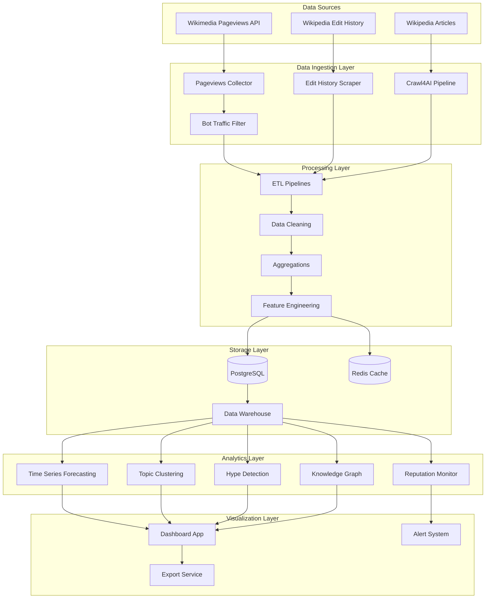

# Design Document: Wikipedia Intelligence System

## Overview

The Wikipedia Intelligence System is a production-ready business intelligence platform that transforms Wikipedia data into actionable business insights. The system follows a layered architecture with five primary components: Data Ingestion, Processing, Storage, Analytics, and Visualization. It leverages the Wikimedia Pageviews API, Wikipedia Edit History, and Crawl4AI web crawler to collect comprehensive data about topics, brands, and industries.

The system is designed for horizontal scalability, real-time processing, and extensibility. It uses asynchronous I/O throughout, implements robust error handling, and provides comprehensive monitoring. The architecture supports both batch analytics (historical trend analysis) and streaming analytics (real-time alerts).

### Key Design Principles

1. **Modularity**: Each component is independently deployable and testable
2. **Scalability**: Horizontal scaling through worker processes and distributed crawling
3. **Resilience**: Circuit breakers, retry logic, and graceful degradation
4. **Performance**: Asynchronous operations, caching, and query optimization
5. **Observability**: Structured logging, metrics, and health checks

## Architecture



### Architecture Layers

**Data Ingestion Layer**: Collects data from three primary sources using specialized collectors. The Pageviews Collector queries the Wikimedia API with rate limiting and bot filtering. The Edit History Scraper extracts revision data and editor metadata. The Crawl4AI Pipeline performs asynchronous crawling with BFS for deep discovery.

**Processing Layer**: ETL pipelines transform raw data into analytics-ready formats. Data cleaning handles missing values, outliers, and schema validation. Aggregations compute metrics at multiple time granularities (hourly, daily, weekly). Feature engineering creates derived metrics like growth rates, velocity, and density scores.

**Storage Layer**: PostgreSQL stores structured data with a star schema optimized for analytics queries. Redis caches frequently accessed data and real-time metrics. The data warehouse implements dimensional modeling with fact tables for pageviews, edits, and crawl results.

**Analytics Layer**: Statistical and machine learning models generate insights. Time series forecasting uses Prophet for demand prediction. Topic clustering groups related articles using TF-IDF and K-means. Hype detection combines multiple signals into composite scores. The reputation monitor analyzes edit patterns for risk assessment. The knowledge graph maps entity relationships.

**Visualization Layer**: Streamlit-based dashboard provides interactive visualizations. The alert system sends notifications for high-priority events. The export service generates reports in CSV and PDF formats.

## Components and Interfaces

### 1. Pageviews Collector

**Purpose**: Collect article traffic statistics from Wikimedia Pageviews API

**Interface**:
```python
class PageviewsCollector:
    def __init__(self, api_client: WikimediaAPIClient, rate_limiter: RateLimiter):
        pass
    
    async def fetch_per_article(
        self, 
        article: str, 
        start_date: datetime, 
        end_date: datetime,
        granularity: str = "daily"
    ) -> List[PageviewRecord]:
        """Fetch pageviews for a specific article"""
        pass
    
    async def fetch_top_articles(
        self, 
        date: datetime, 
        limit: int = 1000
    ) -> List[TopArticleRecord]:
        """Fetch most viewed articles for a date"""
        pass
    
    async def fetch_aggregate(
        self, 
        start_date: datetime, 
        end_date: datetime
    ) -> AggregateStats:
        """Fetch aggregate Wikipedia traffic"""
        pass
```

**Key Behaviors**:
- Implements exponential backoff for rate limit errors (429 status)
- Filters bot traffic using agent_type parameter
- Segments by device type (desktop, mobile-web, mobile-app)
- Validates response schema before returning data
- Logs all API calls with timing metrics

### 2. Edit History Scraper

**Purpose**: Extract edit patterns and editor metadata from Wikipedia revision history

**Interface**:
```python
class EditHistoryScraper:
    def __init__(self, api_client: WikipediaAPIClient):
        pass
    
    async def fetch_revisions(
        self, 
        article: str, 
        start_date: datetime, 
        end_date: datetime
    ) -> List[RevisionRecord]:
        """Fetch all revisions for an article in date range"""
        pass
    
    def calculate_edit_velocity(
        self, 
        revisions: List[RevisionRecord], 
        window_hours: int = 24
    ) -> float:
        """Calculate edits per hour over rolling window"""
        pass
    
    def detect_vandalism_signals(
        self, 
        revisions: List[RevisionRecord]
    ) -> VandalismMetrics:
        """Identify reverted edits and vandalism patterns"""
        pass
```

**Key Behaviors**:
- Classifies editors as anonymous (IP address) or registered (username)
- Detects reverted edits by comparing revision hashes
- Calculates rolling window metrics (24h, 7d, 30d)
- Generates alerts when anonymous edit percentage exceeds threshold

### 3. Crawl4AI Pipeline

**Purpose**: Extract structured content and metadata from Wikipedia articles

**Interface**:
```python
class Crawl4AIPipeline:
    def __init__(self, crawler: AsyncWebCrawler, max_concurrent: int = 10):
        pass
    
    async def crawl_article(
        self, 
        url: str, 
        extract_config: ExtractionConfig
    ) -> ArticleContent:
        """Crawl single article with configured extractors"""
        pass
    
    async def deep_crawl(
        self, 
        seed_url: str, 
        max_depth: int = 2, 
        max_articles: int = 100
    ) -> List[ArticleContent]:
        """Perform BFS crawl starting from seed article"""
        pass
    
    def extract_infobox(self, html: str) -> Dict[str, Any]:
        """Extract infobox data using CSS selectors"""
        pass
    
    def extract_tables(self, html: str) -> List[pd.DataFrame]:
        """Extract all tables from article"""
        pass
```

**Key Behaviors**:
- Uses async/await for concurrent crawling
- Respects robots.txt and implements crawl delays
- Extracts summaries, infoboxes, tables, categories, and internal links
- Supports CSS selector and LLM-based extraction
- Implements checkpointing for long-running deep crawls
- Handles failures gracefully with retry logic

### 4. ETL Pipeline Manager

**Purpose**: Orchestrate data transformation from raw sources to analytics-ready formats

**Interface**:
```python
class ETLPipelineManager:
    def __init__(self, db: Database, cache: RedisCache):
        pass
    
    async def run_pageviews_pipeline(
        self, 
        raw_data: List[PageviewRecord]
    ) -> PipelineResult:
        """Transform pageviews data and load to warehouse"""
        pass
    
    async def run_edits_pipeline(
        self, 
        raw_data: List[RevisionRecord]
    ) -> PipelineResult:
        """Transform edit history and load to warehouse"""
        pass
    
    def validate_data(self, data: List[Record]) -> ValidationResult:
        """Validate data against schema and business rules"""
        pass
    
    def deduplicate(self, data: List[Record]) -> List[Record]:
        """Remove duplicate records based on composite keys"""
        pass
```

**Key Behaviors**:
- Validates data against expected schemas
- Quarantines invalid records for manual review
- Implements idempotent loading (upsert operations)
- Tracks data lineage from source to destination
- Monitors pipeline health with success/failure metrics
- Sends notifications on pipeline failures

### 5. Time Series Forecaster

**Purpose**: Generate demand predictions using historical pageview data

**Interface**:
```python
class TimeSeriesForecaster:
    def __init__(self, model_type: str = "prophet"):
        pass
    
    def train(
        self, 
        historical_data: pd.DataFrame, 
        article: str
    ) -> ForecastModel:
        """Train forecasting model on historical pageviews"""
        pass
    
    def predict(
        self, 
        model: ForecastModel, 
        periods: int = 30
    ) -> ForecastResult:
        """Generate predictions with confidence intervals"""
        pass
    
    def detect_seasonality(
        self, 
        data: pd.DataFrame
    ) -> SeasonalityPattern:
        """Identify seasonal patterns in traffic"""
        pass
    
    def calculate_growth_rate(
        self, 
        data: pd.DataFrame, 
        period_days: int = 30
    ) -> float:
        """Calculate percentage growth over period"""
        pass
```

**Key Behaviors**:
- Requires minimum 90 days of historical data for training
- Generates predictions with upper/lower confidence bounds
- Detects seasonal patterns (weekly, monthly, yearly)
- Flags launch hype when growth exceeds 2 standard deviations
- Retrains models weekly with latest data

### 6. Reputation Monitor

**Purpose**: Analyze edit patterns to assess brand reputation risk

**Interface**:
```python
class ReputationMonitor:
    def __init__(self, alert_threshold: float = 0.7):
        pass
    
    def calculate_reputation_risk(
        self, 
        edit_metrics: EditMetrics
    ) -> ReputationScore:
        """Calculate composite reputation risk score (0-1)"""
        pass
    
    def detect_edit_spikes(
        self, 
        edit_velocity: float, 
        baseline: float
    ) -> bool:
        """Detect when edit rate exceeds 3x baseline"""
        pass
    
    def calculate_vandalism_rate(
        self, 
        revisions: List[RevisionRecord]
    ) -> float:
        """Calculate percentage of reverted edits"""
        pass
    
    def generate_alert(
        self, 
        article: str, 
        risk_score: float
    ) -> Alert:
        """Generate reputation risk alert"""
        pass
```

**Key Behaviors**:
- Combines edit velocity, vandalism rate, and anonymous edit percentage
- Generates high-priority alerts when risk exceeds 70%
- Tracks sentiment from edit summaries and talk pages
- Provides historical reputation trend visualization

### 7. Topic Clustering Engine

**Purpose**: Group related articles by industry and calculate comparative metrics

**Interface**:
```python
class TopicClusteringEngine:
    def __init__(self, n_clusters: int = 20):
        pass
    
    def cluster_articles(
        self, 
        articles: List[ArticleContent]
    ) -> ClusteringResult:
        """Cluster articles using TF-IDF and K-means"""
        pass
    
    def calculate_cluster_growth(
        self, 
        cluster_id: int, 
        pageviews: pd.DataFrame
    ) -> GrowthMetrics:
        """Calculate growth rate for topic cluster"""
        pass
    
    def calculate_topic_cagr(
        self, 
        cluster_id: int, 
        years: int = 1
    ) -> float:
        """Calculate compound annual growth rate"""
        pass
    
    def compare_industries(
        self, 
        cluster_ids: List[int]
    ) -> ComparisonResult:
        """Generate comparative metrics across industries"""
        pass
```

**Key Behaviors**:
- Uses TF-IDF vectorization for article content
- Applies K-means clustering to group related topics
- Normalizes pageviews by baseline traffic for fair comparison
- Calculates CAGR for long-term trend analysis
- Identifies emerging topics with accelerating growth

### 8. Hype Detection Engine

**Purpose**: Identify trending topics and calculate hype scores

**Interface**:
```python
class HypeDetectionEngine:
    def __init__(self, hype_threshold: float = 0.75):
        pass
    
    def calculate_hype_score(
        self, 
        view_velocity: float, 
        edit_growth: float, 
        content_expansion: float
    ) -> float:
        """Calculate composite hype score (0-1)"""
        pass
    
    def calculate_attention_density(
        self, 
        pageviews: pd.DataFrame, 
        window_days: int = 7
    ) -> float:
        """Calculate sustained attention over time window"""
        pass
    
    def detect_attention_spikes(
        self, 
        pageviews: pd.DataFrame
    ) -> List[SpikeEvent]:
        """Identify sudden attention increases"""
        pass
    
    def distinguish_spike_types(
        self, 
        spike: SpikeEvent
    ) -> SpikeType:
        """Classify as sustained growth or temporary spike"""
        pass
```

**Key Behaviors**:
- Combines view velocity, edit growth, and content expansion
- Flags articles as trending when hype score exceeds threshold
- Distinguishes between sustained growth and temporary spikes
- Correlates spikes with external events (product launches, news)
- Provides hype lifecycle visualization (emergence, peak, decline)

### 9. Knowledge Graph Builder

**Purpose**: Construct and analyze domain knowledge graphs from article relationships

**Interface**:
```python
class KnowledgeGraphBuilder:
    def __init__(self, graph_db: GraphDatabase):
        pass
    
    def build_graph(
        self, 
        articles: List[ArticleContent]
    ) -> KnowledgeGraph:
        """Construct graph with articles as nodes, links as edges"""
        pass
    
    def calculate_centrality(
        self, 
        graph: KnowledgeGraph
    ) -> Dict[str, float]:
        """Calculate centrality metrics for all nodes"""
        pass
    
    def detect_communities(
        self, 
        graph: KnowledgeGraph
    ) -> List[Community]:
        """Identify clusters representing industries/competitors"""
        pass
    
    def update_incremental(
        self, 
        graph: KnowledgeGraph, 
        new_articles: List[ArticleContent]
    ) -> KnowledgeGraph:
        """Update graph with newly crawled articles"""
        pass
```

**Key Behaviors**:
- Uses internal links to create directed edges
- Calculates betweenness and eigenvector centrality
- Detects communities using Louvain algorithm
- Supports incremental updates without full rebuild
- Provides interactive graph visualization

### 10. Dashboard Application

**Purpose**: Provide interactive visualizations and real-time monitoring

**Interface**:
```python
class DashboardApp:
    def __init__(self, db: Database, cache: RedisCache):
        pass
    
    def render_demand_trends(
        self, 
        articles: List[str], 
        date_range: DateRange
    ) -> Chart:
        """Render time series chart for product demand"""
        pass
    
    def render_competitor_comparison(
        self, 
        competitors: List[str]
    ) -> Table:
        """Render sortable comparison table"""
        pass
    
    def render_reputation_alerts(self) -> AlertPanel:
        """Display active reputation risk alerts"""
        pass
    
    def render_topic_heatmap(
        self, 
        clusters: List[int]
    ) -> Heatmap:
        """Render emerging topic heatmap"""
        pass
    
    def export_data(
        self, 
        format: str, 
        data: pd.DataFrame
    ) -> bytes:
        """Export dashboard data to CSV or PDF"""
        pass
```

**Key Behaviors**:
- Auto-refreshes data every 5 minutes (configurable)
- Allows filtering by date range, industry, and metric type
- Displays alerts prominently with color coding
- Supports CSV and PDF export
- Implements lazy loading for large datasets
- Uses Redis cache for sub-second response times

## Data Models

### Database Schema

**Fact Tables**:

```sql
-- Pageviews fact table (partitioned by date)
CREATE TABLE fact_pageviews (
    id BIGSERIAL PRIMARY KEY,
    article_id INTEGER NOT NULL REFERENCES dim_articles(id),
    date_id INTEGER NOT NULL REFERENCES dim_dates(id),
    hour INTEGER CHECK (hour >= 0 AND hour < 24),
    device_type VARCHAR(20) NOT NULL,
    views_human INTEGER NOT NULL DEFAULT 0,
    views_bot INTEGER NOT NULL DEFAULT 0,
    views_total INTEGER NOT NULL DEFAULT 0,
    UNIQUE(article_id, date_id, hour, device_type)
) PARTITION BY RANGE (date_id);

-- Edits fact table
CREATE TABLE fact_edits (
    id BIGSERIAL PRIMARY KEY,
    article_id INTEGER NOT NULL REFERENCES dim_articles(id),
    revision_id BIGINT NOT NULL UNIQUE,
    timestamp TIMESTAMP NOT NULL,
    editor_type VARCHAR(20) NOT NULL,
    is_reverted BOOLEAN DEFAULT FALSE,
    bytes_changed INTEGER,
    edit_summary TEXT
);

-- Crawl results fact table
CREATE TABLE fact_crawl_results (
    id BIGSERIAL PRIMARY KEY,
    article_id INTEGER NOT NULL REFERENCES dim_articles(id),
    crawl_timestamp TIMESTAMP NOT NULL,
    content_length INTEGER,
    infobox_data JSONB,
    categories TEXT[],
    internal_links TEXT[],
    tables_count INTEGER DEFAULT 0
);
```

**Dimension Tables**:

```sql
-- Articles dimension
CREATE TABLE dim_articles (
    id SERIAL PRIMARY KEY,
    title VARCHAR(500) NOT NULL UNIQUE,
    url TEXT NOT NULL,
    namespace VARCHAR(50),
    first_seen TIMESTAMP DEFAULT CURRENT_TIMESTAMP,
    last_updated TIMESTAMP DEFAULT CURRENT_TIMESTAMP
);

-- Dates dimension
CREATE TABLE dim_dates (
    id SERIAL PRIMARY KEY,
    date DATE NOT NULL UNIQUE,
    year INTEGER NOT NULL,
    quarter INTEGER NOT NULL,
    month INTEGER NOT NULL,
    week INTEGER NOT NULL,
    day_of_week INTEGER NOT NULL,
    is_weekend BOOLEAN NOT NULL
);

-- Clusters dimension
CREATE TABLE dim_clusters (
    id SERIAL PRIMARY KEY,
    cluster_name VARCHAR(200) NOT NULL,
    industry VARCHAR(100),
    description TEXT,
    created_at TIMESTAMP DEFAULT CURRENT_TIMESTAMP
);

-- Article-Cluster mapping
CREATE TABLE map_article_clusters (
    article_id INTEGER NOT NULL REFERENCES dim_articles(id),
    cluster_id INTEGER NOT NULL REFERENCES dim_clusters(id),
    confidence_score FLOAT CHECK (confidence_score >= 0 AND confidence_score <= 1),
    PRIMARY KEY (article_id, cluster_id)
);
```

**Aggregated Metrics Tables**:

```sql
-- Daily article metrics
CREATE TABLE agg_article_metrics_daily (
    article_id INTEGER NOT NULL REFERENCES dim_articles(id),
    date DATE NOT NULL,
    total_views INTEGER NOT NULL,
    view_growth_rate FLOAT,
    edit_count INTEGER DEFAULT 0,
    edit_velocity FLOAT,
    hype_score FLOAT,
    reputation_risk FLOAT,
    PRIMARY KEY (article_id, date)
);

-- Cluster metrics
CREATE TABLE agg_cluster_metrics (
    cluster_id INTEGER NOT NULL REFERENCES dim_clusters(id),
    date DATE NOT NULL,
    total_views INTEGER NOT NULL,
    article_count INTEGER NOT NULL,
    avg_growth_rate FLOAT,
    topic_cagr FLOAT,
    PRIMARY KEY (cluster_id, date)
);
```

**Indexes**:

```sql
CREATE INDEX idx_pageviews_article_date ON fact_pageviews(article_id, date_id);
CREATE INDEX idx_pageviews_date ON fact_pageviews(date_id);
CREATE INDEX idx_edits_article_timestamp ON fact_edits(article_id, timestamp);
CREATE INDEX idx_edits_timestamp ON fact_edits(timestamp);
CREATE INDEX idx_crawl_article ON fact_crawl_results(article_id);
CREATE INDEX idx_articles_title ON dim_articles(title);
CREATE INDEX idx_dates_date ON dim_dates(date);
```

### Redis Cache Schema

**Key Patterns**:

```
# Real-time metrics (TTL: 5 minutes)
metrics:article:{article_id}:realtime -> JSON
metrics:cluster:{cluster_id}:realtime -> JSON

# Dashboard data (TTL: 5 minutes)
dashboard:demand_trends:{hash} -> JSON
dashboard:competitor_comparison:{hash} -> JSON
dashboard:topic_heatmap:{hash} -> JSON

# Active alerts (TTL: 1 hour)
alerts:reputation:{article_id} -> JSON
alerts:hype:{article_id} -> JSON

# API rate limiting (TTL: 1 second)
ratelimit:wikimedia:{timestamp} -> INTEGER
ratelimit:crawler:{timestamp} -> INTEGER

# Pipeline status (TTL: 24 hours)
pipeline:status:{pipeline_id} -> JSON
pipeline:checkpoint:{pipeline_id} -> JSON
```

### Data Transfer Objects

```python
@dataclass
class PageviewRecord:
    article: str
    timestamp: datetime
    device_type: str
    views_human: int
    views_bot: int
    views_total: int

@dataclass
class RevisionRecord:
    article: str
    revision_id: int
    timestamp: datetime
    editor_type: str  # "anonymous" or "registered"
    editor_id: str
    is_reverted: bool
    bytes_changed: int
    edit_summary: str

@dataclass
class ArticleContent:
    title: str
    url: str
    summary: str
    infobox: Dict[str, Any]
    tables: List[pd.DataFrame]
    categories: List[str]
    internal_links: List[str]
    crawl_timestamp: datetime

@dataclass
class ForecastResult:
    article: str
    predictions: pd.DataFrame  # columns: date, yhat, yhat_lower, yhat_upper
    seasonality: SeasonalityPattern
    growth_rate: float
    confidence: float

@dataclass
class ReputationScore:
    article: str
    risk_score: float  # 0-1
    edit_velocity: float
    vandalism_rate: float
    anonymous_edit_pct: float
    alert_level: str  # "low", "medium", "high"
    timestamp: datetime

@dataclass
class HypeMetrics:
    article: str
    hype_score: float  # 0-1
    view_velocity: float
    edit_growth: float
    content_expansion: float
    attention_density: float
    is_trending: bool
    spike_events: List[SpikeEvent]
```


## Correctness Properties

A property is a characteristic or behavior that should hold true across all valid executions of a system—essentially, a formal statement about what the system should do. Properties serve as the bridge between human-readable specifications and machine-verifiable correctness guarantees.

### Property Reflection

After analyzing all acceptance criteria, I identified several areas of redundancy:

1. **API Response Validation**: Multiple criteria (1.1, 1.2, 1.3, 1.7) test API response handling. These can be consolidated into a single property about response schema validation.

2. **Data Extraction Completeness**: Criteria 2.1, 3.1, 3.4, 3.6 all test that required fields are extracted. These can be combined into properties about extraction completeness for each data source.

3. **Calculation Formulas**: Multiple criteria (2.4, 5.6, 6.2, 6.3, 7.2, 7.4, 9.1, 9.3) test specific calculations. Each unique formula gets one property.

4. **Alert Generation**: Criteria 2.5, 6.1, 6.4, 9.2 all test conditional alert generation. These can be consolidated by alert type.

5. **Caching and Storage**: Criteria 4.2, 4.7 test storage behavior. These remain separate as they test different aspects.

6. **Error Handling**: Criteria 1.6, 3.7, 3.8, 11.2, 12.5 test various error scenarios. These can be grouped by error type.

The following properties represent the unique, non-redundant set of testable behaviors.

### Data Collection Properties

**Property 1: API Response Schema Validation**
*For any* API response from Wikimedia Pageviews API (per-article, top articles, or aggregate), the System should validate the response against the expected schema and reject responses that don't match.
**Validates: Requirements 1.1, 1.2, 1.3, 1.7**

**Property 2: Bot Traffic Filtering**
*For any* pageview request, the System should include bot filtering parameters and return separate counts for human and bot traffic.
**Validates: Requirements 1.4**

**Property 3: Device Segmentation**
*For any* pageview request, the System should return data segmented by all device types (desktop, mobile-web, mobile-app).
**Validates: Requirements 1.5**

**Property 4: Exponential Backoff on Rate Limits**
*For any* sequence of rate limit errors (429 status), the System should implement exponential backoff where each retry delay is at least 2x the previous delay.
**Validates: Requirements 1.6**

### Edit History Properties

**Property 5: Edit Data Extraction Completeness**
*For any* edit history response, the System should extract all required fields (edit count, timestamp, editor identifier) for every revision.
**Validates: Requirements 2.1**

**Property 6: Editor Classification**
*For any* editor in edit history, the System should classify them as exactly one of "anonymous" or "registered" based on whether the identifier is an IP address.
**Validates: Requirements 2.2**

**Property 7: Revert Detection**
*For any* edit history containing reverted edits, the System should flag all reverted edits as potential vandalism signals.
**Validates: Requirements 2.3**

**Property 8: Edit Velocity Calculation**
*For any* article's edit history and time window, the System should calculate edit velocity as (number of edits in window) / (window duration in hours).
**Validates: Requirements 2.4**

**Property 9: Reputation Risk Alert Generation**
*For any* article where anonymous edit percentage exceeds the configured threshold, the System should generate a reputation risk alert.
**Validates: Requirements 2.5**

**Property 10: Rolling Window Metrics**
*For any* edit history, the System should calculate metrics for all specified rolling windows (24h, 7d, 30d).
**Validates: Requirements 2.6**

### Web Crawling Properties

**Property 11: Article Content Extraction Completeness**
*For any* Wikipedia article, the System should extract all available elements (summary, infobox, tables, categories, internal links) when present in the HTML.
**Validates: Requirements 3.1**

**Property 12: BFS Crawl Order**
*For any* deep crawl starting from a seed article, all articles at depth N should be discovered and queued before any article at depth N+1 is crawled.
**Validates: Requirements 3.3**

**Property 13: CSS Selector Extraction**
*For any* article and CSS selector configuration, the System should extract all elements matching the selector.
**Validates: Requirements 3.4**

**Property 14: LLM Extraction When Configured**
*For any* article when LLM extraction is enabled, the System should use the configured AI model to parse unstructured content.
**Validates: Requirements 3.5**

**Property 15: Internal Link Extraction**
*For any* article, the System should extract all internal Wikipedia links (href starting with "/wiki/").
**Validates: Requirements 3.6**

**Property 16: Crawl Rate Limiting**
*For any* crawl session, the System should respect robots.txt directives and implement delays when rate limits are encountered.
**Validates: Requirements 3.7**

**Property 17: Graceful Crawl Failure Handling**
*For any* crawl failure (network error, timeout, invalid HTML), the System should log the error with context and continue processing other articles without crashing.
**Validates: Requirements 3.8**

### Storage Properties

**Property 18: Redis Cache Round-Trip**
*For any* real-time metric data, storing to Redis cache and then retrieving should return equivalent data.
**Validates: Requirements 4.2**

**Property 19: Referential Integrity Enforcement**
*For any* attempt to insert a record with an invalid foreign key reference, the database should reject the insertion and return an integrity constraint error.
**Validates: Requirements 4.7**

### Forecasting Properties

**Property 20: Minimum Training Data Requirement**
*For any* forecasting model training request with less than 90 days of historical data, the System should reject the request or issue a warning.
**Validates: Requirements 5.2**

**Property 21: Prediction Confidence Intervals**
*For any* trained forecasting model and prediction request, the System should return predictions with both upper and lower confidence bounds.
**Validates: Requirements 5.3**

**Property 22: Seasonal Pattern Detection**
*For any* pageview time series with periodic patterns (weekly, monthly, yearly), the System should detect and report the seasonality.
**Validates: Requirements 5.4**

**Property 23: Hype Event Flagging**
*For any* article where pageview growth exceeds 2 standard deviations from the mean, the System should flag it as a launch hype event.
**Validates: Requirements 5.5**

**Property 24: View Growth Rate Calculation**
*For any* pageview time series and time period, the System should calculate growth rate as ((views_end - views_start) / views_start) * 100.
**Validates: Requirements 5.6**

### Reputation Monitoring Properties

**Property 25: Edit Spike Alert Generation**
*For any* article where current edit velocity exceeds 3x the baseline rate, the System should generate a reputation risk alert.
**Validates: Requirements 6.1**

**Property 26: Vandalism Percentage Calculation**
*For any* edit history, the System should calculate vandalism percentage as (reverted_edits / total_edits) * 100.
**Validates: Requirements 6.2**

**Property 27: Reputation Risk Score Calculation**
*For any* article, the System should calculate reputation risk score as a weighted combination of edit velocity, vandalism rate, and anonymous edit percentage, normalized to 0-1 range.
**Validates: Requirements 6.3**

**Property 28: High-Priority Alert Threshold**
*For any* article where reputation risk score exceeds 0.7, the System should send a high-priority alert.
**Validates: Requirements 6.4**

### Topic Clustering Properties

**Property 29: Article Clustering**
*For any* set of articles, the System should assign each article to at least one cluster, and similar articles (by content) should have higher probability of being in the same cluster.
**Validates: Requirements 7.1**

**Property 30: Cluster Growth Rate Calculation**
*For any* topic cluster and time period, the System should calculate growth rate as the aggregate pageview growth of all articles in the cluster.
**Validates: Requirements 7.2**

**Property 31: Baseline Normalization**
*For any* industry comparison, the System should normalize pageviews by dividing by baseline traffic before comparing.
**Validates: Requirements 7.3**

**Property 32: Topic CAGR Calculation**
*For any* topic cluster with at least 1 year of data, the System should calculate CAGR as ((ending_value / beginning_value)^(1/years) - 1) * 100.
**Validates: Requirements 7.4**

**Property 33: Emerging Topic Identification**
*For any* topic cluster with accelerating growth (second derivative > 0), the System should flag it as an emerging topic.
**Validates: Requirements 7.6**

### Dashboard Properties

**Property 34: Competitor Table Sorting**
*For any* competitor comparison table and sort column, clicking the column header should reorder rows by that column's values in ascending or descending order.
**Validates: Requirements 8.2**

**Property 35: Alert Display on Risk Detection**
*For any* active reputation risk alert, the dashboard should display the alert prominently in the alerts panel.
**Validates: Requirements 8.3**

**Property 36: Leaderboard Ranking**
*For any* traffic leaderboard, articles should be ranked in descending order by total pageviews.
**Validates: Requirements 8.5**

**Property 37: Dashboard Auto-Refresh**
*For any* dashboard with auto-refresh enabled, data should be reloaded at the configured interval (default 5 minutes).
**Validates: Requirements 8.6**

**Property 38: Data Filtering**
*For any* dashboard filter combination (date range, industry, metric type), only data matching all active filters should be displayed.
**Validates: Requirements 8.7**

**Property 39: Export Format Validity**
*For any* dashboard data export, the output file should be valid in the requested format (CSV or PDF) and parseable by standard tools.
**Validates: Requirements 8.8**

### Hype Detection Properties

**Property 40: Hype Score Calculation**
*For any* article, the System should calculate hype score as a weighted combination of view velocity, edit growth, and content expansion rate, normalized to 0-1 range.
**Validates: Requirements 9.1**

**Property 41: Trending Flag on Hype Threshold**
*For any* article where hype score exceeds the configured threshold, the System should flag it as trending.
**Validates: Requirements 9.2**

**Property 42: Attention Density Calculation**
*For any* article and time window, the System should calculate attention density as (total pageviews in window) / (window duration).
**Validates: Requirements 9.3**

**Property 43: Attention Spike Detection**
*For any* pageview time series, the System should detect spikes where pageviews exceed the rolling mean by more than 2 standard deviations.
**Validates: Requirements 9.4**

**Property 44: Growth Pattern Classification**
*For any* detected attention spike, the System should classify it as "sustained growth" if pageviews remain elevated for >7 days, otherwise "temporary spike".
**Validates: Requirements 9.5**

### Knowledge Graph Properties

**Property 45: Related Article Discovery**
*For any* deep crawl, the System should discover all articles reachable through internal links up to the configured maximum depth.
**Validates: Requirements 10.1**

**Property 46: Knowledge Graph Construction**
*For any* set of crawled articles, the System should construct a graph where each article is a node and each internal link is a directed edge.
**Validates: Requirements 10.2**

**Property 47: Graph Clustering**
*For any* knowledge graph, the System should identify clusters using community detection algorithms, grouping densely connected nodes.
**Validates: Requirements 10.3**

**Property 48: Centrality Calculation**
*For any* knowledge graph, the System should calculate centrality metrics (betweenness, eigenvector) for all nodes.
**Validates: Requirements 10.4**

**Property 49: Incremental Graph Updates**
*For any* existing knowledge graph and new crawled articles, adding the new articles should update the graph without requiring a full rebuild of existing nodes.
**Validates: Requirements 10.6**

### ETL and Data Quality Properties

**Property 50: Invalid Data Quarantine**
*For any* data record that fails validation, the System should quarantine it (not load to main tables) and log the validation error with record details.
**Validates: Requirements 11.2**

**Property 51: Idempotent Data Loading**
*For any* dataset, loading it multiple times should result in the same final state as loading it once (no duplicates created).
**Validates: Requirements 11.3**

**Property 52: Data Lineage Tracking**
*For any* data record in analytics tables, the System should maintain lineage information tracing back to the original source and transformation steps.
**Validates: Requirements 11.4**

**Property 53: Pipeline Health Metrics**
*For any* pipeline execution, the System should record success/failure status, execution time, and record counts processed.
**Validates: Requirements 11.5**

**Property 54: Failure Notifications**
*For any* pipeline failure, the System should send a notification to configured administrators within 1 minute.
**Validates: Requirements 11.6**

**Property 55: Crawl Checkpointing**
*For any* long-running crawl operation, the System should create checkpoints at regular intervals, and resuming from a checkpoint should continue from the saved state without re-crawling completed articles.
**Validates: Requirements 11.7**

**Property 56: Record Deduplication**
*For any* dataset with duplicate records (same article_id and timestamp), the System should keep only one record based on the deduplication strategy.
**Validates: Requirements 11.8**

### Rate Limiting Properties

**Property 57: API Rate Limit Compliance**
*For any* time window of 1 second, the System should make no more than 200 requests to the Wikimedia API.
**Validates: Requirements 12.1**

**Property 58: Automatic Request Throttling**
*For any* situation where request rate approaches 90% of the limit, the System should automatically throttle subsequent requests to stay under the limit.
**Validates: Requirements 12.2**

**Property 59: Priority Queue Ordering**
*For any* request queue with mixed priority levels, higher priority requests should be processed before lower priority requests submitted at the same time.
**Validates: Requirements 12.3**

**Property 60: Circuit Breaker Pattern**
*For any* API endpoint that fails more than the threshold number of times, the circuit breaker should open (reject requests immediately), and after the timeout period, should attempt one test request before fully closing.
**Validates: Requirements 12.5**

**Property 61: API Request Logging**
*For any* API request, the System should log the request with timestamp, endpoint, parameters, and response code.
**Validates: Requirements 12.6**

**Property 62: API Usage Metrics Collection**
*For any* API request, the System should increment usage metrics (request count, error count, latency) that are queryable from monitoring dashboards.
**Validates: Requirements 12.7**

### Logging Properties

**Property 63: Error Logging Completeness**
*For any* error or exception, the System should log it with stack trace, error message, and contextual information (user, operation, input data).
**Validates: Requirements 14.1**

**Property 64: Lifecycle Event Logging**
*For any* pipeline start or completion event, the System should log an informational message with pipeline name, timestamp, and status.
**Validates: Requirements 14.2**

**Property 65: Structured Log Format**
*For any* log message, the output should be valid JSON with standard fields (timestamp, level, message, context).
**Validates: Requirements 14.3**

**Property 66: Metrics Collection**
*For any* data ingestion, processing, or storage operation, the System should collect and expose metrics for rates, latency, and utilization.
**Validates: Requirements 14.4**

### Configuration Properties

**Property 67: Configuration Loading**
*For any* configuration parameter, the System should load it from environment variables first, then config files, with environment variables taking precedence.
**Validates: Requirements 15.1**

**Property 68: Configuration Profile Support**
*For any* configuration profile (development, staging, production), loading that profile should apply the profile-specific settings.
**Validates: Requirements 15.2**

**Property 69: Configuration Validation on Startup**
*For any* invalid configuration (missing required parameter, invalid value type, out-of-range value), the System should fail startup with a clear error message.
**Validates: Requirements 15.3**

**Property 70: Runtime Configuration Updates**
*For any* non-critical configuration parameter, updating it at runtime should apply the new value to subsequent operations without requiring restart.
**Validates: Requirements 15.4**

**Property 71: Sensitive Value Encryption**
*For any* sensitive configuration value (API key, password, token), the System should store it encrypted and decrypt only when needed for use.
**Validates: Requirements 15.6**

## Error Handling

The system implements comprehensive error handling across all layers:

### Data Ingestion Layer Errors

**API Errors**:
- **Rate Limiting (429)**: Implement exponential backoff with jitter, starting at 1 second
- **Authentication (401/403)**: Log error, send alert to administrators, halt collection
- **Not Found (404)**: Log warning, skip article, continue processing
- **Server Errors (5xx)**: Retry up to 3 times with exponential backoff, then quarantine request
- **Timeout**: Retry with increased timeout (up to 60 seconds), then fail gracefully

**Crawl Errors**:
- **Network Failures**: Retry up to 3 times, log error, continue with next article
- **Invalid HTML**: Log warning with URL, extract what's possible, mark as partial success
- **Robots.txt Violations**: Respect directives, skip disallowed URLs, log compliance
- **JavaScript Required**: Use headless browser mode if configured, otherwise skip with warning

### Processing Layer Errors

**Validation Errors**:
- **Schema Mismatch**: Quarantine record, log detailed error, increment validation_failure metric
- **Missing Required Fields**: Attempt to fill with defaults if configured, otherwise quarantine
- **Out-of-Range Values**: Clamp to valid range if configured, otherwise quarantine
- **Type Conversion Failures**: Log error with original value, quarantine record

**Transformation Errors**:
- **Division by Zero**: Return null or configured default, log warning
- **Null Pointer**: Skip transformation, log error, use original value
- **Overflow**: Clamp to maximum value, log warning
- **Encoding Errors**: Attempt UTF-8 conversion, replace invalid characters, log warning

### Storage Layer Errors

**Database Errors**:
- **Connection Failures**: Retry with exponential backoff, use connection pool failover
- **Constraint Violations**: Log error with violating data, skip record, continue processing
- **Deadlocks**: Retry transaction up to 3 times with random jitter
- **Disk Full**: Send critical alert, halt writes, enable read-only mode

**Cache Errors**:
- **Redis Unavailable**: Fall back to database queries, log degraded performance warning
- **Cache Miss**: Query database, populate cache, continue normally
- **Serialization Errors**: Log error, skip caching, return data directly from database

### Analytics Layer Errors

**Model Errors**:
- **Insufficient Data**: Return error message, log warning, skip prediction
- **Convergence Failures**: Try alternative model parameters, log warning, return null if all fail
- **Invalid Predictions**: Clamp to reasonable bounds, log warning, flag as low confidence
- **Memory Errors**: Reduce batch size, retry, send alert if persistent

### Visualization Layer Errors

**Rendering Errors**:
- **Missing Data**: Display "No data available" message, log warning
- **Timeout**: Show cached data with staleness indicator, retry in background
- **Invalid Chart Configuration**: Use default configuration, log error
- **Export Failures**: Return error message to user, log detailed error

### Error Recovery Strategies

1. **Graceful Degradation**: System continues operating with reduced functionality when components fail
2. **Circuit Breakers**: Prevent cascading failures by stopping requests to failing services
3. **Retry with Backoff**: Automatic retry for transient failures with exponential backoff
4. **Fallback Values**: Use cached or default values when real-time data unavailable
5. **Health Checks**: Continuous monitoring with automatic alerts for critical failures

## Testing Strategy

The Wikipedia Intelligence System requires comprehensive testing across multiple dimensions: unit tests for specific examples and edge cases, property-based tests for universal correctness properties, integration tests for component interactions, and end-to-end tests for complete workflows.

### Testing Approach

**Dual Testing Strategy**:
- **Unit Tests**: Verify specific examples, edge cases, and error conditions
- **Property-Based Tests**: Verify universal properties across all inputs using randomized testing
- Both approaches are complementary and necessary for comprehensive coverage

**Property-Based Testing Configuration**:
- Library: **Hypothesis** (Python)
- Minimum iterations: **100 per property test**
- Each property test references its design document property
- Tag format: `# Feature: wikipedia-intelligence-system, Property {number}: {property_text}`

### Unit Testing Focus Areas

Unit tests should focus on:

1. **Specific Examples**: Concrete cases demonstrating correct behavior
   - Example: Test pageview collection for "Python_(programming_language)" article
   - Example: Test edit history parsing for article with known vandalism
   - Example: Test hype score calculation with specific input values

2. **Edge Cases**: Boundary conditions and special scenarios
   - Empty datasets (no pageviews, no edits)
   - Single-element datasets
   - Maximum values (rate limits, data sizes)
   - Special characters in article titles
   - Malformed API responses

3. **Error Conditions**: Specific failure scenarios
   - API returns 404 for non-existent article
   - Database connection fails during write
   - Invalid configuration values
   - Timeout during crawl operation

4. **Integration Points**: Component interactions
   - ETL pipeline end-to-end with mock data sources
   - Dashboard rendering with mock database
   - Alert system with mock notification service

### Property-Based Testing Focus Areas

Property tests should verify universal correctness properties:

1. **Invariants**: Properties that always hold
   - Edit velocity is always non-negative
   - Hype score is always between 0 and 1
   - Cluster assignments cover all articles

2. **Round-Trip Properties**: Operations with inverses
   - Redis cache: store then retrieve returns equivalent data (Property 18)
   - Configuration: serialize then deserialize preserves values

3. **Idempotence**: Operations that can be repeated safely
   - Loading same data multiple times creates no duplicates (Property 51)
   - Applying same filter multiple times gives same result

4. **Metamorphic Properties**: Relationships between operations
   - Filtering reduces or maintains dataset size
   - Aggregation reduces record count
   - Normalization preserves relative ordering

5. **Error Handling**: Graceful failure across inputs
   - Invalid data is quarantined, not loaded (Property 50)
   - Crawl failures don't crash the system (Property 17)

### Test Organization

```
tests/
├── unit/
│   ├── test_pageviews_collector.py
│   ├── test_edit_history_scraper.py
│   ├── test_crawl4ai_pipeline.py
│   ├── test_etl_pipelines.py
│   ├── test_forecasting.py
│   ├── test_reputation_monitor.py
│   ├── test_clustering.py
│   ├── test_hype_detection.py
│   ├── test_knowledge_graph.py
│   └── test_dashboard.py
├── property/
│   ├── test_data_collection_properties.py
│   ├── test_edit_history_properties.py
│   ├── test_crawling_properties.py
│   ├── test_storage_properties.py
│   ├── test_forecasting_properties.py
│   ├── test_reputation_properties.py
│   ├── test_clustering_properties.py
│   ├── test_dashboard_properties.py
│   ├── test_hype_properties.py
│   ├── test_knowledge_graph_properties.py
│   ├── test_etl_properties.py
│   ├── test_rate_limiting_properties.py
│   ├── test_logging_properties.py
│   └── test_configuration_properties.py
├── integration/
│   ├── test_end_to_end_pipeline.py
│   ├── test_dashboard_integration.py
│   └── test_alert_system.py
└── fixtures/
    ├── sample_pageviews.json
    ├── sample_edit_history.json
    ├── sample_articles.html
    └── test_config.yaml
```

### Example Property Test

```python
from hypothesis import given, strategies as st
import pytest

# Feature: wikipedia-intelligence-system, Property 24: View Growth Rate Calculation
@given(
    views_start=st.integers(min_value=1, max_value=1000000),
    views_end=st.integers(min_value=1, max_value=1000000)
)
def test_view_growth_rate_calculation(views_start, views_end):
    """
    Property 24: For any pageview time series and time period,
    the System should calculate growth rate as
    ((views_end - views_start) / views_start) * 100
    """
    forecaster = TimeSeriesForecaster()
    
    # Create simple time series
    data = pd.DataFrame({
        'date': pd.date_range('2024-01-01', periods=2),
        'views': [views_start, views_end]
    })
    
    growth_rate = forecaster.calculate_growth_rate(data, period_days=1)
    expected = ((views_end - views_start) / views_start) * 100
    
    assert abs(growth_rate - expected) < 0.01, \
        f"Growth rate {growth_rate} doesn't match expected {expected}"
```

### Example Unit Test

```python
def test_reputation_risk_high_priority_alert():
    """Test that high reputation risk (>70%) triggers high-priority alert"""
    monitor = ReputationMonitor(alert_threshold=0.7)
    
    # Create metrics with high risk
    metrics = EditMetrics(
        edit_velocity=50.0,  # 50 edits/hour
        vandalism_rate=0.4,  # 40% vandalism
        anonymous_edit_pct=0.8  # 80% anonymous
    )
    
    score = monitor.calculate_reputation_risk(metrics)
    assert score.risk_score > 0.7
    assert score.alert_level == "high"
    
    alert = monitor.generate_alert("Test_Article", score.risk_score)
    assert alert.priority == "high"
    assert "Test_Article" in alert.message
```

### Test Coverage Goals

- **Unit Test Coverage**: Minimum 80% line coverage for all modules
- **Property Test Coverage**: All 71 correctness properties implemented
- **Integration Test Coverage**: All major workflows (data collection → processing → storage → analytics → visualization)
- **Edge Case Coverage**: All identified edge cases from requirements

### Continuous Testing

- Run unit tests on every commit (< 2 minutes)
- Run property tests on every pull request (< 10 minutes)
- Run integration tests nightly (< 30 minutes)
- Run full test suite before releases

### Test Data Management

- Use fixtures for consistent test data
- Generate realistic synthetic data for property tests
- Mock external APIs (Wikimedia, Wikipedia) to avoid rate limits
- Use test database with sample data for integration tests
- Clean up test data after each test run
