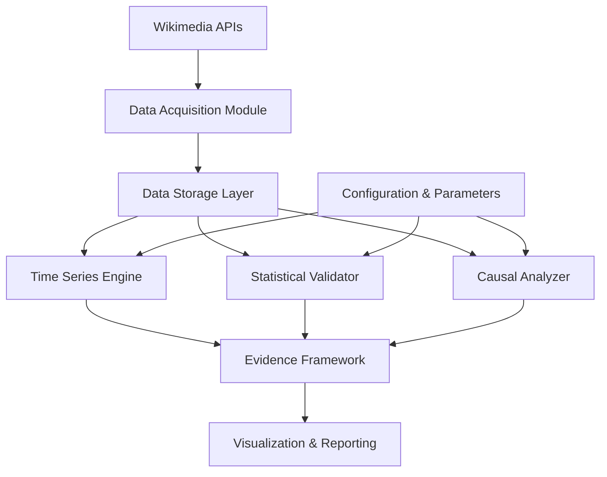

# Design Document: Wikipedia Product Health Analysis

## Overview

The Wikipedia Product Health Analysis system is a rigorous, evidence-based analytics platform that evaluates Wikipedia's product health using time-series data from 2015-2025. The system addresses 11 specific research questions about Wikipedia's product health, from AI search impact to mobile dependency risks to campaign effectiveness.

The system distinguishes itself from traditional descriptive analytics by implementing formal statistical validation, causal inference methodologies, and multi-source cross-validation for all findings. Every trend claim requires statistical significance testing, every causal claim requires causal inference methodology, and every conclusion requires cross-validation across multiple data sources.

**Research Questions Addressed:**
1. **AI-Assisted Search Impact** - Detect structural changes coinciding with ChatGPT (Nov 2022) and Google AI Overviews (May 2024) using PELT, Binary Segmentation, and Bayesian changepoint detection with Chow test validation
2. **Future Traffic Projections** - Generate 12-24 month forecasts using ARIMA, Prophet, and Exponential Smoothing ensemble with 50%, 80%, 95% prediction intervals
3. **Mobile Dependency Risk** - Calculate HHI concentration index and model 10%, 20%, 30% decline scenarios for dominant platforms
4. **Usage Pattern Evolution** - Segment into pre-pandemic (2015-2019), pandemic (2020-2021), post-pandemic (2022-present), AI-era (2023-present) with ANOVA comparison
5. **Mobile App vs Mobile Web Stability** - Compare coefficient of variation, volatility, and autocorrelation between platforms
6. **Campaign Effectiveness** - Measure immediate (0-7 days), short-term (8-30 days), long-term (31-90 days) effects using interrupted time series with synthetic controls
7. **Mobile App Product Health** - Assess CAGR, engagement depth, stability metrics, and competitive position within mobile ecosystem
8. **Weekday vs Weekend Usage** - Perform day-of-week ANOVA and content categorization to distinguish utility vs leisure usage
9. **Platform Growth Drivers** - Decompose total traffic changes using shift-share analysis into growth, share, and interaction effects
10. **Long-term User Reliance Trends** - Calculate pageviews-per-million-internet-users and editors-per-pageview ratios with Mann-Kendall trend tests
11. **Global Disruption Response** - Measure event impacts using event study methodology with CAR, peak impact, duration, and decay half-life

**Data Sources:**
- **Pageviews API**: `https://wikimedia.org/api/rest_v1/metrics/pageviews/aggregate/{project}/{access}/{agent}/{granularity}/{start}/{end}`
- **Top Pages API**: `https://wikimedia.org/api/rest_v1/metrics/pageviews/top/{project}/{access}/{year}/{month}/{day}`
- **Editors & Edits**: Wikimedia Analytics datasets or XTools API

The architecture follows a modular design with five core components:
1. **Data Acquisition Module**: Fetches and validates data from specific Wikimedia API endpoints with rate limiting and retry logic
2. **Statistical Validation Engine**: Performs hypothesis testing (t-tests, ANOVA, Mann-Whitney, Kruskal-Wallis) and significance analysis
3. **Causal Inference Engine**: Implements ITSA with segmented regression, DiD, event study, and synthetic control methods
4. **Time Series Analysis Engine**: Handles STL/X-13 decomposition, PELT/Bayesian changepoint detection, and ARIMA/Prophet/ES forecasting
5. **Evidence Framework**: Orchestrates multi-source cross-validation and robustness checks

The system produces evidence-backed conclusions with quantified uncertainty, enabling data-driven product decisions supported by statistical rigor rather than intuition.

## Architecture

### High-Level Architecture



### Component Responsibilities

**Data Acquisition Module**:
- Interfaces with Wikimedia Pageviews API
- Fetches pageview, editor, and edit volume data
- Filters bot traffic
- Validates data completeness and quality
- Persists raw and processed data

**Time Series Analysis Engine**:
- Seasonal decomposition (STL, X-13-ARIMA-SEATS)
- Changepoint detection (PELT, Binary Segmentation)
- Forecasting (ARIMA, Prophet, Exponential Smoothing)
- Trend extraction and analysis

**Statistical Validation Engine**:
- Hypothesis testing (t-tests, ANOVA, non-parametric tests)
- Significance testing with p-value calculation
- Confidence interval computation
- Effect size quantification
- Model comparison tests (Diebold-Mariano)

**Causal Inference Engine**:
- Interrupted Time Series Analysis (ITSA)
- Difference-in-Differences (DiD)
- Event Study Methodology
- Synthetic Control Methods
- Counterfactual baseline construction

**Evidence Framework**:
- Multi-source validation orchestration
- Cross-validation across data sources
- Robustness and sensitivity analysis
- Geographic and language edition comparison
- Outlier impact assessment

**Visualization & Reporting**:
- Interactive dashboards
- Statistical evidence overlays (confidence bands, p-values)
- Publication-quality plots
- Summary reports with test statistics

### Data Flow

1. **Acquisition Phase**: Raw data fetched from APIs → validated → stored
2. **Processing Phase**: Raw data → cleaned → transformed → feature engineered
3. **Analysis Phase**: Processed data → statistical tests → causal inference → time series analysis
4. **Validation Phase**: Results → cross-validation → robustness checks → evidence synthesis
5. **Reporting Phase**: Validated findings → visualizations → reports with statistical evidence

## Components and Interfaces

### Data Acquisition Module

**Interface: WikimediaAPIClient**
```python
class WikimediaAPIClient:
    BASE_URL = "https://wikimedia.org/api/rest_v1"
    
    def fetch_pageviews(
        self,
        project: str,  # e.g., 'en.wikipedia'
        access: str,  # 'desktop', 'mobile-web', 'mobile-app', 'all-access'
        agent: str,  # 'user', 'spider', 'all-agents'
        granularity: str,  # 'hourly', 'daily', 'monthly'
        start_date: date,
        end_date: date
    ) -> DataFrame
    # Endpoint: /metrics/pageviews/aggregate/{project}/{access}/{agent}/{granularity}/{start}/{end}
    # Example: /metrics/pageviews/aggregate/en.wikipedia/desktop/user/monthly/2019010100/2024123100
    
    def fetch_top_pages(
        self,
        project: str,
        access: str,
        year: int,
        month: int,
        day: int
    ) -> DataFrame
    # Endpoint: /metrics/pageviews/top/{project}/{access}/{year}/{month}/{day}
    # Returns: Top 1000 articles by pageviews for the specified day
    
    def fetch_editor_counts(
        self,
        start_date: date,
        end_date: date,
        granularity: str = 'monthly'
    ) -> DataFrame
    # Source: Wikimedia Analytics datasets or XTools API
    
    def fetch_edit_volumes(
        self,
        start_date: date,
        end_date: date,
        granularity: str = 'monthly'
    ) -> DataFrame
    # Source: Wikimedia Analytics datasets
    
    def validate_response(
        self,
        response: Dict
    ) -> Tuple[bool, List[str]]  # (is_valid, error_messages)
    
    def format_date_for_api(
        self,
        date: date,
        granularity: str
    ) -> str
    # Formats date as YYYYMMDDHH (hour optional for daily/monthly)
```

**Interface: DataValidator**
```python
class DataValidator:
    def check_completeness(
        self,
        data: DataFrame,
        expected_date_range: Tuple[date, date]
    ) -> ValidationReport
    
    def detect_anomalies(
        self,
        data: DataFrame,
        threshold: float = 3.0  # Standard deviations
    ) -> List[Anomaly]
    
    def flag_missing_values(
        self,
        data: DataFrame
    ) -> DataFrame  # With missing value flags
    
    def validate_schema(
        self,
        data: DataFrame,
        expected_schema: Dict
    ) -> bool
```

### Time Series Analysis Engine

**Interface: TimeSeriesDecomposer**
```python
class TimeSeriesDecomposer:
    def decompose_stl(
        self,
        series: Series,
        period: int,
        seasonal: int = 7
    ) -> DecompositionResult  # trend, seasonal, residual
    
    def decompose_x13(
        self,
        series: Series
    ) -> DecompositionResult
    
    def extract_trend(
        self,
        series: Series,
        method: str = 'hp_filter'  # Hodrick-Prescott
    ) -> Series
    
    def extract_seasonality(
        self,
        series: Series,
        period: int
    ) -> Series
```

**Interface: ChangepointDetector**
```python
class ChangepointDetector:
    def detect_pelt(
        self,
        series: Series,
        penalty: float = None,  # Auto-select if None using BIC
        min_size: int = 30,
        model: str = 'rbf'  # 'l1', 'l2', 'rbf', 'linear'
    ) -> List[Changepoint]
    # PELT (Pruned Exact Linear Time) algorithm
    
    def detect_binary_segmentation(
        self,
        series: Series,
        n_changepoints: int = 5,
        min_size: int = 30
    ) -> List[Changepoint]
    # Binary Segmentation algorithm
    
    def detect_bayesian(
        self,
        series: Series,
        prior_scale: float = 0.05,
        n_changepoints: int = 25
    ) -> List[Changepoint]
    # Bayesian changepoint detection (as used in Prophet)
    
    def find_consensus_changepoints(
        self,
        changepoints_list: List[List[Changepoint]],
        tolerance_months: int = 2
    ) -> List[Changepoint]
    # Find changepoints where multiple algorithms agree within tolerance
    
    def test_chow(
        self,
        series: Series,
        changepoint_date: date,
        alpha: float = 0.05
    ) -> Tuple[bool, float, float]  # (is_significant, f_statistic, p_value)
    # Chow test for structural break at specified date
    
    def test_significance(
        self,
        series: Series,
        changepoint: Changepoint,
        alpha: float = 0.05
    ) -> Tuple[bool, float]  # (is_significant, p_value)
    
    def test_temporal_alignment(
        self,
        changepoint_date: date,
        event_date: date,
        tolerance_months: int = 3,
        n_permutations: int = 1000
    ) -> Tuple[float, float]  # (alignment_probability, p_value)
    # Test if changepoint alignment with event is statistically significant
```

**Interface: Forecaster**
```python
class Forecaster:
    def fit_arima(
        self,
        series: Series,
        order: Tuple[int, int, int] = None,  # Auto-select if None using AIC
        seasonal_order: Tuple[int, int, int, int] = None
    ) -> ARIMAModel
    
    def fit_prophet(
        self,
        series: Series,
        seasonality_mode: str = 'multiplicative',
        changepoint_prior_scale: float = 0.05,
        seasonality_prior_scale: float = 10.0,
        holidays: DataFrame = None,  # Known future events
        yearly_seasonality: bool = True,
        weekly_seasonality: bool = True
    ) -> ProphetModel
    
    def fit_exponential_smoothing(
        self,
        series: Series,
        seasonal_periods: int = 12,  # 12 for monthly data
        trend: str = 'add',  # 'add', 'mul', or None
        seasonal: str = 'add'  # 'add', 'mul', or None
    ) -> ExponentialSmoothingModel
    
    def create_ensemble(
        self,
        models: List[ForecastModel],
        weights: List[float] = None  # If None, use inverse MAPE weighting
    ) -> EnsembleModel
    
    def forecast(
        self,
        model: ForecastModel,
        horizon: int,
        confidence_levels: List[float] = [0.50, 0.80, 0.95]
    ) -> ForecastResult  # point_forecast, multiple prediction intervals
    
    def cross_validate(
        self,
        series: Series,
        model_type: str,
        n_splits: int = 5,
        horizon: int = 12
    ) -> CrossValidationResult  # MAPE, RMSE, MAE, MASE
    
    def diebold_mariano_test(
        self,
        errors1: Series,
        errors2: Series,
        alternative: str = 'two-sided'
    ) -> TestResult  # Compare forecast accuracy of two models
    
    def generate_scenarios(
        self,
        series: Series,
        baseline_model: ForecastModel,
        horizon: int
    ) -> Dict[str, ForecastResult]
    # Returns: {'optimistic': ..., 'baseline': ..., 'pessimistic': ...}
    # Optimistic: trend reversal to historical growth rates
    # Baseline: current trends continue
    # Pessimistic: 1.5x current decline rate
```

### Statistical Validation Engine

**Interface: HypothesisTester**
```python
class HypothesisTester:
    def t_test(
        self,
        sample1: Series,
        sample2: Series,
        alternative: str = 'two-sided',
        equal_var: bool = True
    ) -> TestResult  # statistic, p_value, effect_size (Cohen's d)
    
    def anova(
        self,
        groups: List[Series],
        post_hoc: str = None  # 'tukey', 'bonferroni', None
    ) -> TestResult  # F-statistic, p_value, eta_squared
    
    def mann_whitney(
        self,
        sample1: Series,
        sample2: Series,
        alternative: str = 'two-sided'
    ) -> TestResult  # Non-parametric alternative to t-test
    
    def kruskal_wallis(
        self,
        groups: List[Series]
    ) -> TestResult  # Non-parametric ANOVA
    
    def mann_kendall_trend(
        self,
        series: Series
    ) -> TestResult  # Non-parametric trend test
    # Tests for monotonic trend in time series
    
    def levene_test(
        self,
        groups: List[Series]
    ) -> TestResult  # Test for equality of variances
    
    def permutation_test(
        self,
        sample1: Series,
        sample2: Series,
        n_permutations: int = 10000,
        statistic: Callable = None  # Default: difference in means
    ) -> TestResult
    
    def chow_test(
        self,
        series: Series,
        break_date: date,
        alpha: float = 0.05
    ) -> TestResult  # Test for structural break
```

**Interface: RiskAnalyzer**
```python
class RiskAnalyzer:
    def calculate_platform_mix(
        self,
        platform_data: Dict[str, Series],
        n_bootstrap: int = 10000
    ) -> Dict[str, Tuple[float, Tuple[float, float]]]
    # Returns: {platform: (proportion, (lower_ci, upper_ci))}
    
    def calculate_hhi(
        self,
        platform_proportions: Dict[str, float]
    ) -> Tuple[float, str]
    # Returns: (HHI_score, risk_classification)
    # HHI = Σ(platform_share²) × 10,000
    # Classification: 'low' (<1500), 'moderate' (1500-2500), 'high' (>2500)
    
    def calculate_cagr(
        self,
        series: Series,
        start_date: date,
        end_date: date
    ) -> Tuple[float, Tuple[float, float]]
    # Returns: (CAGR, confidence_interval)
    # CAGR = (end_value / start_value)^(1/years) - 1
    
    def coefficient_of_variation(
        self,
        series: Series
    ) -> float
    # CV = std / mean
    
    def scenario_analysis(
        self,
        platform_data: Dict[str, Series],
        dominant_platform: str,
        decline_percentages: List[float] = [10, 20, 30]
    ) -> Dict[float, Tuple[float, Tuple[float, float]]]
    # Returns: {decline_pct: (total_traffic, confidence_interval)}
```

**Interface: GrowthAnalyzer**
```python
class GrowthAnalyzer:
    def shift_share_analysis(
        self,
        platform_data: Dict[str, Series],
        base_period: DateRange,
        comparison_period: DateRange
    ) -> Dict[str, Dict[str, float]]
    # Returns: {platform: {'growth_effect': ..., 'share_effect': ..., 'interaction_effect': ...}}
    
    def calculate_rolling_growth_rate(
        self,
        series: Series,
        window: int = 12  # months
    ) -> Series
    # Returns: rolling year-over-year growth rates
    
    def identify_acceleration_phases(
        self,
        growth_rates: Series
    ) -> List[Tuple[date, date, str]]
    # Returns: [(start_date, end_date, 'acceleration'/'deceleration')]
    
    def marginal_effect_analysis(
        self,
        platform_data: Dict[str, Series],
        total_traffic: Series
    ) -> Dict[str, float]
    # Returns: {platform: correlation_with_total}
    # Identifies which platform changes most strongly predict total changes
```

**Interface: EngagementAnalyzer**
```python
class EngagementAnalyzer:
    def calculate_engagement_ratio(
        self,
        editors: Series,
        pageviews: Series,
        scale: int = 1000000  # editors per million pageviews
    ) -> Series
    # Returns: (editors / pageviews) * scale
    
    def calculate_content_vitality(
        self,
        edits: Series,
        pageviews: Series,
        scale: int = 1000000  # edits per million pageviews
    ) -> Series
    # Returns: (edits / pageviews) * scale
    
    def categorize_articles(
        self,
        articles: List[str],
        categories: List[str] = ['news', 'reference', 'entertainment', 'education']
    ) -> Dict[str, List[str]]
    # Returns: {category: [article_list]}
    # Uses article titles and metadata to categorize content
```

**Interface: ConfidenceIntervalCalculator**
```python
class ConfidenceIntervalCalculator:
    def bootstrap_ci(
        self,
        data: Series,
        statistic: Callable,
        confidence_level: float = 0.95,
        n_bootstrap: int = 10000
    ) -> Tuple[float, float]  # (lower, upper)
    
    def parametric_ci(
        self,
        data: Series,
        confidence_level: float = 0.95
    ) -> Tuple[float, float]
    
    def prediction_interval(
        self,
        model: ForecastModel,
        horizon: int,
        confidence_level: float = 0.95
    ) -> DataFrame  # lower and upper bounds for each time point
```

**Interface: EffectSizeCalculator**
```python
class EffectSizeCalculator:
    def cohens_d(
        self,
        sample1: Series,
        sample2: Series
    ) -> float
    
    def hedges_g(
        self,
        sample1: Series,
        sample2: Series
    ) -> float  # Bias-corrected Cohen's d
    
    def percentage_change(
        self,
        baseline: float,
        treatment: float
    ) -> float
    
    def absolute_difference(
        self,
        sample1: Series,
        sample2: Series
    ) -> Tuple[float, Tuple[float, float]]  # (diff, confidence_interval)
```

### Causal Inference Engine

**Interface: InterruptedTimeSeriesAnalyzer**
```python
class InterruptedTimeSeriesAnalyzer:
    def fit_segmented_regression(
        self,
        series: Series,
        intervention_date: date,
        pre_period_length: int = 90
    ) -> ITSAModel
    # Models: level_change (immediate effect) and slope_change (sustained effect)
    # Regression: Y = β0 + β1*time + β2*intervention + β3*time_after_intervention + ε
    
    def estimate_level_change(
        self,
        model: ITSAModel
    ) -> CausalEffect
    # Immediate effect at intervention point
    
    def estimate_slope_change(
        self,
        model: ITSAModel
    ) -> CausalEffect
    # Change in trend after intervention
    
    def construct_counterfactual(
        self,
        model: ITSAModel,
        post_period: DateRange
    ) -> Series  # Predicted values without intervention
    
    def calculate_ate(
        self,
        observed: Series,
        counterfactual: Series,
        time_window: Tuple[int, int]  # (start_day, end_day) post-intervention
    ) -> Tuple[float, Tuple[float, float]]
    # Returns: (average_treatment_effect, confidence_interval)
    
    def calculate_cumulative_effect(
        self,
        observed: Series,
        counterfactual: Series,
        time_window: Tuple[int, int]
    ) -> float
    # Total incremental impact over time window
    
    def estimate_effect_decay(
        self,
        abnormal_returns: Series
    ) -> Tuple[float, float]
    # Fits exponential decay model, returns (half_life_days, decay_rate)
    
    def test_parallel_trends(
        self,
        model: ITSAModel
    ) -> TestResult  # Validates ITSA assumptions
```

**Interface: DifferenceInDifferencesAnalyzer**
```python
class DifferenceInDifferencesAnalyzer:
    def fit(
        self,
        treatment_series: Series,
        control_series: Series,
        intervention_date: date,
        pre_period_length: int = 90
    ) -> DiDModel
    
    def estimate_effect(
        self,
        model: DiDModel
    ) -> CausalEffect
    # DiD estimator: (Y_treatment_post - Y_treatment_pre) - (Y_control_post - Y_control_pre)
    
    def test_parallel_trends(
        self,
        model: DiDModel,
        pre_period: DateRange
    ) -> TestResult  # Critical assumption test
    # Tests if treatment and control had parallel trends before intervention
    
    def placebo_test(
        self,
        model: DiDModel,
        placebo_date: date
    ) -> TestResult  # Robustness check
    # Applies DiD to pre-intervention period to test for spurious effects
```

**Interface: EventStudyAnalyzer**
```python
class EventStudyAnalyzer:
    def fit_baseline(
        self,
        series: Series,
        event_date: date,
        estimation_window: int = 90,  # days before event for baseline
        event_window: int = 30  # days around event to analyze
    ) -> BaselineModel
    # Fits ARIMA or Prophet model on pre-event data
    
    def estimate_event_impact(
        self,
        series: Series,
        baseline: BaselineModel,
        event_date: date,
        event_window: int = 30
    ) -> EventImpact
    # Returns: observed, predicted, abnormal_returns, confidence_intervals
    
    def calculate_car(
        self,
        abnormal_returns: Series
    ) -> Tuple[float, Tuple[float, float]]
    # Cumulative Abnormal Return with confidence interval
    
    def calculate_peak_impact(
        self,
        abnormal_returns: Series
    ) -> Tuple[float, date]
    # Returns: (max_abnormal_return, date_of_peak)
    
    def measure_impact_duration(
        self,
        abnormal_returns: Series,
        prediction_intervals: DataFrame,
        confidence_level: float = 0.95
    ) -> int
    # Number of days with significant abnormal returns (outside prediction interval)
    
    def test_significance(
        self,
        abnormal_returns: Series,
        prediction_intervals: DataFrame
    ) -> List[Tuple[date, float]]  # [(date, z_score)]
    # Tests which days have significant deviations
    
    def measure_persistence(
        self,
        abnormal_returns: Series
    ) -> Tuple[float, float]  # (half_life_days, decay_rate)
    # Fits exponential decay to measure how quickly impact fades
```

**Interface: SyntheticControlBuilder**
```python
class SyntheticControlBuilder:
    def construct_synthetic_control(
        self,
        treated_unit: Series,
        donor_pool: List[Series],
        pre_period: DateRange,
        optimization_method: str = 'minimize_rmse'
    ) -> SyntheticControl  # Weighted combination of donors
    # Finds optimal weights to match pre-intervention treated unit
    
    def estimate_effect(
        self,
        treated: Series,
        synthetic: SyntheticControl,
        post_period: DateRange
    ) -> CausalEffect
    
    def evaluate_fit_quality(
        self,
        treated: Series,
        synthetic: SyntheticControl,
        pre_period: DateRange
    ) -> Dict[str, float]
    # Returns: {'rmse': ..., 'r_squared': ..., 'mean_absolute_error': ...}
    
    def placebo_test(
        self,
        donor_pool: List[Series],
        intervention_date: date,
        n_placebos: int = None  # If None, test all donors
    ) -> List[PlaceboResult]  # Test on untreated units
    
    def inference(
        self,
        effect: CausalEffect,
        placebo_results: List[PlaceboResult]
    ) -> TestResult  # P-value from placebo distribution
    # Rank-based p-value: (1 + # placebos with larger effect) / (1 + # placebos)
```

### Evidence Framework

**Interface: CrossValidator**
```python
class CrossValidator:
    def validate_across_sources(
        self,
        finding: Finding,
        data_sources: List[str]  # ['pageviews', 'editors', 'edits']
    ) -> ValidationResult  # consistency_score, supporting_sources
    
    def validate_across_platforms(
        self,
        finding: Finding,
        platforms: List[str]
    ) -> ValidationResult
    
    def validate_across_regions(
        self,
        finding: Finding,
        regions: List[str]
    ) -> ValidationResult
    
    def compare_to_benchmark(
        self,
        metric: Series,
        benchmark: Series
    ) -> ComparisonResult
```

**Interface: RobustnessChecker**
```python
class RobustnessChecker:
    def sensitivity_analysis(
        self,
        analysis_function: Callable,
        parameters: Dict[str, List],
        base_result: Any
    ) -> SensitivityResult  # How results vary with parameters
    
    def outlier_sensitivity(
        self,
        series: Series,
        analysis_function: Callable
    ) -> OutlierSensitivityResult  # Results with/without outliers
    
    def method_comparison(
        self,
        series: Series,
        methods: List[str]  # Different decomposition/forecasting methods
    ) -> MethodComparisonResult  # Consistency across methods
    
    def subsample_stability(
        self,
        series: Series,
        analysis_function: Callable,
        n_subsamples: int = 100
    ) -> StabilityResult  # Bootstrap-style stability check
```

## Data Models

### Core Data Structures

**TimeSeriesData**
```python
@dataclass
class TimeSeriesData:
    date: Series  # DatetimeIndex
    values: Series  # Numeric values
    platform: str  # 'desktop', 'mobile-web', 'mobile-app', 'all'
    metric_type: str  # 'pageviews', 'editors', 'edits'
    granularity: str  # 'hourly', 'daily', 'monthly'
    metadata: Dict  # Source, acquisition_date, filters applied
    
    def to_dataframe(self) -> DataFrame
    def resample(self, frequency: str) -> 'TimeSeriesData'
    def filter_date_range(self, start: date, end: date) -> 'TimeSeriesData'
    def normalize_by_internet_users(self, internet_users: Series) -> 'TimeSeriesData'
```

**DecompositionResult**
```python
@dataclass
class DecompositionResult:
    trend: Series
    seasonal: Series
    residual: Series
    method: str  # 'STL', 'X-13-ARIMA-SEATS'
    parameters: Dict
    seasonal_strength: float  # Measure of seasonality importance
    trend_strength: float  # Measure of trend importance
    
    def plot(self) -> Figure
    def reconstruct(self) -> Series  # trend + seasonal + residual
```

**Changepoint**
```python
@dataclass
class Changepoint:
    date: date
    index: int
    confidence: float  # 0-1
    magnitude: float  # Size of change
    direction: str  # 'increase', 'decrease'
    pre_mean: float
    post_mean: float
    pre_slope: float  # Growth rate before break
    post_slope: float  # Growth rate after break
    algorithm: str  # 'PELT', 'BinarySegmentation', 'Bayesian'
    
    def is_significant(self, alpha: float = 0.05) -> bool
    def percentage_change(self) -> float
```

**PlatformMix**
```python
@dataclass
class PlatformMix:
    date: date
    desktop_proportion: Tuple[float, Tuple[float, float]]  # (value, CI)
    mobile_web_proportion: Tuple[float, Tuple[float, float]]
    mobile_app_proportion: Tuple[float, Tuple[float, float]]
    hhi_score: float
    risk_classification: str  # 'low', 'moderate', 'high'
    
    def total_mobile_proportion(self) -> Tuple[float, Tuple[float, float]]
    def dominant_platform(self) -> str
```

**GrowthMetrics**
```python
@dataclass
class GrowthMetrics:
    platform: str
    cagr: Tuple[float, Tuple[float, float]]  # (value, CI)
    rolling_growth_rates: Series
    acceleration_phases: List[Tuple[date, date, str]]  # (start, end, 'acceleration'/'deceleration')
    contribution_to_total: float  # Percentage contribution to total traffic change
    
    def is_growing(self) -> bool
    def growth_classification(self) -> str  # 'rapid_growth', 'growth', 'stable', 'decline', 'rapid_decline'
```

**EngagementMetrics**
```python
@dataclass
class EngagementMetrics:
    date_range: DateRange
    platform: str
    editors_per_million_pageviews: Series
    edits_per_million_pageviews: Series
    coefficient_of_variation: float
    autocorrelation_lag1: float  # Stability measure
    
    def engagement_trend(self) -> str  # 'increasing', 'stable', 'decreasing'
    def stability_classification(self) -> str  # 'high', 'moderate', 'low'
```

**TestResult**
```python
@dataclass
class TestResult:
    test_name: str
    statistic: float
    p_value: float
    effect_size: float
    confidence_interval: Tuple[float, float]
    is_significant: bool  # p_value < alpha
    alpha: float
    interpretation: str  # Human-readable summary
    sample_sizes: Dict[str, int]  # For group comparisons
    
    def to_dict(self) -> Dict
    def format_p_value(self) -> str  # "p < 0.001", "p = 0.023", "p = 0.156 (ns)"
```

**CausalEffect**
```python
@dataclass
class CausalEffect:
    effect_size: float  # Estimated causal impact
    confidence_interval: Tuple[float, float]
    p_value: float
    method: str  # 'ITSA', 'DiD', 'EventStudy', 'SyntheticControl'
    counterfactual: Series  # Predicted without intervention
    observed: Series  # Actual observed values
    treatment_period: DateRange
    level_change: float  # Immediate effect (for ITSA)
    slope_change: float  # Sustained effect (for ITSA)
    
    def plot_comparison(self) -> Figure  # Observed vs counterfactual
    def percentage_effect(self) -> float
    def cumulative_effect(self) -> float
```

**EventImpact**
```python
@dataclass
class EventImpact:
    event_name: str
    event_date: date
    event_category: str  # 'political', 'natural_disaster', 'celebrity', 'scientific', 'pandemic'
    observed: Series
    predicted: Series
    abnormal_returns: Series  # observed - predicted
    prediction_intervals: DataFrame  # lower and upper bounds
    car: Tuple[float, Tuple[float, float]]  # Cumulative Abnormal Return with CI
    peak_impact: Tuple[float, date]  # (magnitude, date)
    impact_duration: int  # days
    half_life: float  # days
    z_scores: Series  # Significance of each day's deviation
    
    def plot_event_study(self) -> Figure
    def significant_days(self) -> List[date]
```

**ForecastResult**
```python
@dataclass
class ForecastResult:
    point_forecast: Series
    prediction_intervals: Dict[float, Tuple[Series, Series]]  # {confidence_level: (lower, upper)}
    # e.g., {0.50: (lower_50, upper_50), 0.80: (lower_80, upper_80), 0.95: (lower_95, upper_95)}
    model_type: str
    horizon: int  # Number of periods forecasted
    accuracy_metrics: Dict[str, float]  # MAPE, RMSE, MAE, MASE from cross-validation
    
    def plot(self, historical: Series = None) -> Figure
    def get_interval(self, confidence_level: float) -> Tuple[Series, Series]
```

**ScenarioAnalysis**
```python
@dataclass
class ScenarioAnalysis:
    baseline: ForecastResult
    optimistic: ForecastResult
    pessimistic: ForecastResult
    scenario_descriptions: Dict[str, str]
    probability_weights: Dict[str, float]  # Optional probability for each scenario
    
    def plot_scenarios(self, historical: Series = None) -> Figure
    def expected_value(self) -> Series  # Probability-weighted forecast
```

**ValidationReport**
```python
@dataclass
class ValidationReport:
    is_valid: bool
    completeness_score: float  # 0-1
    missing_dates: List[date]
    anomalies: List[Anomaly]
    quality_metrics: Dict  # Various data quality indicators
    recommendations: List[str]  # Suggested actions
    data_source: str  # API endpoint or dataset name
    acquisition_timestamp: datetime
```

**Finding**
```python
@dataclass
class Finding:
    finding_id: str
    research_question: str  # Which of the 11 questions this addresses
    description: str
    evidence: List[TestResult]  # Statistical evidence
    causal_effects: List[CausalEffect]  # If causal analysis performed
    confidence_level: str  # 'high', 'medium', 'low'
    requirements_validated: List[str]  # Requirement IDs
    cross_validation_results: Dict[str, bool]  # {data_source: supports_finding}
    robustness_checks: List[str]  # Descriptions of robustness tests passed
    
    def summary(self) -> str
    def evidence_strength(self) -> float  # Aggregate evidence score
    def is_robust(self) -> bool  # All robustness checks passed
```


## Correctness Properties

*A property is a characteristic or behavior that should hold true across all valid executions of a system—essentially, a formal statement about what the system should do. Properties serve as the bridge between human-readable specifications and machine-verifiable correctness guarantees.*

### Property 1: Data Acquisition Completeness

*For any* requested date range within 2015-2025, project identifier, access method, agent type, and granularity, when data is fetched from the Wikimedia Pageviews API using the `/metrics/pageviews/aggregate/{project}/{access}/{agent}/{granularity}/{start}/{end}` endpoint, the returned data should cover the complete requested range with the specified parameters, and any gaps or anomalies should be flagged in the validation report.

**Validates: Requirements 1.1, 1.7**

### Property 2: Bot Traffic Exclusion

*For any* pageview data fetched by the system, all API requests should use agent='user' parameter and the returned records should contain only human traffic with no bot traffic present in the dataset.

**Validates: Requirements 1.2**

### Property 3: Platform-Specific Data Separation

*For any* analysis requiring platform comparison, the system should make separate API calls for access='desktop', access='mobile-web', and access='mobile-app', enabling independent analysis of each platform's traffic patterns.

**Validates: Requirements 1.3**

### Property 4: Multi-Source Data Alignment

*For any* analysis period, pageview data, editor count data, and edit volume data should all cover the same date range with matching granularity, enabling cross-validation across data sources.

**Validates: Requirements 1.4, 1.5**

### Property 5: Daily Granularity for Day-of-Week Analysis

*For any* weekday vs weekend analysis, the system should fetch daily granularity pageviews using the `/metrics/pageviews/aggregate/en.wikipedia/all-access/user/daily/{start}/{end}` endpoint to enable day-of-week aggregation.

**Validates: Requirements 1.6**

### Property 6: Data Persistence with Metadata

*For any* acquired dataset, storing the data with metadata (API endpoint, query parameters, acquisition timestamp, date range, access method, agent type, granularity) and then retrieving it should produce an equivalent dataset with all metadata intact.

**Validates: Requirements 1.8**

### Property 7: Changepoint Consensus Detection

*For any* time series analyzed for structural breaks, at least two different changepoint detection algorithms (from PELT, Binary Segmentation, Bayesian methods) should agree on the break location within ±2 months, and the break should pass Chow test significance testing at α = 0.05.

**Validates: Requirements 2.2, 2.3**

### Property 8: Temporal Alignment Statistical Testing

*For any* detected changepoint attributed to an external event (e.g., ChatGPT launch Nov 2022, Google AI Overviews May 2024), the system should calculate the probability of such temporal alignment occurring by chance and test whether the alignment is statistically significant.

**Validates: Requirements 2.4**

### Property 9: Platform-Specific Impact Quantification

*For any* structural break analysis, the system should calculate pre-break and post-break growth rates separately for desktop, mobile-web, and mobile-app with 95% confidence intervals, enabling platform-specific impact comparison.

**Validates: Requirements 2.5**

### Property 10: Cross-Validation with Editor Activity

*For any* pageview trend change, the system should correlate the pageview change with editor activity changes to distinguish between reduced passive consumption and reduced active engagement, reporting the correlation coefficient and significance.

**Validates: Requirements 2.7**

### Property 11: Multi-Model Forecast Ensemble

*For any* forecasting task, the system should implement at least three forecasting methods (ARIMA, Prophet, Exponential Smoothing), ensemble them using inverse MAPE weighting from cross-validation, and provide point forecasts with 50%, 80%, and 95% prediction intervals.

**Validates: Requirements 3.1, 3.2, 3.3**

### Property 12: Forecast Accuracy Cross-Validation

*For any* forecast model, the system should evaluate accuracy on holdout data (minimum 10% of time series) using multiple error metrics (MAPE, RMSE, MAE, MASE) and perform Diebold-Mariano tests to determine if accuracy differences between models are statistically significant.

**Validates: Requirements 3.4, 3.5**

### Property 13: Scenario Generation

*For any* forecast, the system should generate three scenarios: optimistic (trend reversal to historical growth rates), baseline (current trends continue), and pessimistic (1.5x current decline rate), each with probability assignments and uncertainty quantification.

**Validates: Requirements 3.6**

### Property 14: HHI Concentration Risk Calculation

*For any* platform mix analysis, the system should calculate Herfindahl-Hirschman Index as HHI = Σ(platform_share²) × 10,000 and classify concentration risk as: low (HHI < 1500), moderate (1500-2500), or high (> 2500).

**Validates: Requirements 4.4**

### Property 15: Platform Volatility Comparison

*For any* platform stability analysis, the system should calculate coefficient of variation (CV = std/mean) for each platform's monthly pageviews and test whether CVs differ significantly using Levene's test for equality of variances.

**Validates: Requirements 4.5**

### Property 16: Scenario Impact Analysis

*For any* dominant platform, the system should model the impact on total traffic of 10%, 20%, and 30% declines in that platform (assuming other platforms remain constant) and calculate resulting total traffic with confidence intervals.

**Validates: Requirements 4.7**

### Property 17: Time Period Segmentation with ANOVA

*For any* usage pattern evolution analysis, the system should divide data into pre-pandemic (2015-2019), pandemic (2020-2021), post-pandemic (2022-present), and AI-era (2023-present) periods, then perform ANOVA to test whether mean pageviews differ significantly across periods with effect size quantification (eta-squared).

**Validates: Requirements 5.3**

### Property 18: Rolling Growth Rate Calculation

*For any* time series, the system should compute rolling 12-month year-over-year growth rates for each month and identify periods of acceleration (growth rate increasing) vs deceleration (growth rate decreasing).

**Validates: Requirements 5.2**

### Property 19: Engagement Ratio Trend Testing

*For any* time period comparison, the system should calculate the ratio of active editors per 1 million pageviews for each period and test whether this ratio has changed significantly using t-tests with confidence intervals.

**Validates: Requirements 5.5**

### Property 20: Platform Stability Metrics

*For any* mobile app vs mobile web comparison, the system should calculate: (a) coefficient of variation for stability, (b) month-over-month volatility (std of percentage changes), (c) autocorrelation at lag-1 for consistency, and test whether these metrics differ significantly between platforms.

**Validates: Requirements 6.1, 6.2, 6.3**

### Property 21: Engagement Depth Comparison

*For any* platform comparison, the system should calculate editors-per-million-pageviews ratio for each platform and test whether engagement depth differs significantly between platforms using t-tests or ANOVA.

**Validates: Requirements 6.4**

### Property 22: Interrupted Time Series with Segmented Regression

*For any* campaign evaluation, the system should implement interrupted time series analysis with segmented regression modeling level change (immediate effect) and slope change (sustained effect) at the campaign start date, with statistical significance testing.

**Validates: Requirements 7.2**

### Property 23: Synthetic Control Baseline Construction

*For any* campaign analysis, the system should construct synthetic control baselines using 90 days of pre-campaign data, fitting ARIMA or Prophet models to forecast expected traffic without the campaign, with 95% prediction intervals.

**Validates: Requirements 7.3**

### Property 24: Average Treatment Effect Calculation

*For any* campaign, the system should calculate average treatment effect (ATE) for three time windows: immediate (0-7 days), short-term (8-30 days), and long-term (31-90 days) post-campaign as mean(observed - predicted) with 95% confidence intervals using bootstrap (10,000 iterations).

**Validates: Requirements 7.4, 7.5**

### Property 25: Campaign Effect Decay Analysis

*For any* campaign with measured effects, the system should measure effect decay using exponential decay model to estimate half-life (time for effect to decay to 50% of peak).

**Validates: Requirements 7.6**

### Property 26: Cross-Campaign Meta-Analysis

*For any* set of multiple campaigns, the system should test whether effect sizes differ significantly across campaigns using meta-analysis or hierarchical modeling, controlling for campaign duration and intensity.

**Validates: Requirements 7.7**

### Property 27: Campaign Engagement Cross-Validation

*For any* campaign with pageview increases, the system should check whether pageview increases align with editor activity increases (true engagement) or remain isolated to pageviews (passive consumption spike).

**Validates: Requirements 7.8**

### Property 28: Placebo Test for Robustness

*For any* causal analysis (campaign, event, structural break), the system should conduct placebo tests by applying the same analysis to non-intervention periods and verify that placebo effects are not statistically significant.

**Validates: Requirements 7.9**

### Property 29: Mobile App Growth Metrics

*For any* mobile app health assessment, the system should calculate: (a) CAGR from 2015-2025 with confidence intervals, (b) rolling 12-month growth rates to identify acceleration/deceleration, (c) comparison to mobile-web CAGR to assess competitive position.

**Validates: Requirements 8.1**

### Property 30: Mobile App Competitive Position

*For any* mobile app analysis, the system should calculate mobile app's share of total mobile traffic (app / (app + mobile-web)) over time and test whether this share is increasing, stable, or decreasing using trend analysis.

**Validates: Requirements 8.4**

### Property 31: Day-of-Week ANOVA

*For any* weekday vs weekend analysis, the system should perform one-way ANOVA with day-of-week as factor to test whether mean pageviews differ significantly across days (H0: all days equal), followed by post-hoc tests for pairwise comparisons.

**Validates: Requirements 9.3**

### Property 32: Weekday vs Weekend Effect Size

*For any* day-of-week analysis, the system should aggregate Monday-Friday as "weekday" and Saturday-Sunday as "weekend", perform t-test to compare means, calculate Cohen's d effect size, and compute percentage difference with confidence intervals.

**Validates: Requirements 9.4**

### Property 33: Content Pattern Categorization

*For any* weekday vs weekend analysis, the system should use Top Pages API to identify top 100 articles on weekdays vs weekends and categorize them as: reference/educational (utility), entertainment/current events (leisure), or mixed, to infer usage intent.

**Validates: Requirements 9.6**

### Property 34: Shift-Share Decomposition

*For any* platform growth driver analysis, the system should decompose each platform's contribution into: (a) growth effect (platform growing/shrinking), (b) share effect (platform gaining/losing market share), (c) interaction effect, using shift-share analysis methodology.

**Validates: Requirements 10.2**

### Property 35: Marginal Effect Correlation

*For any* platform growth analysis, the system should calculate the correlation between each platform's month-over-month change and total traffic's month-over-month change to identify which platform changes most strongly predict total traffic changes.

**Validates: Requirements 10.5**

### Property 36: Normalized Reliance Metrics

*For any* long-term reliance analysis, the system should acquire global internet user statistics and calculate pageviews-per-million-internet-users as a normalized reliance metric, then test whether this metric shows increasing, stable, or decreasing trends using Mann-Kendall trend test.

**Validates: Requirements 11.2**

### Property 37: Content Vitality Measurement

*For any* reliance analysis, the system should calculate the ratio of edits to pageviews over time as a proxy for content freshness and user investment, then test for significant trends using regression or Mann-Kendall test.

**Validates: Requirements 11.4**

### Property 38: Event Study Methodology

*For any* major event analysis, the system should implement event study methodology: (a) define event window (±30 days), (b) define estimation window (90 days pre-event), (c) fit ARIMA or Prophet model on estimation window, (d) forecast expected traffic during event window with 95% prediction intervals.

**Validates: Requirements 12.2**

### Property 39: Cumulative Abnormal Return Calculation

*For any* event impact analysis, the system should calculate: (a) daily abnormal returns (observed - predicted), (b) cumulative abnormal return (CAR = sum of daily abnormal returns), (c) peak impact (maximum daily abnormal return), (d) impact duration (number of days with significant abnormal returns).

**Validates: Requirements 12.3**

### Property 40: Event Category Comparison

*For any* set of events across different categories (political, natural disaster, celebrity, scientific, pandemic), the system should perform ANOVA to test whether CAR, peak impact, or duration differ significantly across event categories.

**Validates: Requirements 12.6**

### Property 41: Statistical Significance Testing

*For any* trend change, structural shift, or group comparison, the system should perform appropriate hypothesis testing (t-test for two groups, ANOVA for multiple groups, or non-parametric equivalents if assumptions violated) and report p-values, test statistics, and significance determination at α = 0.05.

**Validates: Requirements 13.1, 13.5**

### Property 42: Confidence Interval Inclusion

*For any* statistical estimate (effect size, forecast, growth rate, platform proportion), the system should provide 95% confidence intervals alongside the point estimate using appropriate methods (bootstrap, parametric, or prediction intervals).

**Validates: Requirements 13.3, 13.4**

### Property 43: Multi-Source Validation

*For any* finding or pattern, the system should validate it across multiple data sources (pageviews, editors, edits) and report the consistency score indicating what proportion of sources support the finding.

**Validates: Requirements 14.1, 14.7**

### Property 44: Platform Consistency Validation

*For any* platform-specific pattern, the system should verify consistency across desktop, mobile-web, and mobile-app data, reporting which platforms support the finding.

**Validates: Requirements 14.2**

### Property 45: Sensitivity Analysis

*For any* analysis with configurable parameters (changepoint penalty, forecast horizon, significance level), the system should perform sensitivity analysis by varying parameters and confirm findings remain stable across the parameter space.

**Validates: Requirements 14.3**

### Property 46: Outlier Robustness Testing

*For any* finding, the system should test with and without outlier removal (using z-score > 3 threshold) to assess impact on conclusions, and flag findings that change substantially as "sensitive to outliers".

**Validates: Requirements 14.4**

### Property 47: Method Consistency Validation

*For any* analysis that can be performed with multiple methods (e.g., STL vs X-13-ARIMA-SEATS for seasonal decomposition, multiple changepoint algorithms), the system should apply multiple methods and report consensus findings.

**Validates: Requirements 14.5, 14.6**

### Property 48: Analysis Reproducibility

*For any* analysis execution, running the same analysis twice with identical inputs, parameters, and random seeds should produce identical results within numerical precision tolerance of 1e-10.

**Validates: Requirements 15.6**

### Property 49: Complete Metadata Logging

*For any* analysis execution, the system should log: (a) all data sources with API endpoints, query parameters, and acquisition timestamps, (b) exact test names and implementations with library versions, (c) all parameter values, (d) code commit hashes, (e) dependency versions, (f) random seeds, (g) execution environment details.

**Validates: Requirements 15.1, 15.2, 15.4**

### Property 50: Result Integrity with Checksums

*For any* generated result (intermediate or final), the system should save it with a SHA-256 checksum, enabling verification of data integrity.

**Validates: Requirements 15.3**

### Property 51: Pipeline Re-execution Support

*For any* completed analysis, the system should support re-running the entire pipeline with new data inputs while preserving historical analysis versions in separate directories with timestamps.

**Validates: Requirements 15.5**

### Property 52: Visualization Evidence Overlays

*For any* visualization (trend plot, campaign effect plot, forecast plot), the system should include statistical evidence overlays: confidence bands/prediction intervals for trends and forecasts, p-values and effect sizes for comparisons, and significance indicators (*, **, ***).

**Validates: Requirements 16.1, 16.2, 16.3**

### Property 53: Interactive Dashboard Elements

*For any* dashboard, the system should provide interactive elements: (a) hover tooltips showing confidence intervals and sample sizes, (b) click-through to detailed test results, (c) date range filters, (d) platform toggles, (e) methodology tooltips explaining each statistical measure.

**Validates: Requirements 16.7**

### Property 54: API Rate Limiting Compliance

*For any* API request to Wikimedia APIs, the system should implement rate limiting to respect the 200 requests per second per IP limit and include proper user-agent identification.

**Validates: Requirements 17.1**

### Property 55: Exponential Backoff Retry Logic

*For any* failed API request, the system should implement exponential backoff retry logic with: (a) maximum 5 retries, (b) backoff factor of 2 (wait 1s, 2s, 4s, 8s, 16s), (c) jitter to avoid thundering herd, and raise DataAcquisitionError with detailed context if all retries fail.

**Validates: Requirements 17.2, 17.5**

### Property 56: Response Status Code Handling

*For any* API response, the system should validate response status codes and handle appropriately: (a) 200 OK → process data, (b) 404 Not Found → log and skip, (c) 429 Too Many Requests → backoff and retry, (d) 500 Server Error → retry with backoff.

**Validates: Requirements 17.3**

## Error Handling

### Data Acquisition Errors

**API Failures**:
- Implement exponential backoff retry logic (max 5 retries, backoff factor 2)
- Log all failed requests with timestamps and error messages
- Fall back to cached data if available and within staleness threshold (24 hours)
- Raise `DataAcquisitionError` with detailed context if all retries fail

**Data Quality Issues**:
- Flag missing dates and interpolate only if gap < 3 days
- Detect anomalies using z-score method (threshold = 3.0) and flag for review
- Reject datasets with > 10% missing values
- Log all data quality issues in validation report

**Schema Validation Failures**:
- Validate all API responses against expected schema
- Raise `SchemaValidationError` with diff between expected and actual schema
- Do not proceed with analysis if schema validation fails

### Statistical Analysis Errors

**Insufficient Data**:
- Require minimum 90 days of data for trend analysis
- Require minimum 30 days pre-intervention for causal analysis
- Raise `InsufficientDataError` with specific requirements if data is inadequate

**Assumption Violations**:
- Test statistical assumptions (normality, homoscedasticity, independence)
- Log warnings when assumptions are violated
- Automatically switch to non-parametric alternatives when appropriate
- Document assumption violations in analysis metadata

**Convergence Failures**:
- Set maximum iterations for iterative algorithms (e.g., ARIMA fitting: 1000 iterations)
- Raise `ConvergenceError` if algorithms fail to converge
- Try alternative starting values or simpler models
- Log convergence diagnostics

**Numerical Instability**:
- Use numerically stable implementations (e.g., log-space calculations for probabilities)
- Check for NaN, Inf values after each computation
- Raise `NumericalError` if instability detected
- Implement regularization for ill-conditioned problems

### Causal Inference Errors

**Parallel Trends Violation**:
- Test parallel trends assumption for DiD and ITSA
- Raise `ParallelTrendsViolationWarning` if test fails (p < 0.05)
- Suggest alternative methods (synthetic control, event study)
- Document violation in analysis report

**Weak Synthetic Control**:
- Require minimum R² = 0.7 for synthetic control fit
- Raise `WeakSyntheticControlWarning` if fit is poor
- Report donor weights and fit quality metrics
- Suggest expanding donor pool or using alternative methods

**Insufficient Pre-Period**:
- Require minimum 60 days pre-intervention for baseline modeling
- Raise `InsufficientPrePeriodError` if requirement not met
- Cannot proceed with causal analysis without adequate baseline

### Forecasting Errors

**Model Selection Failures**:
- Try multiple model specifications if auto-selection fails
- Fall back to simpler models (exponential smoothing) if complex models fail
- Raise `ModelSelectionError` if no model can be fit
- Log all attempted specifications

**Forecast Horizon Too Long**:
- Warn if forecast horizon > 25% of training data length
- Widen prediction intervals for long horizons
- Document increased uncertainty in forecast report

**Covariate Unavailability**:
- Proceed with univariate models if covariates unavailable
- Log warning about missing covariates
- Document limitation in forecast metadata

### Validation and Robustness Errors

**Cross-Validation Inconsistency**:
- Raise `ValidationInconsistencyWarning` if finding not confirmed across data sources
- Report consistency score and which sources support/contradict finding
- Flag finding as "low confidence" in report

**Sensitivity Analysis Instability**:
- Raise `SensitivityWarning` if results change substantially with parameter variations
- Report range of results across parameter space
- Flag finding as "sensitive to assumptions" in report

**Outlier Impact**:
- Raise `OutlierImpactWarning` if conclusions change when outliers removed
- Report both with-outlier and without-outlier results
- Recommend manual review of outliers

### Visualization and Reporting Errors

**Plotting Failures**:
- Catch all plotting exceptions and log error details
- Generate text-based summary if visualization fails
- Raise `VisualizationError` with fallback content

**Report Generation Failures**:
- Implement graceful degradation (partial reports if some sections fail)
- Log all section generation errors
- Raise `ReportGenerationError` with successfully generated sections

**Dashboard Rendering Errors**:
- Implement error boundaries for each dashboard component
- Display error message in failed component while keeping rest of dashboard functional
- Log all rendering errors for debugging

### General Error Handling Principles

1. **Fail Fast**: Validate inputs early and raise errors before expensive computations
2. **Informative Messages**: Include context, expected vs actual values, and suggested fixes
3. **Graceful Degradation**: Provide partial results when possible rather than complete failure
4. **Comprehensive Logging**: Log all errors, warnings, and recovery attempts with timestamps
5. **User Guidance**: Suggest next steps or alternative approaches in error messages
6. **Error Propagation**: Use custom exception hierarchy for clear error categorization
7. **Recovery Mechanisms**: Implement automatic recovery where safe (e.g., retry logic, fallback methods)

## Testing Strategy

### Dual Testing Approach

The system requires both unit testing and property-based testing for comprehensive coverage:

**Unit Tests**: Verify specific examples, edge cases, and error conditions
- Focus on concrete scenarios with known inputs and expected outputs
- Test integration points between components
- Validate error handling and edge cases
- Test specific statistical calculations with known results

**Property Tests**: Verify universal properties across all inputs
- Test properties that should hold for any valid input
- Use randomized input generation to explore input space
- Validate invariants and mathematical properties
- Ensure robustness across diverse scenarios

**Balance**: Avoid writing too many unit tests. Property-based tests handle comprehensive input coverage. Unit tests should focus on specific examples that demonstrate correct behavior and edge cases that are difficult to generate randomly.

### Property-Based Testing Configuration

**Library Selection**: Use `hypothesis` for Python (industry-standard PBT library)

**Test Configuration**:
- Minimum 100 iterations per property test (due to randomization)
- Each property test must reference its design document property
- Tag format: `# Feature: wikipedia-product-health-analysis, Property {number}: {property_text}`

**Example Property Test Structure**:
```python
from hypothesis import given, settings
from hypothesis.strategies import dates, lists, floats
import pytest

@settings(max_examples=100)
@given(
    start_date=dates(min_value=date(2015, 1, 1), max_value=date(2024, 12, 31)),
    end_date=dates(min_value=date(2015, 1, 1), max_value=date(2025, 12, 31)),
    platforms=lists(sampled_from(['desktop', 'mobile-web', 'mobile-app']), min_size=1, max_size=3, unique=True)
)
def test_property_1_data_acquisition_completeness(start_date, end_date, platforms):
    """
    Feature: wikipedia-product-health-analysis
    Property 1: For any requested date range within 2015-2025 and any platform combination,
    when data is fetched from the Wikimedia APIs, the returned data should cover the complete
    requested range with all specified platforms, and any gaps or anomalies should be flagged.
    """
    # Arrange
    if end_date < start_date:
        start_date, end_date = end_date, start_date
    
    client = WikimediaAPIClient()
    
    # Act
    data = client.fetch_pageviews(start_date, end_date, platforms)
    validation_report = client.validate_response(data)
    
    # Assert
    assert data is not None
    assert set(data['platform'].unique()) == set(platforms)
    assert data['date'].min() >= start_date
    assert data['date'].max() <= end_date
    
    # Check that gaps are flagged
    expected_dates = pd.date_range(start_date, end_date, freq='D')
    actual_dates = data['date'].unique()
    missing_dates = set(expected_dates) - set(actual_dates)
    
    if missing_dates:
        assert len(validation_report.missing_dates) > 0
        assert set(validation_report.missing_dates) == missing_dates
```

### Unit Testing Strategy

**Component-Level Tests**:

1. **Data Acquisition Module**:
   - Test API client with mocked responses
   - Test data validation with known good/bad data
   - Test error handling for API failures
   - Test retry logic and exponential backoff

2. **Statistical Validation Engine**:
   - Test hypothesis tests with known distributions
   - Test confidence interval calculations with analytical solutions
   - Test effect size calculations with standard examples
   - Test model comparison with synthetic data

3. **Causal Inference Engine**:
   - Test ITSA with simulated intervention data
   - Test DiD with parallel and non-parallel trends
   - Test synthetic control construction with known weights
   - Test placebo tests with null interventions

4. **Time Series Engine**:
   - Test decomposition with synthetic seasonal data
   - Test changepoint detection with known breaks
   - Test forecasting with holdout validation
   - Test seasonal strength metrics

5. **Evidence Framework**:
   - Test cross-validation logic with multi-source data
   - Test sensitivity analysis with parameter sweeps
   - Test robustness checks with outlier injection
   - Test method consistency validation

**Integration Tests**:
- Test end-to-end pipeline from data acquisition to report generation
- Test component interactions and data flow
- Test error propagation across components
- Test reproducibility of full analysis runs

**Edge Case Tests**:
- Empty datasets
- Single data point
- All missing values
- Extreme outliers
- Zero variance data
- Perfect correlations
- Boundary dates (2015-01-01, 2025-12-31)

**Error Handling Tests**:
- API timeout scenarios
- Network failures
- Invalid API responses
- Schema mismatches
- Insufficient data scenarios
- Convergence failures
- Assumption violations

### Test Coverage Goals

- **Line Coverage**: Minimum 85%
- **Branch Coverage**: Minimum 80%
- **Property Coverage**: 100% (all 36 properties must have tests)
- **Critical Path Coverage**: 100% (all main analysis workflows)

### Continuous Testing

- Run unit tests on every commit
- Run property tests on every pull request
- Run integration tests nightly
- Run full end-to-end tests weekly with real API data
- Monitor test execution time and optimize slow tests

### Test Data Management

**Synthetic Data Generation**:
- Create synthetic time series with known properties
- Generate data with controlled seasonality, trends, and breaks
- Create datasets with specific statistical properties

**Fixture Data**:
- Cache real API responses for offline testing
- Version control test fixtures
- Update fixtures quarterly to reflect current data patterns

**Mocking Strategy**:
- Mock external API calls in unit tests
- Use real API calls in integration tests (with rate limiting)
- Mock expensive computations in property tests when appropriate

### Performance Testing

**Benchmarks**:
- Data acquisition: < 5 seconds for 1 year of daily data
- Statistical tests: < 1 second for 1000 data points
- Changepoint detection: < 10 seconds for 10 years of daily data
- Forecasting: < 30 seconds for 1 year forecast with ensemble
- Full pipeline: < 5 minutes for complete analysis

**Load Testing**:
- Test with 10 years of daily data (3650 points)
- Test with multiple concurrent analyses
- Test memory usage with large datasets
- Test API rate limiting handling

### Documentation Testing

- Verify all code examples in documentation execute correctly
- Test that all configuration examples are valid
- Validate that all API endpoint examples work
- Ensure all statistical formulas are correctly implemented

### Regression Testing

- Maintain suite of historical analyses as regression tests
- Compare new results with historical baselines
- Flag significant deviations for review
- Document intentional changes to analysis methods
