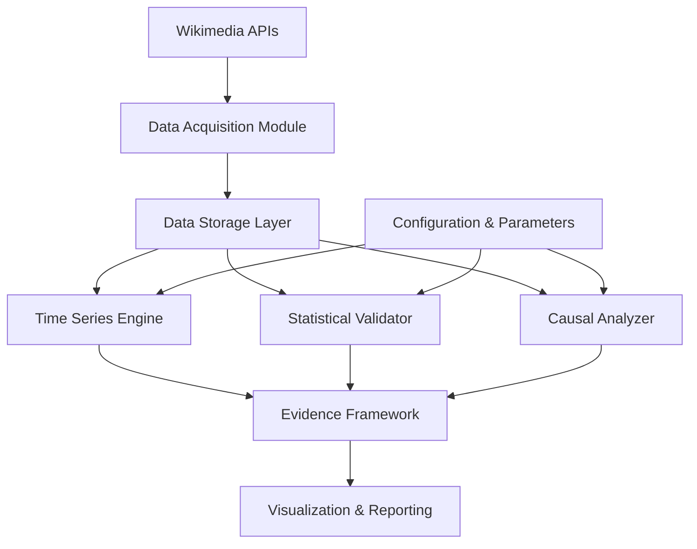

# Design Document: Wikipedia Product Health Analysis

## Overview

The Wikipedia Product Health Analysis system is a rigorous, evidence-based analytics platform that evaluates Wikipedia's product health using time-series data from 2015-2025. The system distinguishes itself from traditional descriptive analytics by implementing formal statistical validation, causal inference methodologies, and multi-source cross-validation for all findings.

The architecture follows a modular design with five core components:
1. **Data Acquisition Module**: Fetches and validates data from Wikimedia APIs
2. **Statistical Validation Engine**: Performs hypothesis testing and significance analysis
3. **Causal Inference Engine**: Implements causal analysis methodologies
4. **Time Series Analysis Engine**: Handles temporal decomposition, forecasting, and pattern detection
5. **Evidence Framework**: Orchestrates cross-validation and robustness checks

The system produces evidence-backed conclusions with quantified uncertainty, enabling data-driven product decisions supported by statistical rigor rather than intuition.

## Architecture

### High-Level Architecture



### Component Responsibilities

**Data Acquisition Module**:
- Interfaces with Wikimedia Pageviews API
- Fetches pageview, editor, and edit volume data
- Filters bot traffic
- Validates data completeness and quality
- Persists raw and processed data

**Time Series Analysis Engine**:
- Seasonal decomposition (STL, X-13-ARIMA-SEATS)
- Changepoint detection (PELT, Binary Segmentation)
- Forecasting (ARIMA, Prophet, Exponential Smoothing)
- Trend extraction and analysis

**Statistical Validation Engine**:
- Hypothesis testing (t-tests, ANOVA, non-parametric tests)
- Significance testing with p-value calculation
- Confidence interval computation
- Effect size quantification
- Model comparison tests (Diebold-Mariano)

**Causal Inference Engine**:
- Interrupted Time Series Analysis (ITSA)
- Difference-in-Differences (DiD)
- Event Study Methodology
- Synthetic Control Methods
- Counterfactual baseline construction

**Evidence Framework**:
- Multi-source validation orchestration
- Cross-validation across data sources
- Robustness and sensitivity analysis
- Geographic and language edition comparison
- Outlier impact assessment

**Visualization & Reporting**:
- Interactive dashboards
- Statistical evidence overlays (confidence bands, p-values)
- Publication-quality plots
- Summary reports with test statistics

### Data Flow

1. **Acquisition Phase**: Raw data fetched from APIs → validated → stored
2. **Processing Phase**: Raw data → cleaned → transformed → feature engineered
3. **Analysis Phase**: Processed data → statistical tests → causal inference → time series analysis
4. **Validation Phase**: Results → cross-validation → robustness checks → evidence synthesis
5. **Reporting Phase**: Validated findings → visualizations → reports with statistical evidence

## Components and Interfaces

### Data Acquisition Module

**Interface: WikimediaAPIClient**
```python
class WikimediaAPIClient:
    def fetch_pageviews(
        self,
        start_date: date,
        end_date: date,
        platforms: List[str],  # ['desktop', 'mobile-web', 'mobile-app']
        agent_type: str = 'user'  # Exclude bots
    ) -> DataFrame
    
    def fetch_editor_counts(
        self,
        start_date: date,
        end_date: date,
        granularity: str = 'daily'
    ) -> DataFrame
    
    def fetch_edit_volumes(
        self,
        start_date: date,
        end_date: date,
        granularity: str = 'daily'
    ) -> DataFrame
    
    def validate_response(
        self,
        response: Dict
    ) -> Tuple[bool, List[str]]  # (is_valid, error_messages)
```

**Interface: DataValidator**
```python
class DataValidator:
    def check_completeness(
        self,
        data: DataFrame,
        expected_date_range: Tuple[date, date]
    ) -> ValidationReport
    
    def detect_anomalies(
        self,
        data: DataFrame,
        threshold: float = 3.0  # Standard deviations
    ) -> List[Anomaly]
    
    def flag_missing_values(
        self,
        data: DataFrame
    ) -> DataFrame  # With missing value flags
    
    def validate_schema(
        self,
        data: DataFrame,
        expected_schema: Dict
    ) -> bool
```

### Time Series Analysis Engine

**Interface: TimeSeriesDecomposer**
```python
class TimeSeriesDecomposer:
    def decompose_stl(
        self,
        series: Series,
        period: int,
        seasonal: int = 7
    ) -> DecompositionResult  # trend, seasonal, residual
    
    def decompose_x13(
        self,
        series: Series
    ) -> DecompositionResult
    
    def extract_trend(
        self,
        series: Series,
        method: str = 'hp_filter'  # Hodrick-Prescott
    ) -> Series
    
    def extract_seasonality(
        self,
        series: Series,
        period: int
    ) -> Series
```

**Interface: ChangepointDetector**
```python
class ChangepointDetector:
    def detect_pelt(
        self,
        series: Series,
        penalty: float = None,  # Auto-select if None
        min_size: int = 30
    ) -> List[Changepoint]
    
    def detect_binary_segmentation(
        self,
        series: Series,
        n_changepoints: int = 5
    ) -> List[Changepoint]
    
    def detect_bayesian(
        self,
        series: Series,
        prior_scale: float = 0.05
    ) -> List[Changepoint]
    
    def test_significance(
        self,
        series: Series,
        changepoint: Changepoint,
        alpha: float = 0.05
    ) -> Tuple[bool, float]  # (is_significant, p_value)
```

**Interface: Forecaster**
```python
class Forecaster:
    def fit_arima(
        self,
        series: Series,
        order: Tuple[int, int, int] = None  # Auto-select if None
    ) -> ARIMAModel
    
    def fit_prophet(
        self,
        series: Series,
        seasonality_mode: str = 'multiplicative',
        changepoint_prior_scale: float = 0.05
    ) -> ProphetModel
    
    def fit_exponential_smoothing(
        self,
        series: Series,
        seasonal_periods: int = 7
    ) -> ExponentialSmoothingModel
    
    def forecast(
        self,
        model: ForecastModel,
        horizon: int,
        confidence_level: float = 0.95
    ) -> ForecastResult  # point_forecast, lower_bound, upper_bound
    
    def cross_validate(
        self,
        series: Series,
        model_type: str,
        n_splits: int = 5
    ) -> CrossValidationResult
```

### Statistical Validation Engine

**Interface: HypothesisTester**
```python
class HypothesisTester:
    def t_test(
        self,
        sample1: Series,
        sample2: Series,
        alternative: str = 'two-sided'
    ) -> TestResult  # statistic, p_value, effect_size
    
    def anova(
        self,
        groups: List[Series]
    ) -> TestResult
    
    def mann_whitney(
        self,
        sample1: Series,
        sample2: Series
    ) -> TestResult  # Non-parametric alternative
    
    def kruskal_wallis(
        self,
        groups: List[Series]
    ) -> TestResult  # Non-parametric ANOVA
    
    def permutation_test(
        self,
        sample1: Series,
        sample2: Series,
        n_permutations: int = 10000
    ) -> TestResult
```

**Interface: ConfidenceIntervalCalculator**
```python
class ConfidenceIntervalCalculator:
    def bootstrap_ci(
        self,
        data: Series,
        statistic: Callable,
        confidence_level: float = 0.95,
        n_bootstrap: int = 10000
    ) -> Tuple[float, float]  # (lower, upper)
    
    def parametric_ci(
        self,
        data: Series,
        confidence_level: float = 0.95
    ) -> Tuple[float, float]
    
    def prediction_interval(
        self,
        model: ForecastModel,
        horizon: int,
        confidence_level: float = 0.95
    ) -> DataFrame  # lower and upper bounds for each time point
```

**Interface: EffectSizeCalculator**
```python
class EffectSizeCalculator:
    def cohens_d(
        self,
        sample1: Series,
        sample2: Series
    ) -> float
    
    def hedges_g(
        self,
        sample1: Series,
        sample2: Series
    ) -> float  # Bias-corrected Cohen's d
    
    def percentage_change(
        self,
        baseline: float,
        treatment: float
    ) -> float
    
    def absolute_difference(
        self,
        sample1: Series,
        sample2: Series
    ) -> Tuple[float, Tuple[float, float]]  # (diff, confidence_interval)
```

### Causal Inference Engine

**Interface: InterruptedTimeSeriesAnalyzer**
```python
class InterruptedTimeSeriesAnalyzer:
    def fit(
        self,
        series: Series,
        intervention_date: date,
        pre_period_length: int = 90
    ) -> ITSAModel
    
    def estimate_effect(
        self,
        model: ITSAModel,
        post_period_length: int = 90
    ) -> CausalEffect  # effect_size, confidence_interval, p_value
    
    def construct_counterfactual(
        self,
        model: ITSAModel,
        post_period: DateRange
    ) -> Series  # Predicted values without intervention
    
    def test_parallel_trends(
        self,
        model: ITSAModel
    ) -> TestResult  # Validates ITSA assumptions
```

**Interface: DifferenceInDifferencesAnalyzer**
```python
class DifferenceInDifferencesAnalyzer:
    def fit(
        self,
        treatment_series: Series,
        control_series: Series,
        intervention_date: date
    ) -> DiDModel
    
    def estimate_effect(
        self,
        model: DiDModel
    ) -> CausalEffect
    
    def test_parallel_trends(
        self,
        model: DiDModel,
        pre_period: DateRange
    ) -> TestResult  # Critical assumption test
    
    def placebo_test(
        self,
        model: DiDModel,
        placebo_date: date
    ) -> TestResult  # Robustness check
```

**Interface: EventStudyAnalyzer**
```python
class EventStudyAnalyzer:
    def fit_baseline(
        self,
        series: Series,
        event_date: date,
        baseline_window: int = 90
    ) -> BaselineModel
    
    def estimate_event_impact(
        self,
        series: Series,
        baseline: BaselineModel,
        event_date: date,
        post_window: int = 30
    ) -> EventImpact  # observed, predicted, difference, confidence_interval
    
    def test_significance(
        self,
        impact: EventImpact,
        alpha: float = 0.05
    ) -> Tuple[bool, float]  # (is_significant, p_value)
    
    def measure_persistence(
        self,
        series: Series,
        event_date: date,
        max_window: int = 180
    ) -> int  # Days until return to baseline
```

**Interface: SyntheticControlBuilder**
```python
class SyntheticControlBuilder:
    def construct_synthetic_control(
        self,
        treated_unit: Series,
        donor_pool: List[Series],
        pre_period: DateRange
    ) -> SyntheticControl  # Weighted combination of donors
    
    def estimate_effect(
        self,
        treated: Series,
        synthetic: SyntheticControl,
        post_period: DateRange
    ) -> CausalEffect
    
    def placebo_test(
        self,
        donor_pool: List[Series],
        intervention_date: date
    ) -> List[PlaceboResult]  # Test on untreated units
    
    def inference(
        self,
        effect: CausalEffect,
        placebo_results: List[PlaceboResult]
    ) -> TestResult  # P-value from placebo distribution
```

### Evidence Framework

**Interface: CrossValidator**
```python
class CrossValidator:
    def validate_across_sources(
        self,
        finding: Finding,
        data_sources: List[str]  # ['pageviews', 'editors', 'edits']
    ) -> ValidationResult  # consistency_score, supporting_sources
    
    def validate_across_platforms(
        self,
        finding: Finding,
        platforms: List[str]
    ) -> ValidationResult
    
    def validate_across_regions(
        self,
        finding: Finding,
        regions: List[str]
    ) -> ValidationResult
    
    def compare_to_benchmark(
        self,
        metric: Series,
        benchmark: Series
    ) -> ComparisonResult
```

**Interface: RobustnessChecker**
```python
class RobustnessChecker:
    def sensitivity_analysis(
        self,
        analysis_function: Callable,
        parameters: Dict[str, List],
        base_result: Any
    ) -> SensitivityResult  # How results vary with parameters
    
    def outlier_sensitivity(
        self,
        series: Series,
        analysis_function: Callable
    ) -> OutlierSensitivityResult  # Results with/without outliers
    
    def method_comparison(
        self,
        series: Series,
        methods: List[str]  # Different decomposition/forecasting methods
    ) -> MethodComparisonResult  # Consistency across methods
    
    def subsample_stability(
        self,
        series: Series,
        analysis_function: Callable,
        n_subsamples: int = 100
    ) -> StabilityResult  # Bootstrap-style stability check
```

## Data Models

### Core Data Structures

**TimeSeriesData**
```python
@dataclass
class TimeSeriesData:
    date: Series  # DatetimeIndex
    values: Series  # Numeric values
    platform: str  # 'desktop', 'mobile-web', 'mobile-app', 'all'
    metric_type: str  # 'pageviews', 'editors', 'edits'
    metadata: Dict  # Source, acquisition_date, filters applied
    
    def to_dataframe(self) -> DataFrame
    def resample(self, frequency: str) -> 'TimeSeriesData'
    def filter_date_range(self, start: date, end: date) -> 'TimeSeriesData'
```

**DecompositionResult**
```python
@dataclass
class DecompositionResult:
    trend: Series
    seasonal: Series
    residual: Series
    method: str  # 'STL', 'X-13-ARIMA-SEATS'
    parameters: Dict
    
    def plot(self) -> Figure
    def reconstruct(self) -> Series  # trend + seasonal + residual
```

**Changepoint**
```python
@dataclass
class Changepoint:
    date: date
    index: int
    confidence: float  # 0-1
    magnitude: float  # Size of change
    direction: str  # 'increase', 'decrease'
    pre_mean: float
    post_mean: float
    
    def is_significant(self, alpha: float = 0.05) -> bool
```

**TestResult**
```python
@dataclass
class TestResult:
    test_name: str
    statistic: float
    p_value: float
    effect_size: float
    confidence_interval: Tuple[float, float]
    is_significant: bool  # p_value < alpha
    alpha: float
    interpretation: str  # Human-readable summary
    
    def to_dict(self) -> Dict
```

**CausalEffect**
```python
@dataclass
class CausalEffect:
    effect_size: float  # Estimated causal impact
    confidence_interval: Tuple[float, float]
    p_value: float
    method: str  # 'ITSA', 'DiD', 'EventStudy', 'SyntheticControl'
    counterfactual: Series  # Predicted without intervention
    observed: Series  # Actual observed values
    treatment_period: DateRange
    
    def plot_comparison(self) -> Figure  # Observed vs counterfactual
    def percentage_effect(self) -> float
```

**ForecastResult**
```python
@dataclass
class ForecastResult:
    point_forecast: Series
    lower_bound: Series  # Lower prediction interval
    upper_bound: Series  # Upper prediction interval
    confidence_level: float
    model_type: str
    horizon: int  # Number of periods forecasted
    
    def plot(self, historical: Series = None) -> Figure
```

**ValidationReport**
```python
@dataclass
class ValidationReport:
    is_valid: bool
    completeness_score: float  # 0-1
    missing_dates: List[date]
    anomalies: List[Anomaly]
    quality_metrics: Dict  # Various data quality indicators
    recommendations: List[str]  # Suggested actions
```

**Finding**
```python
@dataclass
class Finding:
    finding_id: str
    description: str
    evidence: List[TestResult]  # Statistical evidence
    causal_effects: List[CausalEffect]  # If causal analysis performed
    confidence_level: str  # 'high', 'medium', 'low'
    requirements_validated: List[str]  # Requirement IDs
    
    def summary(self) -> str
    def evidence_strength(self) -> float  # Aggregate evidence score
```


## Correctness Properties

*A property is a characteristic or behavior that should hold true across all valid executions of a system—essentially, a formal statement about what the system should do. Properties serve as the bridge between human-readable specifications and machine-verifiable correctness guarantees.*

### Property 1: Data Acquisition Completeness

*For any* requested date range within 2015-2025 and any platform combination, when data is fetched from the Wikimedia APIs, the returned data should cover the complete requested range with all specified platforms, and any gaps or anomalies should be flagged in the validation report.

**Validates: Requirements 1.1, 1.3, 1.6**

### Property 2: Bot Traffic Exclusion

*For any* pageview data fetched by the system, all records should have agent_type='user' and no bot traffic should be present in the dataset.

**Validates: Requirements 1.2**

### Property 3: Multi-Source Data Alignment

*For any* analysis period, pageview data, editor count data, and edit volume data should all cover the same date range, enabling cross-validation across data sources.

**Validates: Requirements 1.4, 1.5**

### Property 4: Data Persistence Round-Trip

*For any* acquired dataset, storing the data with metadata and then retrieving it should produce an equivalent dataset with all metadata intact (acquisition timestamp, source parameters, filters applied).

**Validates: Requirements 1.7**

### Property 5: Statistical Significance Testing

*For any* trend change, structural shift, or group comparison, the system should perform appropriate hypothesis testing and report p-values, test statistics, and significance determination at α = 0.05.

**Validates: Requirements 2.1, 2.2, 2.5, 2.6, 6.3, 6.6**

### Property 6: Confidence Interval Inclusion

*For any* statistical estimate (effect size, forecast, growth rate, platform proportion), the system should provide 95% confidence intervals alongside the point estimate.

**Validates: Requirements 2.3, 2.4, 3.6, 6.5, 7.1, 9.3, 11.2**

### Property 7: Causal Method Selection

*For any* causal analysis request, the system should apply the appropriate causal inference method based on the analysis type: interrupted time series for campaigns, difference-in-differences for platform comparisons, event study for external shocks, and regression discontinuity for policy changes.

**Validates: Requirements 3.1, 3.2, 3.3, 3.4**

### Property 8: Counterfactual Construction

*For any* causal analysis, the system should construct a counterfactual baseline or synthetic control using pre-intervention data, enabling comparison between observed and predicted outcomes.

**Validates: Requirements 3.5, 9.2, 10.2**

### Property 9: Multi-Dimensional Correlation

*For any* pageview trend analysis, the system should correlate pageview changes with editor activity and edit volume to distinguish between passive consumption and active engagement.

**Validates: Requirements 4.1, 4.2, 4.4, 4.6**

### Property 10: Engagement Ratio Significance Testing

*For any* time period comparison, when engagement ratios (editors per 1000 pageviews) are computed, the system should test whether the ratios differ significantly between periods using appropriate statistical tests.

**Validates: Requirements 4.3**

### Property 11: Cross-Platform Engagement Analysis

*For any* analysis involving multiple platforms, engagement metrics should be computed and compared across desktop, mobile web, and mobile app to identify platform-specific behavior patterns.

**Validates: Requirements 4.5, 4.7**

### Property 12: Multi-Source Validation

*For any* finding or pattern, the system should validate it across multiple data sources (pageviews, editors, edits) and report the consistency score and which sources support the finding.

**Validates: Requirements 5.1, 5.2**

### Property 13: Sensitivity Analysis

*For any* analysis with configurable parameters, the system should perform sensitivity analysis by varying parameters and assumptions, reporting how results change across the parameter space.

**Validates: Requirements 5.5, 5.6**

### Property 14: Method Consistency Validation

*For any* analysis that can be performed with multiple methods (e.g., seasonal decomposition with STL vs X-13-ARIMA-SEATS), the system should apply multiple methods and verify consistency of results.

**Validates: Requirements 5.7, 6.2**

### Property 15: Time Series Decomposition Completeness

*For any* time series analyzed, the decomposition should produce trend, seasonal, and residual components, and reconstructing the series from these components should yield the original series (within numerical precision).

**Validates: Requirements 6.1**

### Property 16: Structural Break Consensus

*For any* detected structural break, at least two different changepoint detection algorithms (from PELT, Binary Segmentation, Bayesian methods) should agree on the break location (within a tolerance window), and the break should pass statistical significance testing.

**Validates: Requirements 6.2, 6.3**

### Property 17: Temporal Alignment Testing

*For any* structural shift attributed to an external cause (e.g., AI search launch), the system should test whether the temporal alignment between the shift and the external event is statistically significant beyond chance coincidence.

**Validates: Requirements 6.4**

### Property 18: Platform Risk Quantification

*For any* analysis period, the system should compute platform concentration metrics (proportions, HHI), test whether mobile dependency exceeds 70%, calculate coefficient of variation for each platform, and provide scenario analysis for 10%, 20%, 30% declines in the dominant platform.

**Validates: Requirements 7.1, 7.2, 7.3, 7.4, 7.6**

### Property 19: Seasonality Validation

*For any* time series with suspected seasonality, the system should apply spectral analysis or autocorrelation tests (ACF, PACF) to confirm periodicity with p-values, and validate that seasonal patterns are statistically significant.

**Validates: Requirements 8.1, 8.2**

### Property 20: Day-of-Week Effect Quantification

*For any* time series, the system should perform ANOVA to test for day-of-week effects, compute effect sizes for weekday vs weekend differences, and compare engagement ratios to classify usage as utility vs leisure.

**Validates: Requirements 8.4, 8.6**

### Property 21: Holiday Effect Modeling

*For any* time series covering holiday periods, the system should model holiday impacts using regression with dummy variables and quantify effect sizes with confidence intervals.

**Validates: Requirements 8.5**

### Property 22: Campaign Effect Isolation

*For any* campaign evaluation, the system should implement interrupted time series analysis with segmented regression, construct a synthetic control baseline, calculate average treatment effect with 95% CI, and perform permutation tests (minimum 1000 permutations) to assess significance.

**Validates: Requirements 9.1, 9.2, 9.3, 9.4**

### Property 23: Campaign Duration Analysis

*For any* campaign with measured effects, the system should distinguish between immediate (0-7 days), short-term (8-30 days), and long-term (30+ days) effects with separate effect size estimates for each time window.

**Validates: Requirements 9.5**

### Property 24: Cross-Campaign Comparison

*For any* set of multiple campaigns, the system should test whether effect sizes differ significantly across campaigns using meta-analysis or hierarchical modeling.

**Validates: Requirements 9.6**

### Property 25: Event Impact Measurement

*For any* external event, the system should construct a baseline forecast with 95% prediction intervals, calculate cumulative abnormal return (CAR), test whether observed values exceed prediction intervals, and measure the half-life of traffic decay back to baseline.

**Validates: Requirements 10.1, 10.2, 10.3, 10.4, 10.5**

### Property 26: Event Category Comparison

*For any* set of external events across different categories (political, natural disaster, celebrity, scientific), the system should test whether response magnitudes differ significantly across categories using ANOVA.

**Validates: Requirements 10.6**

### Property 27: Multi-Method Forecast Ensemble

*For any* forecasting task, the system should implement multiple methods (ARIMA, Prophet, exponential smoothing), ensemble them, and provide point forecasts with 50%, 80%, and 95% prediction intervals.

**Validates: Requirements 11.1, 11.2**

### Property 28: Forecast Accuracy Evaluation

*For any* forecast model, the system should evaluate accuracy on holdout data (minimum 10% of time series) using multiple error metrics (MAPE, RMSE, MAE, MASE) and perform Diebold-Mariano tests to compare model performance.

**Validates: Requirements 11.3, 11.4**

### Property 29: Scenario Analysis Generation

*For any* forecast, the system should generate optimistic, baseline, and pessimistic scenarios with probability assignments, enabling risk-aware planning.

**Validates: Requirements 11.6**

### Property 30: Analysis Reproducibility

*For any* analysis execution, running the same analysis twice with identical inputs, parameters, and random seeds should produce identical results within numerical precision tolerance of 1e-10.

**Validates: Requirements 12.6**

### Property 31: Metadata Completeness

*For any* analysis execution, the system should log all data sources (API endpoints, query parameters, timestamps), statistical methods (test implementations, library versions, assumptions), and execution environment details (code commit hashes, dependency versions, random seeds).

**Validates: Requirements 12.1, 12.2, 12.4**

### Property 32: Result Integrity

*For any* generated result (intermediate or final), the system should save it with a SHA-256 checksum, enabling verification of data integrity.

**Validates: Requirements 12.3**

### Property 33: Pipeline Re-execution

*For any* completed analysis, the system should support re-running the entire pipeline with new data inputs while preserving historical analysis versions, enabling longitudinal tracking of findings.

**Validates: Requirements 12.5**

### Property 34: Visualization Evidence Inclusion

*For any* visualization (trend plot, campaign effect plot, forecast plot, comparison plot), the system should include statistical evidence overlays: confidence bands/prediction intervals for trends and forecasts, p-values and effect sizes for comparisons, and significance indicators.

**Validates: Requirements 13.1, 13.2, 13.3, 13.4, 13.5**

### Property 35: Report Completeness

*For any* analysis report, the system should include summary tables with test statistics, p-values, confidence intervals, effect sizes, and plain-language interpretations for all findings.

**Validates: Requirements 13.6**

### Property 36: Interactive Dashboard Elements

*For any* dashboard, the system should provide interactive elements (hover for confidence intervals, click for detailed test results, filter by time period) and methodology tooltips explaining each statistical measure.

**Validates: Requirements 13.7**

## Error Handling

### Data Acquisition Errors

**API Failures**:
- Implement exponential backoff retry logic (max 5 retries, backoff factor 2)
- Log all failed requests with timestamps and error messages
- Fall back to cached data if available and within staleness threshold (24 hours)
- Raise `DataAcquisitionError` with detailed context if all retries fail

**Data Quality Issues**:
- Flag missing dates and interpolate only if gap < 3 days
- Detect anomalies using z-score method (threshold = 3.0) and flag for review
- Reject datasets with > 10% missing values
- Log all data quality issues in validation report

**Schema Validation Failures**:
- Validate all API responses against expected schema
- Raise `SchemaValidationError` with diff between expected and actual schema
- Do not proceed with analysis if schema validation fails

### Statistical Analysis Errors

**Insufficient Data**:
- Require minimum 90 days of data for trend analysis
- Require minimum 30 days pre-intervention for causal analysis
- Raise `InsufficientDataError` with specific requirements if data is inadequate

**Assumption Violations**:
- Test statistical assumptions (normality, homoscedasticity, independence)
- Log warnings when assumptions are violated
- Automatically switch to non-parametric alternatives when appropriate
- Document assumption violations in analysis metadata

**Convergence Failures**:
- Set maximum iterations for iterative algorithms (e.g., ARIMA fitting: 1000 iterations)
- Raise `ConvergenceError` if algorithms fail to converge
- Try alternative starting values or simpler models
- Log convergence diagnostics

**Numerical Instability**:
- Use numerically stable implementations (e.g., log-space calculations for probabilities)
- Check for NaN, Inf values after each computation
- Raise `NumericalError` if instability detected
- Implement regularization for ill-conditioned problems

### Causal Inference Errors

**Parallel Trends Violation**:
- Test parallel trends assumption for DiD and ITSA
- Raise `ParallelTrendsViolationWarning` if test fails (p < 0.05)
- Suggest alternative methods (synthetic control, event study)
- Document violation in analysis report

**Weak Synthetic Control**:
- Require minimum R² = 0.7 for synthetic control fit
- Raise `WeakSyntheticControlWarning` if fit is poor
- Report donor weights and fit quality metrics
- Suggest expanding donor pool or using alternative methods

**Insufficient Pre-Period**:
- Require minimum 60 days pre-intervention for baseline modeling
- Raise `InsufficientPrePeriodError` if requirement not met
- Cannot proceed with causal analysis without adequate baseline

### Forecasting Errors

**Model Selection Failures**:
- Try multiple model specifications if auto-selection fails
- Fall back to simpler models (exponential smoothing) if complex models fail
- Raise `ModelSelectionError` if no model can be fit
- Log all attempted specifications

**Forecast Horizon Too Long**:
- Warn if forecast horizon > 25% of training data length
- Widen prediction intervals for long horizons
- Document increased uncertainty in forecast report

**Covariate Unavailability**:
- Proceed with univariate models if covariates unavailable
- Log warning about missing covariates
- Document limitation in forecast metadata

### Validation and Robustness Errors

**Cross-Validation Inconsistency**:
- Raise `ValidationInconsistencyWarning` if finding not confirmed across data sources
- Report consistency score and which sources support/contradict finding
- Flag finding as "low confidence" in report

**Sensitivity Analysis Instability**:
- Raise `SensitivityWarning` if results change substantially with parameter variations
- Report range of results across parameter space
- Flag finding as "sensitive to assumptions" in report

**Outlier Impact**:
- Raise `OutlierImpactWarning` if conclusions change when outliers removed
- Report both with-outlier and without-outlier results
- Recommend manual review of outliers

### Visualization and Reporting Errors

**Plotting Failures**:
- Catch all plotting exceptions and log error details
- Generate text-based summary if visualization fails
- Raise `VisualizationError` with fallback content

**Report Generation Failures**:
- Implement graceful degradation (partial reports if some sections fail)
- Log all section generation errors
- Raise `ReportGenerationError` with successfully generated sections

**Dashboard Rendering Errors**:
- Implement error boundaries for each dashboard component
- Display error message in failed component while keeping rest of dashboard functional
- Log all rendering errors for debugging

### General Error Handling Principles

1. **Fail Fast**: Validate inputs early and raise errors before expensive computations
2. **Informative Messages**: Include context, expected vs actual values, and suggested fixes
3. **Graceful Degradation**: Provide partial results when possible rather than complete failure
4. **Comprehensive Logging**: Log all errors, warnings, and recovery attempts with timestamps
5. **User Guidance**: Suggest next steps or alternative approaches in error messages
6. **Error Propagation**: Use custom exception hierarchy for clear error categorization
7. **Recovery Mechanisms**: Implement automatic recovery where safe (e.g., retry logic, fallback methods)

## Testing Strategy

### Dual Testing Approach

The system requires both unit testing and property-based testing for comprehensive coverage:

**Unit Tests**: Verify specific examples, edge cases, and error conditions
- Focus on concrete scenarios with known inputs and expected outputs
- Test integration points between components
- Validate error handling and edge cases
- Test specific statistical calculations with known results

**Property Tests**: Verify universal properties across all inputs
- Test properties that should hold for any valid input
- Use randomized input generation to explore input space
- Validate invariants and mathematical properties
- Ensure robustness across diverse scenarios

**Balance**: Avoid writing too many unit tests. Property-based tests handle comprehensive input coverage. Unit tests should focus on specific examples that demonstrate correct behavior and edge cases that are difficult to generate randomly.

### Property-Based Testing Configuration

**Library Selection**: Use `hypothesis` for Python (industry-standard PBT library)

**Test Configuration**:
- Minimum 100 iterations per property test (due to randomization)
- Each property test must reference its design document property
- Tag format: `# Feature: wikipedia-product-health-analysis, Property {number}: {property_text}`

**Example Property Test Structure**:
```python
from hypothesis import given, settings
from hypothesis.strategies import dates, lists, floats
import pytest

@settings(max_examples=100)
@given(
    start_date=dates(min_value=date(2015, 1, 1), max_value=date(2024, 12, 31)),
    end_date=dates(min_value=date(2015, 1, 1), max_value=date(2025, 12, 31)),
    platforms=lists(sampled_from(['desktop', 'mobile-web', 'mobile-app']), min_size=1, max_size=3, unique=True)
)
def test_property_1_data_acquisition_completeness(start_date, end_date, platforms):
    """
    Feature: wikipedia-product-health-analysis
    Property 1: For any requested date range within 2015-2025 and any platform combination,
    when data is fetched from the Wikimedia APIs, the returned data should cover the complete
    requested range with all specified platforms, and any gaps or anomalies should be flagged.
    """
    # Arrange
    if end_date < start_date:
        start_date, end_date = end_date, start_date
    
    client = WikimediaAPIClient()
    
    # Act
    data = client.fetch_pageviews(start_date, end_date, platforms)
    validation_report = client.validate_response(data)
    
    # Assert
    assert data is not None
    assert set(data['platform'].unique()) == set(platforms)
    assert data['date'].min() >= start_date
    assert data['date'].max() <= end_date
    
    # Check that gaps are flagged
    expected_dates = pd.date_range(start_date, end_date, freq='D')
    actual_dates = data['date'].unique()
    missing_dates = set(expected_dates) - set(actual_dates)
    
    if missing_dates:
        assert len(validation_report.missing_dates) > 0
        assert set(validation_report.missing_dates) == missing_dates
```

### Unit Testing Strategy

**Component-Level Tests**:

1. **Data Acquisition Module**:
   - Test API client with mocked responses
   - Test data validation with known good/bad data
   - Test error handling for API failures
   - Test retry logic and exponential backoff

2. **Statistical Validation Engine**:
   - Test hypothesis tests with known distributions
   - Test confidence interval calculations with analytical solutions
   - Test effect size calculations with standard examples
   - Test model comparison with synthetic data

3. **Causal Inference Engine**:
   - Test ITSA with simulated intervention data
   - Test DiD with parallel and non-parallel trends
   - Test synthetic control construction with known weights
   - Test placebo tests with null interventions

4. **Time Series Engine**:
   - Test decomposition with synthetic seasonal data
   - Test changepoint detection with known breaks
   - Test forecasting with holdout validation
   - Test seasonal strength metrics

5. **Evidence Framework**:
   - Test cross-validation logic with multi-source data
   - Test sensitivity analysis with parameter sweeps
   - Test robustness checks with outlier injection
   - Test method consistency validation

**Integration Tests**:
- Test end-to-end pipeline from data acquisition to report generation
- Test component interactions and data flow
- Test error propagation across components
- Test reproducibility of full analysis runs

**Edge Case Tests**:
- Empty datasets
- Single data point
- All missing values
- Extreme outliers
- Zero variance data
- Perfect correlations
- Boundary dates (2015-01-01, 2025-12-31)

**Error Handling Tests**:
- API timeout scenarios
- Network failures
- Invalid API responses
- Schema mismatches
- Insufficient data scenarios
- Convergence failures
- Assumption violations

### Test Coverage Goals

- **Line Coverage**: Minimum 85%
- **Branch Coverage**: Minimum 80%
- **Property Coverage**: 100% (all 36 properties must have tests)
- **Critical Path Coverage**: 100% (all main analysis workflows)

### Continuous Testing

- Run unit tests on every commit
- Run property tests on every pull request
- Run integration tests nightly
- Run full end-to-end tests weekly with real API data
- Monitor test execution time and optimize slow tests

### Test Data Management

**Synthetic Data Generation**:
- Create synthetic time series with known properties
- Generate data with controlled seasonality, trends, and breaks
- Create datasets with specific statistical properties

**Fixture Data**:
- Cache real API responses for offline testing
- Version control test fixtures
- Update fixtures quarterly to reflect current data patterns

**Mocking Strategy**:
- Mock external API calls in unit tests
- Use real API calls in integration tests (with rate limiting)
- Mock expensive computations in property tests when appropriate

### Performance Testing

**Benchmarks**:
- Data acquisition: < 5 seconds for 1 year of daily data
- Statistical tests: < 1 second for 1000 data points
- Changepoint detection: < 10 seconds for 10 years of daily data
- Forecasting: < 30 seconds for 1 year forecast with ensemble
- Full pipeline: < 5 minutes for complete analysis

**Load Testing**:
- Test with 10 years of daily data (3650 points)
- Test with multiple concurrent analyses
- Test memory usage with large datasets
- Test API rate limiting handling

### Documentation Testing

- Verify all code examples in documentation execute correctly
- Test that all configuration examples are valid
- Validate that all API endpoint examples work
- Ensure all statistical formulas are correctly implemented

### Regression Testing

- Maintain suite of historical analyses as regression tests
- Compare new results with historical baselines
- Flag significant deviations for review
- Document intentional changes to analysis methods
