# Architecture Documentation

## System Overview

The Wikipedia Intelligence System is a production-ready business intelligence platform that transforms Wikipedia data into actionable business insights. The system follows a layered architecture with five primary components operating in a data pipeline pattern.

## High-Level Architecture

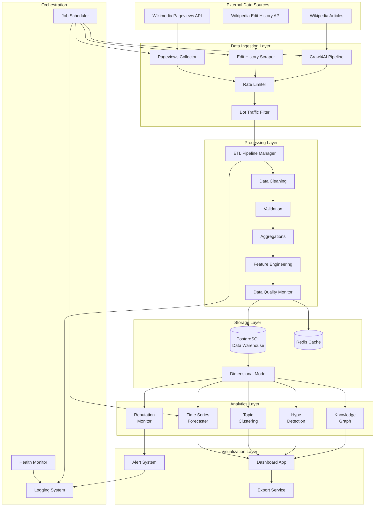

## Component Details

### Data Ingestion Layer

The Data Ingestion Layer collects data from three primary sources using specialized collectors.

#### Components

**Pageviews Collector**
- Queries Wikimedia Pageviews API
- Filters bot traffic automatically
- Segments by device type (desktop, mobile-web, mobile-app)
- Implements exponential backoff for rate limits
- Validates response schemas

**Edit History Scraper**
- Extracts revision data from Wikipedia API
- Classifies editors (anonymous vs registered)
- Detects reverted edits (vandalism signals)
- Calculates edit velocity metrics
- Tracks rolling window statistics

**Crawl4AI Pipeline**
- Performs asynchronous web crawling
- Extracts structured content (infoboxes, tables, categories)
- Implements BFS for deep crawls
- Respects robots.txt and rate limits
- Supports checkpoint/resume for long operations

**Supporting Components**
- **Rate Limiter**: Token bucket algorithm, 200 req/sec limit
- **Bot Traffic Filter**: Separates human from automated traffic
- **API Client**: Connection pooling, retry logic, circuit breakers

#### Data Flow

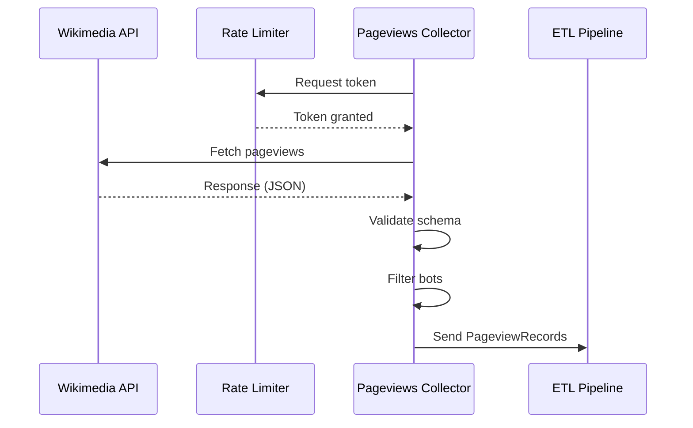

### Processing Layer

The Processing Layer transforms raw data into analytics-ready formats through ETL pipelines.

#### Components

**ETL Pipeline Manager**
- Orchestrates data transformation workflows
- Implements validation rules
- Performs deduplication
- Tracks data lineage
- Monitors pipeline health

**Data Cleaning**
- Handles missing values
- Removes outliers
- Normalizes formats
- Fixes encoding issues

**Validation**
- Schema validation
- Business rule checks
- Referential integrity
- Quarantines invalid records

**Aggregations**
- Hourly, daily, weekly, monthly rollups
- Platform aggregations
- Cluster-level metrics
- Trend calculations

**Feature Engineering**
- Growth rate calculations
- Velocity metrics
- Density scores
- Composite indicators

#### Pipeline Architecture

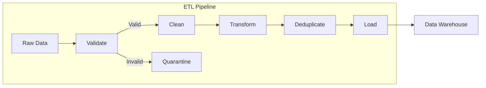

### Storage Layer

The Storage Layer provides persistent storage and caching for analytics data.

#### Database Schema (Star Schema)

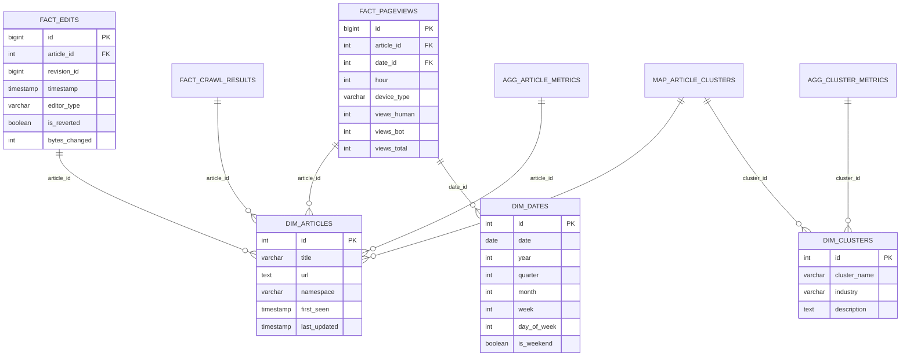

#### Redis Cache Structure

```
# Key Patterns (with TTL)
metrics:article:{article_id}:realtime (5 min)
metrics:cluster:{cluster_id}:realtime (5 min)
dashboard:demand_trends:{hash} (5 min)
dashboard:competitor_comparison:{hash} (5 min)
alerts:reputation:{article_id} (1 hour)
alerts:hype:{article_id} (1 hour)
ratelimit:wikimedia:{timestamp} (1 sec)
pipeline:status:{pipeline_id} (24 hours)
pipeline:checkpoint:{pipeline_id} (24 hours)
```

### Analytics Layer

The Analytics Layer applies statistical and machine learning models to generate insights.

#### Component Architecture

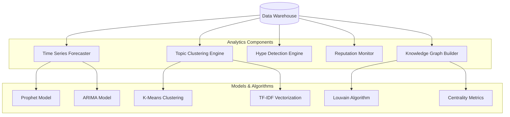

#### Analytics Workflows

**Forecasting Workflow**
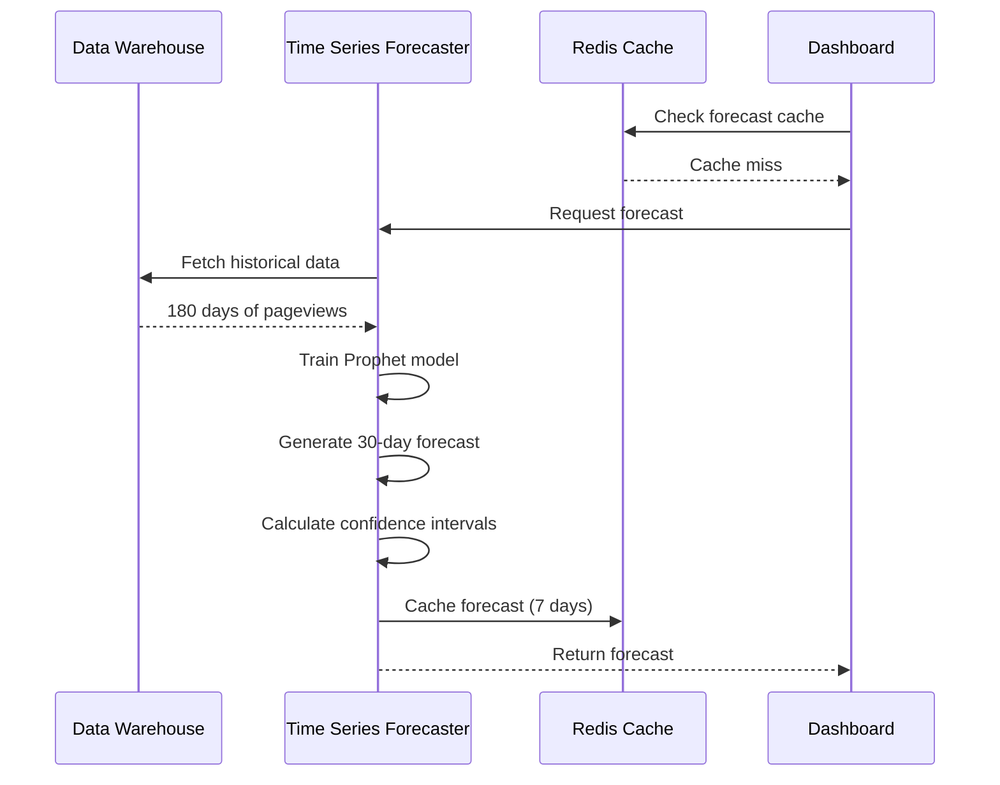

**Reputation Monitoring Workflow**
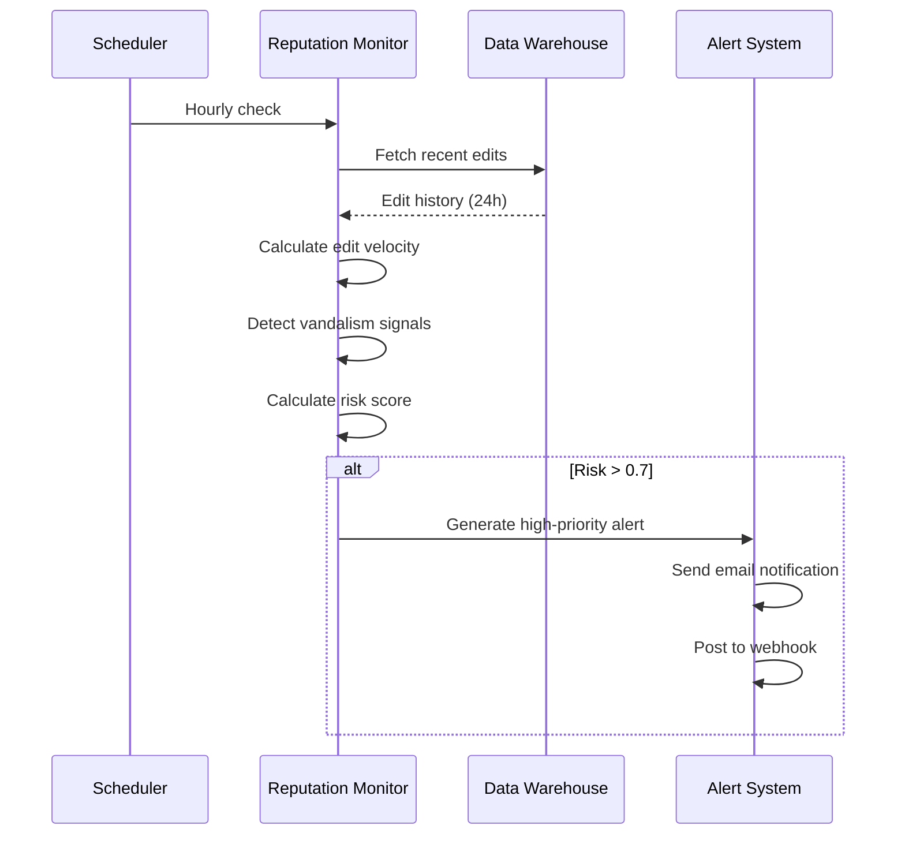

### Visualization Layer

The Visualization Layer provides interactive dashboards and reporting capabilities.

#### Dashboard Architecture

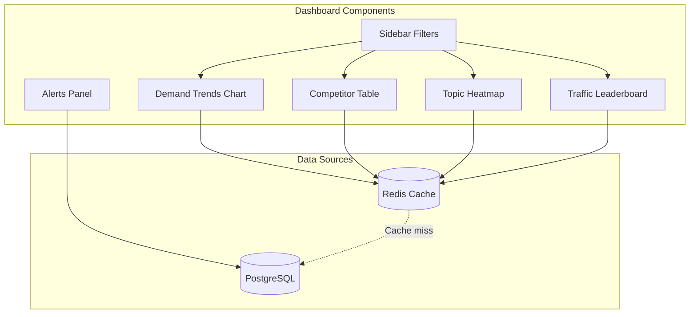

#### Dashboard Features

- **Auto-refresh**: Configurable interval (default 5 minutes)
- **Filtering**: Date range, industry, metric type
- **Sorting**: All tables support multi-column sorting
- **Export**: CSV and PDF formats
- **Interactivity**: Zoom, pan, tooltips on all charts

### Orchestration & Monitoring

#### Job Scheduling

```mermaid
gantt
    title Scheduled Jobs Timeline
    dateFormat HH:mm
    axisFormat %H:%M
    
    section Hourly
    Pageview Collection :active, h1, 00:00, 1h
    Pageview Collection :h2, 01:00, 1h
    Pageview Collection :h3, 02:00, 1h
    
    section Daily
    Edit History Scraping :d1, 02:00, 2h
    Deep Crawl :d2, 04:00, 3h
    Metrics Aggregation :d3, 07:00, 1h
    
    section Weekly
    Model Retraining :w1, 03:00, 4h
    Data Cleanup :w2, 07:00, 1h
```

#### Health Monitoring

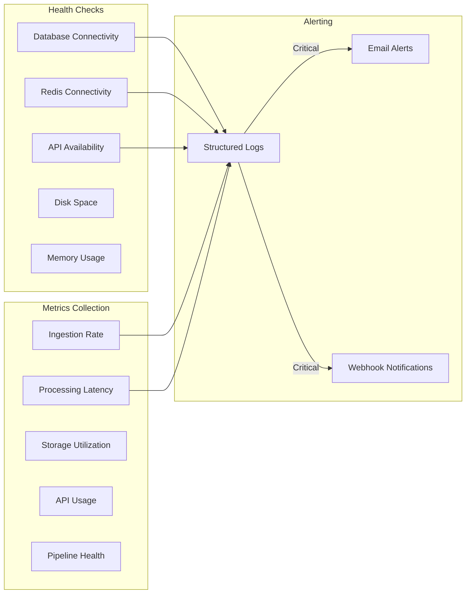

## Data Flow

### End-to-End Data Flow

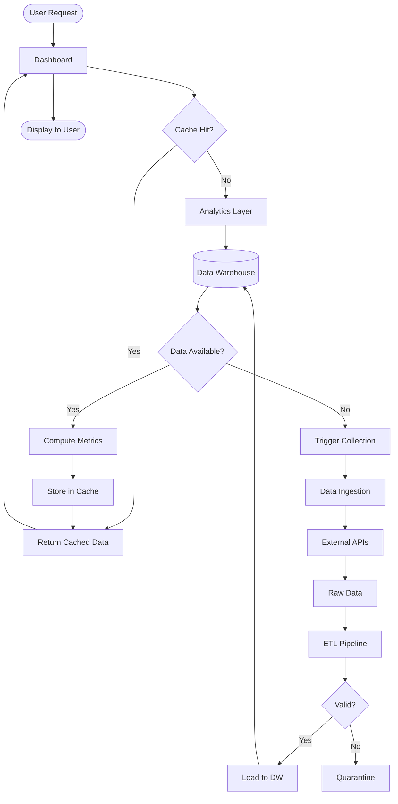

### Real-Time Alert Flow

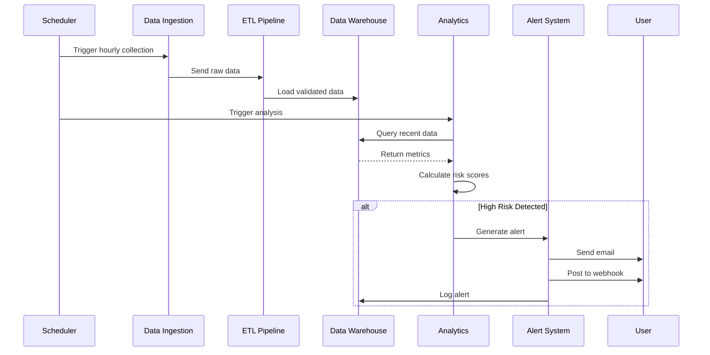

## Deployment Architecture

### Docker Deployment

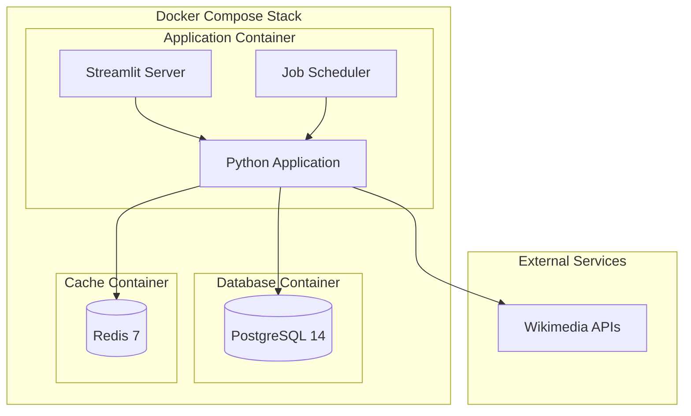

### Production Deployment

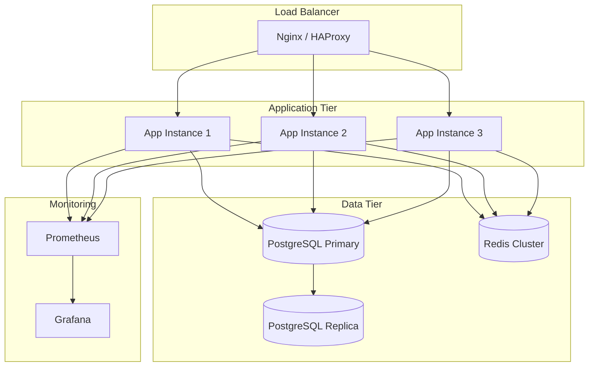

## Scalability Considerations

### Horizontal Scaling

- **Application Tier**: Stateless design allows adding workers
- **Data Ingestion**: Distributed crawling across multiple processes
- **Analytics**: Parallel processing of independent articles/clusters
- **Database**: Read replicas for query load distribution

### Performance Optimization

- **Caching Strategy**: Redis for hot data (5-minute TTL)
- **Query Optimization**: Indexed columns, partitioned tables
- **Async I/O**: All network operations use async/await
- **Connection Pooling**: Reuse database connections
- **Lazy Loading**: Dashboard loads data on-demand

### Capacity Planning

| Component | Current | Target | Scaling Strategy |
|-----------|---------|--------|------------------|
| Pageviews/day | 1M | 10M | Add ingestion workers |
| Articles tracked | 10K | 100K | Partition by article_id |
| Dashboard users | 10 | 100 | Add app instances |
| Forecast models | 100 | 1000 | Distributed training |
| Storage | 100GB | 1TB | Table partitioning |

## Security Architecture

### Authentication & Authorization

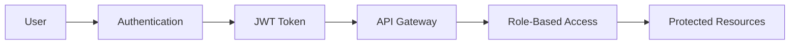

### Data Security

- **Encryption at Rest**: Database encryption enabled
- **Encryption in Transit**: TLS for all API calls
- **Secrets Management**: Environment variables, encrypted config
- **API Keys**: Stored encrypted, rotated regularly
- **Audit Logging**: All access logged with timestamps

## Disaster Recovery

### Backup Strategy

- **Database**: Daily full backups, hourly incrementals
- **Redis**: Persistence enabled (RDB + AOF)
- **Configuration**: Version controlled in Git
- **Logs**: Retained for 30 days, archived to S3

### Recovery Procedures

1. **Database Failure**: Promote replica to primary
2. **Cache Failure**: Fallback to database queries
3. **Application Failure**: Auto-restart with health checks
4. **Data Corruption**: Restore from latest backup

## Monitoring & Observability

### Key Metrics

- **Ingestion**: Records/second, API latency, error rate
- **Processing**: Pipeline duration, validation failures, quarantine rate
- **Storage**: Query latency, connection pool usage, disk utilization
- **Analytics**: Model training time, prediction accuracy, cache hit rate
- **Dashboard**: Page load time, concurrent users, export requests

### Logging Strategy

- **Format**: Structured JSON logs
- **Levels**: ERROR, WARNING, INFO, DEBUG
- **Retention**: 30 days in system, archived to S3
- **Aggregation**: Centralized logging with ELK stack

## Technology Stack

| Layer | Technologies |
|-------|-------------|
| Language | Python 3.11+ |
| Web Framework | Streamlit |
| Database | PostgreSQL 14+ |
| Cache | Redis 7+ |
| ML/Analytics | Prophet, scikit-learn, NetworkX |
| Data Processing | pandas, numpy |
| Web Crawling | Crawl4AI, aiohttp |
| Testing | pytest, Hypothesis |
| Orchestration | APScheduler |
| Containerization | Docker, Docker Compose |
| Migrations | Alembic |

## Future Enhancements

1. **Machine Learning**
   - Deep learning for trend prediction
   - NLP for sentiment analysis
   - Anomaly detection with autoencoders

2. **Scalability**
   - Kubernetes deployment
   - Distributed task queue (Celery)
   - Sharded database architecture

3. **Features**
   - Real-time streaming analytics
   - Custom alert rules engine
   - Multi-language support
   - Mobile app

4. **Integration**
   - Slack/Teams notifications
   - Jira ticket creation
   - Salesforce integration
   - Custom webhooks
